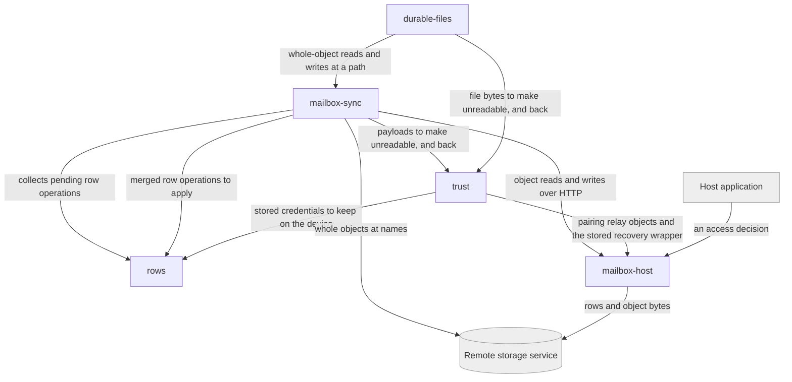

# Blocks — interocitor

## Decomposition

The seam is the product's own: what converges, how it travels, what refuses to
converge, what keeps it unreadable, and who is allowed near it at all.

Laid beside the repository, this set pairs off one-to-one with nothing.
`packages/core` carries four of the five blocks; the web, React, Swift, and
Python packages each spread across several. One block —
[mailbox-host](./mailbox-host/README.md) — nearly coincides with one package,
and the disposition is _legitimate_: the **operator**-side responsibility for who
may reach a **mesh** exists whether or not a Worker deployable does, and is also
realized by a WebDAV server that is not that package.

Budget disposition: each block's self-description — responsibility, logical role,
boundary, technology, and what it communicates with — is 148–188 words, inside
the L2 budget. Where a README runs past 300, the excess is entirely `## Uses`:
one consumer-relationship record per block consumed, which grows with the number
of dependencies rather than with the block's identity. That content is not
compressible without deleting the decision it exists to hold.

## Blocks

| Block                                      | Responsibility                                                                                                           |
| ------------------------------------------ | ------------------------------------------------------------------------------------------------------------------------ |
| [rows](./rows/README.md)                   | What a **row** is, how two independently written versions of one become one, and where a device keeps them               |
| [mailbox-sync](./mailbox-sync/README.md)   | The protocol by which devices exchange row state through a **remote mailbox** that never merges or reads it              |
| [durable-files](./durable-files/README.md) | The path-addressed byte surface, deliberately exempt from convergence, queueing, and caching                             |
| [trust](./trust/README.md)                 | The **encryption boundary**, and how the keys and credentials that hold it are obtained, held, handed over, and regained |
| [mailbox-host](./mailbox-host/README.md)   | The trusted server side of a mailbox — which meshes exist at which addresses, and who may reach them                     |

## Diagram

