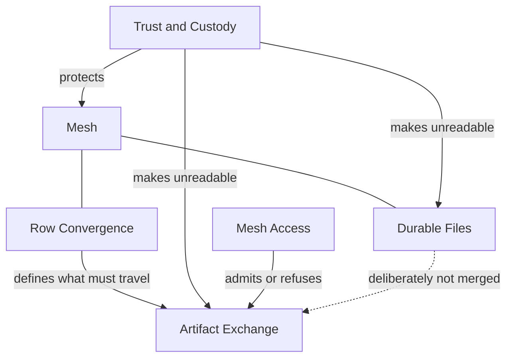

# Domain — interocitor

## Mesh

### What it is

A **mesh** is one shared data space and the set of devices entitled to hold a
complete copy of it. It is not an account, a server, or a subscription — it is
an identity that several devices agree they are working inside.

### Concepts

#### Mesh

##### What it is

The shared data space itself: its rows, its durable files, its device records,
and the configuration that says how it is protected.

##### Invariants

- A mesh has exactly one **mesh ID**, and every device that believes it is in
  the mesh agrees on it.
- A mesh has no owner device. No copy is authoritative over another.
- Membership confers a complete copy, not a view. There is no partial member.
- A mesh does not require any Interocitor-operated service to exist.

##### Lifecycle

Created by a first device → joined by further devices → optionally re-joined by
a device that lost its copy → abandoned when no device holds it and no stored
copy remains.

##### Composed of

Rows, **durable files**, device records, and the protection configuration.

##### Domain events

Mesh created. Device joined. Device re-joined. Protection configured.

#### Device

##### What it is

One participant holding a copy of the mesh and able to originate changes to
it — the dictionary's _client replica_, whether that is a browser, a phone, or a
headless process.

##### Invariants

- A device has a **device ID** that distinguishes its changes from every other
  device's, for the life of its copy.
- A device may work entirely alone. Nothing about the mesh requires another
  device to be present or reachable.
- A device ID is not a secret and grants nothing on its own.

##### Lifecycle

Introduced to a mesh → holds and changes a copy → falls silent → returns and
reconciles, or is forgotten.

##### Domain events

Device introduced. Device reconciled. Device went silent.

### Relationships

- → [Row Convergence](#row-convergence) — shared kernel; convergence is defined
  over the mesh's device IDs.
- → [Trust and Custody](#trust-and-custody) — customer/supplier; a mesh is
  protected by whatever custody supplies, and remains meaningful unprotected.
- → [Durable Files](#durable-files) — shared kernel; files are part of the space
  a mesh is.

---

## Row Convergence

### What it is

The rules by which two devices that changed the same record without speaking to
each other end up holding the same record. A **CRDT** is the model that makes
this true without anyone deciding the result.

### Concepts

#### Row

##### What it is

An addressable record in the mesh, made of independently changeable columns.

##### Invariants

- Convergence is per column, not per row. Two devices that changed different
  columns of one row both keep their change.
- Two devices applying the same set of changes reach the same row, in any order,
  however many times they apply them.
- A change is never silently lost to reconcile a conflict; it is either kept or
  demonstrably superseded by a later one.

##### Lifecycle

Created → amended, column by column, by any device → deleted, leaving a
**tombstone** → forgotten once every device has seen the tombstone.

##### Composed of

Columns, each carrying its own **HLC** stamp of when it was last set and by
which device.

##### Domain events

Row created. Column set. Row deleted.

#### Tombstone

##### What it is

The persisting evidence that a row was deleted, kept so that a late-arriving
change cannot resurrect it.

##### Invariants

- A tombstone outranks any earlier change to the same row and is outranked by
  any later one.
- A tombstone cannot be discarded while a device may still be carrying changes
  older than it.

#### HLC stamp

##### What it is

The ordering mark carried by every column change, which lets devices compare two
changes without a shared clock or a coordinator.

##### Invariants

- Stamps compare consistently on every device: if one device judges a change
  later, all do.
- A stamp never goes backwards on the device that issues it, even when that
  device's wall clock does.
- Ties are broken by device ID, so no two changes are indistinguishable.

### Relationships

- → [Artifact Exchange](#artifact-exchange) — upstream; convergence defines what
  exchange must carry and what it may safely discard.
- → [Mesh](#mesh) — shared kernel.

---

## Artifact Exchange

### What it is

How devices hand each other their row changes through a **remote mailbox** that
never merges, reads, or reasons about what it is holding.

### Concepts

#### Remote mailbox

##### What it is

The passive place a mesh's state is left for other devices to collect. It stores
whole objects at names and does nothing else.

##### Invariants

- The mailbox never merges, orders, validates, or interprets. Every rule about
  the data lives on the devices.
- Correctness never depends on the mailbox holding two things at once, or on it
  enforcing that one write happened before another.
- A device remains fully usable while the mailbox is unreachable; only sharing
  pauses.

##### Domain events

Change file deposited. Change file collected. Mailbox found unreachable.

#### Change file

##### What it is

One batch of a device's row operations, packaged for other devices to collect.

##### Invariants

- A change file's exact name is its identity. Two objects sharing a name are the
  same change file, whatever else differs about them.
- A change file is immutable once written. Superseding it means writing another,
  never editing it.
- A device that has already accounted for a change file must not account for it
  twice, and must be able to tell that it has without re-reading it.

##### Lifecycle

Packaged → written to the mailbox → observed by another device → applied →
retired once a **snapshot** covers it.

#### Snapshot

##### What it is

A full representation of row state at a point in time, published so the change
files leading up to it need not be kept or replayed.

##### Invariants

- A snapshot is only publishable when every change it claims to cover is
  actually contained in it.
- No change file may be retired before a snapshot covering it is durably
  readable by every device that has not yet caught up — this is what
  **compaction** waits for.
- A device arriving with no history at all can be made current from a snapshot
  plus whatever change files follow it.

##### Domain events

Snapshot published. History retired.

#### Manifest

##### What it is

The small, unencrypted control record naming the mesh, its current
**generation** and schema, whether it is protected, and which snapshot is
current. It is the first thing an arriving device reads.

##### Invariants

- The manifest is readable without any key. It names things; it never contains
  them, and it never carries row or file content.
- A manifest is never published ahead of what it points at.
- A device that cannot read the manifest must not conclude the mesh is empty.

##### Domain events

Manifest advanced.

#### Generation

##### What it is

Which era of a mesh's exchange history a device is working in. Devices in
different generations must reconcile deliberately rather than merge by accident.

##### Invariants

- A device that finds itself in an older generation stops writing and reconciles
  before it resumes.

### Relationships

- → [Row Convergence](#row-convergence) — downstream; exchange carries what
  convergence defines and discards only what convergence says is safe.
- → [Trust and Custody](#trust-and-custody) — conformist; exchange is
  indifferent to whether its payloads are readable.
- → [Mesh Access](#mesh-access) — customer/supplier; exchange asks for a mailbox
  and is told yes or no.

---

## Durable Files

### What it is

Bytes stored in the mesh at a path the caller chooses, deliberately exempt from
convergence.

### Concepts

#### Durable file

##### What it is

A path-addressed byte object in the mesh, written and read whole.

##### Invariants

- Files are not merged. The last write at a path is the content at that path;
  there is no per-column reconciliation and no conflict record.
- A file operation acts directly against the mailbox. It is not queued, batched,
  deferred, or reconciled later.
- Because there is no queue, a file operation attempted with the mailbox
  unreachable fails, and says so, rather than appearing to succeed.

##### Lifecycle

Written → read or overwritten → deleted.

##### Domain events

File written. File deleted.

#### Sealed file

##### What it is

A durable file deliberately locked to a key other than the **mesh key**, so that
mesh membership alone does not open it.

##### Invariants

- Membership in the mesh is not sufficient to read a sealed file.
- The seal is an honest label, not a guard: whoever opens the file must supply
  the matching key, and nothing in the mesh can supply it for them.

### Relationships

- → [Mesh](#mesh) — shared kernel; files are part of the space.
- → [Trust and Custody](#trust-and-custody) — customer/supplier.
- → [Artifact Exchange](#artifact-exchange) — separate path; files deliberately
  do not travel as change files, and this asymmetry is a product decision rather
  than an omission.

---

## Trust and Custody

### What it is

What a mesh keeps unreadable outside its devices, and how the keys that hold
that line are obtained, held, handed over, and regained.

### Concepts

#### Encryption boundary

##### What it is

The point at which mesh content stops being readable — the edge of the device,
not the edge of the network.

##### Invariants

- Content is unreadable before it leaves a device, or it is not protected at
  all. Nothing downstream can restore protection that was not applied here.
- What remains visible beyond the boundary is published, not discovered: object
  names, sizes, timestamps, device IDs, and the manifest. This is a stated
  limit, not a leak.
- Whoever holds the mesh key and a copy of the mesh can read it. There is no
  further party who could refuse them.
- A mesh may be configured with no protection at all, and then nothing above
  applies. That is a choice the application makes, visibly.

#### Mesh key

##### What it is

The single key that opens a mesh's protected content. Its copyable form is the
**portable key**.

##### Invariants

- One mesh, one mesh key. Devices do not hold different keys for the same
  content.
- The portable key is generated, never chosen. It is a capability, not a
  password, and it is not rememberable.
- Losing every copy loses the mesh. Nothing and nobody can reissue it.

##### Lifecycle

Generated → held by a device → handed to another device by **pairing** →
optionally placed in **recovery** against loss → gone when the last copy is.

##### Domain events

Mesh key generated. Portable key transferred. Recovery deposited. Mesh key lost.

#### Key source

##### What it is

The application's standing answer to "where does this device's key material come
from, and where are its mesh credentials kept?"

##### Invariants

- The mesh never chooses a key source for the application, and never assumes one
  survives a restart.
- A key source may require a deliberate human act before key material becomes
  usable; the mesh must tolerate that act being refused.
- How a **credential store** guards its copy at rest says nothing about how mesh
  content is protected. The two are separable.

#### Pairing

##### What it is

A deliberate, time-boxed act by which a device already in the mesh admits
another.

##### Invariants

- The portable key is never carried by whatever both parties can see. The
  visible part of a pairing carries only enough to establish a private channel.
- A pairing is bounded in time and single-use; an abandoned one expires rather
  than lingering.
- The temporary key protecting a pairing is unrelated to the mesh key and is
  discarded when the pairing ends.

##### Lifecycle

Offered → accepted → private channel established → connection details
transferred → discarded, or expired unused.

##### Domain events

Pairing offered. Pairing completed. Pairing expired.

#### Recovery

##### What it is

A protected copy of the portable key, left where it can be retrieved later by
someone who remembers only a **recovery phrase**.

##### Invariants

- The recovery phrase is never stored and never leaves the device. Only the
  result of protecting the key with it does.
- Whoever holds the stored copy cannot open it; the phrase is the whole of the
  difference.
- Recovery restores access to the mesh's content. It does not restore access to
  the place the mesh is stored.

##### Domain events

Recovery deposited. Recovery redeemed.

### Relationships

- → [Mesh](#mesh) — supplier.
- → [Artifact Exchange](#artifact-exchange) — supplier; exchange never inspects
  what custody made unreadable.
- → [Durable Files](#durable-files) — supplier.
- → [Mesh Access](#mesh-access) — separate concern; custody decides what can be
  read, access decides who may reach it at all. Neither substitutes for the
  other.

---

## Mesh Access

### What it is

Whether a caller may reach a given mesh's storage at all — a question
Interocitor deliberately refuses to answer for itself, and delegates to a system
that knows who people are.

### Concepts

#### Access decision

##### What it is

A yes or no about one caller and one mesh, made by the **operator**'s own system and
enforced at the storage front door.

##### Invariants

- Interocitor never authenticates anyone. It asks and it enforces; it does not
  decide.
- A refusal is enforced whatever the caller holds. Possessing the mesh key does
  not grant reach, and being granted reach does not grant readability.
- An indeterminate answer is a refusal. There is no default-allow.

##### Lifecycle

Requested → decided → enforced → revoked.

##### Domain events

Access granted. Access refused. Access revoked.

#### Mesh address

##### What it is

The name by which a deployment's storage knows a mesh — routing, not identity.

##### Invariants

- The mesh address is a deployment concern and may legitimately differ from the
  mesh ID.
- The operator decides which addresses are admissible; a device does not
  self-issue one.

#### Invalidation

##### What it is

The operator-side courtesy of telling devices that something changed, so they
need not keep asking.

##### Invariants

- Invalidation is an optimisation, never a correctness requirement. A device
  that hears nothing must still converge, more slowly.
- A missed invalidation never loses a change; it only delays noticing one.

##### Domain events

Change announced.

### Relationships

- → [Artifact Exchange](#artifact-exchange) — supplier; access hands exchange a
  usable mailbox or refuses it one.
- → [Trust and Custody](#trust-and-custody) — separate concern, deliberately not
  layered.

---

## Context map

