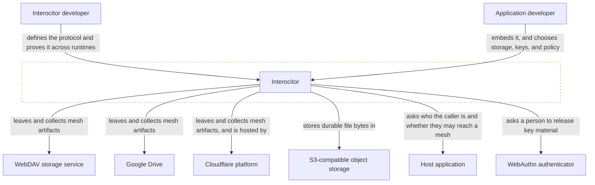

# Interocitor

## Scope

Interocitor is a protocol and a set of runtimes that let trusted devices share
an encrypted, convergent **mesh** through commodity storage that never merges,
queries, or reads what it carries.

## Diagram

## Actors

- **Interocitor developer** — defines what the protocol guarantees and keeps
  four runtimes agreeing about it; the only party who can change what a mesh
  means, and its own first consumer through the examples and suites.
- **Application developer** — embeds Interocitor in a product and decides where
  a mesh is stored, where its keys come from, and who may reach it; gets local
  data that keeps working offline and converges without operating a database.
  When they stand up a mailbox host, this is the same person acting as its
  **operator** — a role, not a third actor.

## External systems

| System                                                            | What crosses the boundary                                                            |
| ----------------------------------------------------------------- | ------------------------------------------------------------------------------------ |
| [WebDAV storage service](../externals/webdav-storage.md)          | Mesh artifacts and durable file bytes, written and read as whole objects at paths    |
| [Google Drive](../externals/google-drive.md)                      | The same artifacts and bytes, in storage the account holder already owns             |
| [Cloudflare platform](../externals/cloudflare-platform.md)        | Mesh artifacts and file bytes, plus the execution and storage a mailbox host runs on |
| [S3-compatible object storage](../externals/s3-object-storage.md) | Durable file bodies for a deployment that keeps them out of its row store            |
| [Host application](../externals/host-application.md)              | A caller identity in, an access decision out                                         |
| [WebAuthn authenticator](../externals/webauthn-authenticator.md)  | A human gesture in, released key material out                                        |

## Inside this root

- [Domain](./DOMAIN.md) — bounded contexts and context map
- [Glossary](./GLOSSARY.md) — ubiquitous language
- [Blocks](./CONTAINERS.md) — how the root is decomposed
- [Viewports](./VIEWPORTS.md) — cross-cutting flows
