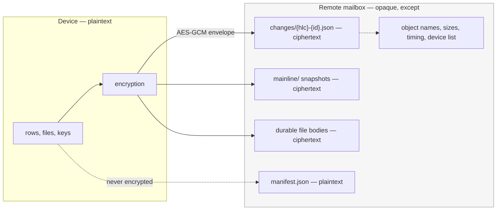
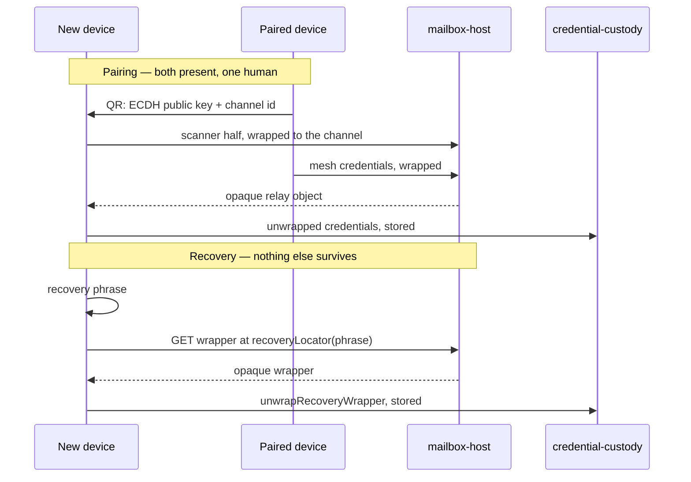

# Viewports — interocitor

Four questions that no single block answers, because the answer is the path
between them. Each is written from the chart, not from a call stack; where a
data shape changes, the seam names the concrete function.

## How does a row written on one device reach another?

Type: lifecycle

### Question

A developer patches a row offline. Later the device reconnects. What has to
happen, in what order, before a second device shows that value — and what
guarantees the second device did not miss anything?

### Participants

- [`table-api`](./rows/table-api/README.md) — accepts the write and queues an operation
- [`crdt-merge`](./rows/crdt-merge/README.md) — stamps it and decides the winner per column
- [`local-store`](./rows/local-store/README.md) — holds rows, outbox, and bookkeeping atomically
- [`sync-lifecycle`](./mailbox-sync/sync-lifecycle/README.md) — orders push, collect, and apply
- [`change-transfer`](./mailbox-sync/change-transfer/README.md) — writes and collects **change files**
- [`manifest`](./mailbox-sync/manifest/README.md) — read first, advanced last
- [`encryption`](./trust/encryption/README.md) — the **encryption boundary**, before the write
- [`storage-adapters`](./mailbox-sync/storage-adapters/README.md) — whole objects at names

### Diagram

```mermaid
sequenceDiagram
  participant App as Application
  participant Tbl as table-api
  participant Mrg as crdt-merge
  participant Str as local-store
  participant Life as sync-lifecycle
  participant Xfer as change-transfer
  participant Enc as encryption
  participant Box as Remote mailbox

  App->>Tbl: patch(row, fields)
  Tbl->>Mrg: stamp with HLC
  Mrg->>Str: merged row + outbox entry (one transaction)
  Note over App,Str: readable and correct here, with nothing remote reached

  Life->>Box: read manifest
  Life->>Xfer: flush outbox
  Xfer->>Enc: encodeChangePayload
  Enc->>Box: PUT changes/{hlc}-{id}.json
  Life->>Box: advance manifest generation

  Life->>Box: list changes/ (other device)
  Box-->>Xfer: unseen names only
  Xfer->>Enc: decodeChangePayload
  Enc->>Mrg: operations to merge
  Mrg->>Str: converged rows
```

### Seams

- **Operation → stamped entry.** `ChangeEntry` carries `hlc` and `id`;
  `packages/core/src/core/hlc.ts` produces the stamp.
- **Entry → object name.** `changeFileName(entry)` in `change-observation.ts`
  yields `{hlc}-{id}.json`. The name _is_ the observation record: a device knows
  what it has seen by name, never by a counter it keeps itself. `changeFileHlc`
  reverses it; `compareChangeFiles` orders by it.
- **Entry → bytes.** `encodeChangePayload(state, entry)` /
  `decodeChangePayload` in `codec.ts`, with `assertExpectedMeshId` refusing a
  payload minted for another **mesh**.
- **Bytes → mailbox.** `StorageAdapter.writeFile(path, data)` /
  `readFile(path)` in `packages/core/src/core/types.ts`.
- **Ordering.** `Manifest.generation` is advanced after the objects it names
  exist, never before.

## What can the mailbox actually see?

Type: boundary

### Question

The root's claim is that storage you do not control can carry a **mesh** without
reading it. Where exactly is that line, what crosses it in the clear, and what
does an honest answer to "is this private?" have to concede?

### Participants

- [`encryption`](./trust/encryption/README.md) — the only crossing point
- [`key-sources`](./trust/key-sources/README.md) — where the **mesh key** comes from
- [`change-transfer`](./mailbox-sync/change-transfer/README.md) and
  [`compaction`](./mailbox-sync/compaction/README.md) — encrypt before writing
- [`manifest`](./mailbox-sync/manifest/README.md) — deliberately readable
- [`file-api`](./durable-files/file-api/README.md) — bodies, same rule
- [`storage-adapters`](./mailbox-sync/storage-adapters/README.md) — sees bytes only

### Diagram



### Seams

- **The crossing.** `encryptEntry(key, plaintext)` / `decryptEntry` in
  `packages/core/src/crypto/encryption.ts`, producing an `EncryptedEnvelope`.
  Every path to the mailbox passes through `codec.ts`, which calls them — no
  adapter encrypts, and no adapter may.
- **Conceded in the clear.** `Manifest` in `types.ts` is plaintext JSON:
  `meshId`, `generation`, `epoch`, `watermarkHlc`, `snapshotPath`, `writtenBy`,
  `encrypted`. Object names carry HLC values, so write _times_ and write _rates_
  are visible. Sizes are visible. The device list is visible.
- **Unprotected by choice.** When no key source is configured, `encrypted` is
  false and payloads are readable. That is a supported mode, not a failure —
  the manifest records which one is in force.
- **Not the same line.** [`credential-custody`](./trust/credential-custody/README.md)
  guards a _local copy_ of credentials. How well it does that says nothing about
  this boundary.

## How does a device become usable before the remote answers?

Type: lifecycle

### Question

A mailbox is slow, unreachable, or has never been contacted. The application
still has to render. What is guaranteed to work, what is deferred, and what does
the developer see instead of a hang?

### Participants

- [`sync-lifecycle`](./mailbox-sync/sync-lifecycle/README.md) — cold to ready, under deadlines
- [`local-store`](./rows/local-store/README.md) — the answer available immediately
- [`table-api`](./rows/table-api/README.md) — live results that do not wait
- [`manifest`](./mailbox-sync/manifest/README.md) — created locally when absent remotely
- [`key-sources`](./trust/key-sources/README.md) — must resolve before any remote read
- [`credential-custody`](./trust/credential-custody/README.md) — or may not

### Diagram

```mermaid
sequenceDiagram
  participant App as Application
  participant Life as sync-lifecycle
  participant Cred as credential-custody
  participant Keys as key-sources
  participant Str as local-store
  participant Box as Remote mailbox

  App->>Life: connect(mesh)
  Life->>Cred: stored credentials?
  alt present
    Cred-->>Keys: reload
  else absent
    Keys->>App: ask (portable key, passkey, pairing)
  end
  Life->>Str: open
  Str-->>App: rows readable and writable — ready
  Note over App,Str: everything below is best-effort

  Life->>Box: read manifest (deadline)
  alt reachable
    Box-->>Life: manifest
    Life->>Box: push, then collect
  else absent or timed out
    Life->>Str: local manifest, queue kept
    Life-->>App: connection status, typed error
  end
```

### Seams

- **Readiness is local.** The store opens and serves before any adapter call.
  `packages/core/src/core/sync-engine.ts` orders this; the local path never
  awaits a remote one.
- **Deadlines.** `with-deadline.ts` bounds every remote step. A timeout is a
  status change, not an exception thrown at the application.
- **First contact.** `loadOrCreateManifest` in `manifest.ts` — an empty mailbox
  and an unreachable one are different outcomes and must stay distinguishable.
- **Status out.** `packages/react/src/use-connection-status.ts` is the surface a
  developer renders; typed errors come from `packages/core/src/core/errors.ts`.
- **Key first.** `MeshKeySource.resolve` (`crypto/key-source.ts`) must succeed
  before a protected object can be read — an unavailable key source blocks sync,
  not local reads.

## How does a second device join, and how is access regained after losing one?

Type: lifecycle

### Question

Two acts look alike and are not: bringing a new device into an existing **mesh**,
and getting back in when every device holding the key is gone. What does each
require a human to do, and who could impersonate whom if it went wrong?

### Participants

- [`pairing`](./trust/pairing/README.md) — the two-device handshake
- [`recovery`](./trust/recovery/README.md) — the phrase-addressed **wrapper**
- [`key-sources`](./trust/key-sources/README.md) — where the resulting key lands
- [`credential-custody`](./trust/credential-custody/README.md) — where it rests
- [`encryption`](./trust/encryption/README.md) — envelope and key derivation
- [`mesh-routing`](./mailbox-host/mesh-routing/README.md) — the relay and wrapper routes
- [`sync-lifecycle`](./mailbox-sync/sync-lifecycle/README.md) — what happens next

### Diagram



### Seams

- **Pairing.** `createGeneratorSession` / `runScannerHandshake` in
  `packages/core/src/handshake/channel.ts`; `HandshakeCredentials` is the shape
  that crosses. Capability ids are negotiated in `handshake/capabilities.ts` and
  **fail closed** on anything unknown.
- **Recovery address.** `recoveryLocator(phrase)` in `crypto/recovery.ts` — the
  wrapper is found by a derivation of the phrase, never by **mesh ID**, so the
  host cannot associate a stored wrapper with a mesh it serves.
- **Wrapper.** `createRecoveryWrapper` / `unwrapRecoveryWrapper` produce and
  open a `RecoveryWrapper`; the KDF hardening is what stands between a guessed
  phrase and the key.
- **What the host holds.** In both flows, opaque bytes under a locator. It can
  withhold and it can delete; it cannot read. Relay objects are removed by
  `relayCleanup` in `handshake/channel.ts` — by the _participants_, best-effort,
  when the handshake ends. The host expires nothing, so an abandoned pairing
  leaves objects behind until something else removes them.
- **After.** Either path ends at `credential-custody`, and
  `sync-lifecycle` proceeds exactly as for any other cold start.
