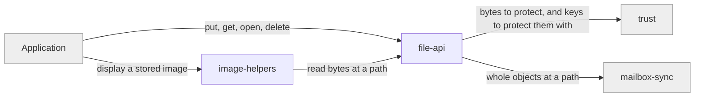

# durable-files

## Responsibility

The path-addressed byte surface of a **mesh** — written and read whole, and
deliberately exempt from convergence.

## Logical role

Realizes the root's second data surface: the one where the product promises
last-write-wins on the path and nothing else, so that an application storing a
photo is never told its photo was merged.

## Boundary

Does not queue, cache, batch, retry, or reconcile. A file operation that cannot
reach the mailbox fails rather than appearing to succeed, and nothing about a
file ever enters row history.

## Technology

TypeScript, with browser and React helpers for image objects. The same adapter
contract as row artifacts, called directly.

## Implementation coordinates

- Durable-file APIs in `packages/core/src/core/sync-engine.ts`
- `packages/web/src/image.ts`
- `packages/react/src/image.ts`

## Communicates with

- → [`trust`](../trust/README.md) — file bytes to make unreadable before they
  leave, and to make readable on arrival, including under a **sealed file**'s own
  key
- → [`mailbox-sync`](../mailbox-sync/README.md) — whole-object reads and writes at
  a path, through that block's adapter

## Uses

### [trust](../trust/README.md)

#### Why

File bytes cross the same **encryption boundary** as everything else, and sealed
files need a second, caller-supplied key that this block must never be tempted to
manage.

#### What I need from it

Encryption and decryption under either the **mesh key** or an explicitly supplied
one, and a clear failure when the supplied key is wrong.

#### What would make me leave

A custody model that assumed one key per mesh. Sealed files exist precisely
because that assumption is sometimes wrong.

### [mailbox-sync](../mailbox-sync/README.md)

#### Why

There is exactly one contract for reaching a mailbox, and a second one would
double the number of storage backends anyone has to implement.

#### What I need from it

Whole-object read, write, and delete at a path, and nothing else — no queueing,
no ordering, no bookkeeping.

#### What would make me leave

Any adapter contract that only made sense for row artifacts, such as one that
assumed immutable names or fixed folder layout.

## Components

| Component                                  | Responsibility                                                                            |
| ------------------------------------------ | ----------------------------------------------------------------------------------------- |
| [file-api](./file-api/README.md)           | Put, get, open, and delete at a path, including sealing a file to a caller's own key      |
| [image-helpers](./image-helpers/README.md) | Turning stored file bytes into something a browser or a React tree can display and revoke |

## Diagram

