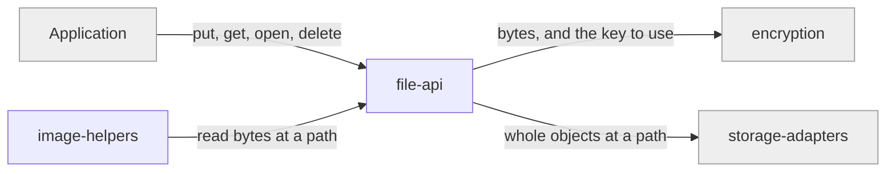

# file-api

«service»

## Responsibility

Put, get, open, and delete a **durable file** at a path, including sealing one to
a key the caller supplies instead of the **mesh key**.

## Bounded context

[Durable Files](../../DOMAIN.md#durable-files)

## Inputs and outputs

In: a path, bytes, and optionally an explicit key. Out: bytes, or a failure —
never a queued promise. Sealing marks the stored object as a **sealed file** so a
later reader knows it needs a key nobody else can supply.

## Depends on

- [`encryption`](../../trust/encryption/README.md) — under the mesh key, or an
  explicitly supplied one
- [`storage-adapters`](../../mailbox-sync/storage-adapters/README.md) — whole
  objects at a path

## Used by

- The consuming application, directly
- [`image-helpers`](../image-helpers/README.md) — reads bytes through it

## Boundary

Does not queue, cache, batch, retry, or merge. With the mailbox unreachable, a
call fails and says so; nothing is written locally to be reconciled later, and
nothing about a file enters row history.

## Implementation coordinates

- Durable-file APIs in `packages/core/src/core/sync-engine.ts` —
  `putFile`, `getFile`, `openFile`, `deleteFile`, and the sealed-file variants
  (`tainted` in code)

That file carries two coordinates. It also holds
[`sync-lifecycle`](../../mailbox-sync/sync-lifecycle/README.md)'s connect and
transfer loop, and the two do not separate along a file boundary today.
Disposition: _legitimate bridge_, not a split to schedule — the file APIs need
the engine's adapter and connection state, and a 3,500-line file that does two
jobs is a density signal, not a defect. Anyone moving it must move both
coordinates.

## Diagram

