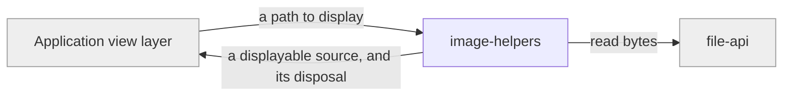

# image-helpers

«factory»

## Responsibility

Turn a stored **durable file** into something a browser or a React tree can
display, and release it again when nothing is showing it.

## Bounded context

[Durable Files](../../DOMAIN.md#durable-files)

## Inputs and outputs

In: a file path and the engine holding it. Out: a displayable source, and the
disposal that goes with it — the lifetime is the whole point, because an
undisposed object URL is a leak in a long-lived application.

## Depends on

- [`file-api`](../file-api/README.md) — the bytes

## Used by

- The consuming application's view layer

## Boundary

Does not decode, resize, transform, or cache image content, and does not know
what a **mesh** is. It converts and it cleans up.

## Implementation coordinates

- `packages/web/src/image.ts`
- `packages/react/src/image.ts`

## Diagram

