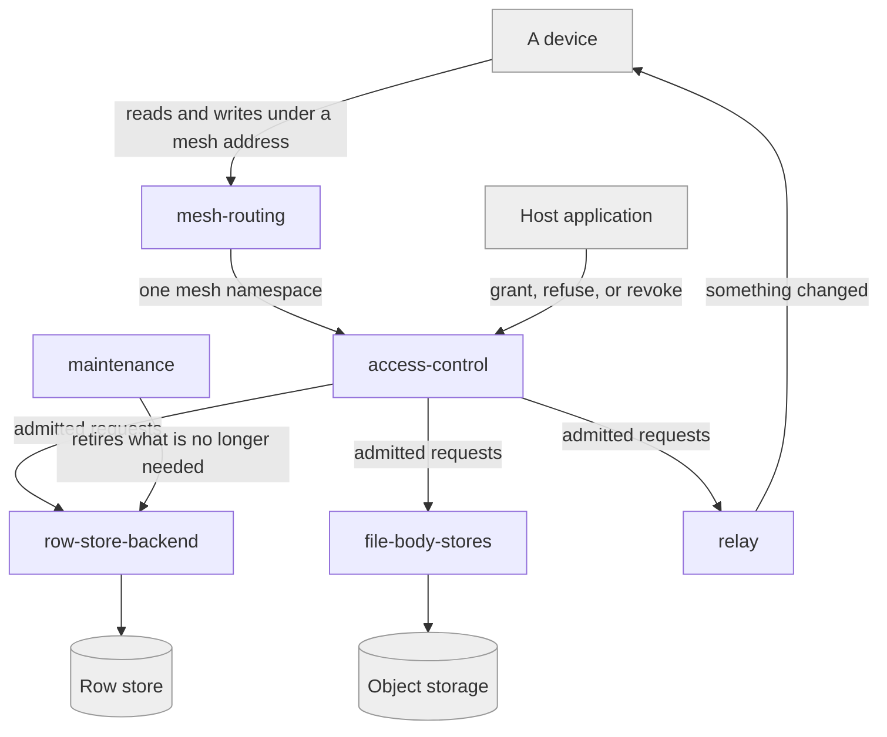

# mailbox-host

## Responsibility

The trusted server side of a **remote mailbox** — which meshes exist at which
addresses, who may reach them, and where their bytes are kept.

## Logical role

Realizes the one question the root refuses to answer for itself: whether a caller
may touch a given **mesh** at all. It exists because access is a property of the
**operator**'s world, not of the protocol.

## Boundary

Does not merge rows, does not read protected payloads, does not hold or derive
any **mesh key**, and does not authenticate anyone — it asks the host application
and enforces the answer. Interocitor operates no instance of it.

## Technology

A Cloudflare Worker mounted inside the operator's own Worker, over D1 for rows,
R2 or S3 for file bodies, and Durable Objects for relay and handshake state. A
disposable Node WebDAV server stands in for it in tests.

## Implementation coordinates

- `packages/workers/src/`
- `packages/workers/schema.sql`
- `tools/webdav-server/`

## Communicates with

- ← [`mailbox-sync`](../mailbox-sync/README.md) — whole-object reads and writes
  over HTTP under a **mesh address**
- ← [`trust`](../trust/README.md) — expiring **pairing** relay objects, and the
  stored **wrapper** a **recovery phrase** unlocks

## Uses

This block depends on no other block, and that is deliberate: everything it does
must remain true for a mailbox that is only a folder on a file server. It is
reached, never reaching.

## Components

| Component                                          | Responsibility                                                                                     |
| -------------------------------------------------- | -------------------------------------------------------------------------------------------------- |
| [mesh-routing](./mesh-routing/README.md)           | Turning a request path into one mesh's namespace, and admitting only addresses the operator allows |
| [access-control](./access-control/README.md)       | Asking the host application for an **access decision** and enforcing it, including on refusal      |
| [row-store-backend](./row-store-backend/README.md) | Holding a mesh's row artifacts and metadata in the deployment's own row store                      |
| [file-body-stores](./file-body-stores/README.md)   | Holding **durable file** bodies in object storage, whichever one the operator configured           |
| [relay](./relay/README.md)                         | Announcing that something changed, and carrying short-lived handshake material                     |
| [maintenance](./maintenance/README.md)             | Retiring what a deployment no longer needs to keep                                                 |
| `tools/webdav-server/`                             | L5 — disposable loopback WebDAV server for demos and integration tests; explicitly not deployable  |

## Diagram

