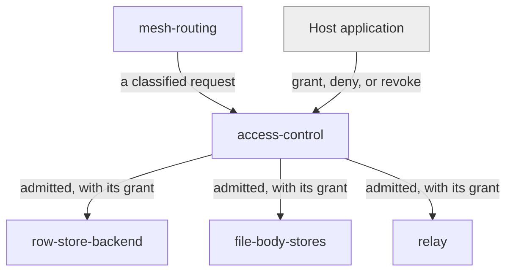

# access-control

«handler»

## Responsibility

Ask the [host application](../../../externals/host-application.md) whether this
caller may touch this **mesh**, and enforce the answer.

## Bounded context

[Mesh Access](../../DOMAIN.md#mesh-access)

## Inputs and outputs

In: a classified request and the **operator**'s middleware. Out: an admitted request
carrying its grant, or a refusal. A grant may be narrower than full, and an
indeterminate answer is a refusal.

## Depends on

- [`mesh-routing`](../mesh-routing/README.md) — the mesh a request is bound to
- The host application's own identity and membership, supplied as middleware

## Used by

- [`row-store-backend`](../row-store-backend/README.md),
  [`file-body-stores`](../file-body-stores/README.md), and
  [`relay`](../relay/README.md) — none of which is reachable except through here

## Boundary

Authenticates nobody and holds no key material. It cannot tell a stale token from
a fresh one, and does not try — freshness is the host's to guarantee, and that
limit is stated rather than papered over.

## Implementation coordinates

- `packages/workers/src/access-control.ts` — grant principals and grant selection
- `createMeshAuthorizationMiddleware` and `meshMiddleware` in
  `packages/workers/src/worker.ts`

## Diagram

