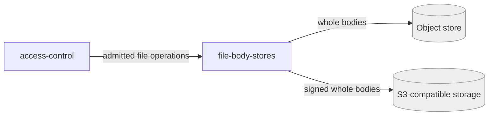

# file-body-stores

«gateway»

## Responsibility

Hold **durable file** bodies in whichever object storage the **operator** configured,
behind one provider-neutral boundary.

## Bounded context

[Durable Files](../../DOMAIN.md#durable-files)

## Inputs and outputs

In: admitted whole-body reads and writes at a path. Out: bytes, with the metadata
the deployment needs to serve them again. Which provider is behind the boundary
is invisible to the device.

## Depends on

- [`access-control`](../access-control/README.md) — nothing reaches it otherwise
- The [Cloudflare platform](../../../externals/cloudflare-platform.md)'s object
  store, or
  [S3-compatible object storage](../../../externals/s3-object-storage.md)

## Used by

- [`access-control`](../access-control/README.md) — routes admitted file
  operations here rather than to the row store

## Boundary

Never decrypts, never merges, and never mixes file bodies into row artifacts.
Keeping bodies out of the row store is a capacity decision, not a semantic one —
which is why both backends satisfy one contract.

## Implementation coordinates

- `packages/workers/src/r2-file-body-store.ts`
- `packages/workers/src/s3-file-body-store.ts` — including request signing
- The `FileBodyStore` contract in `packages/workers/src/types.ts`

## Diagram

