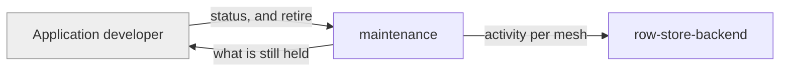

# maintenance

«service»

## Responsibility

Report what a deployment is still holding, and retire what it no longer needs to.

## Bounded context

[Mesh Access](../../DOMAIN.md#mesh-access)

## Inputs and outputs

In: a developer-initiated request, and per-mesh activity — when a namespace was
last written and last read. Out: a status they can act on, and the deletions they
asked for.

## Depends on

- [`row-store-backend`](../row-store-backend/README.md) — where the activity is
  recorded

## Used by

- The [application developer](../../README.md#actors) running the deployment,
  through the mount's own routes

## Boundary

Never runs on its own judgement, and never deletes on a device's behalf. Client
**compaction** decides what mesh history is safe to retire; this component only
carries out what the developer running the deployment has decided about their own
storage.

## Implementation coordinates

- `packages/workers/src/maintenance.ts` — per-prefix status and retirement

## Diagram

