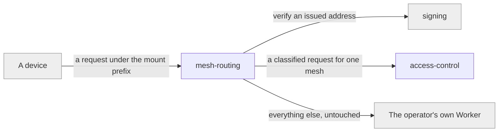

# mesh-routing

«handler»

## Responsibility

Turn an incoming request path into one **mesh**'s namespace, admitting only the
**mesh address** forms the **operator** allows.

## Bounded context

[Mesh Access](../../DOMAIN.md#mesh-access)

## Inputs and outputs

In: a request under the deployment's mount prefix, and the **operator**'s
integrity gates. Out: a classified operation against a named mesh — or a
refusal, before any store is touched. Requests outside the prefix are handed
back to the operator's own Worker untouched.

The presented address need not be the stored one. A deployment may issue each
subject a **mesh alias** that this component resolves in one hop, so revoking a
subject deletes one binding rather than re-keying a mesh. Resolution is not
authorization: an alias says which mesh, never who —
[`access-control`](../access-control/README.md) still decides.

## Depends on

- [`signing`](../../trust/signing/README.md) — to verify a checksummed address a
  deployment chose to issue

## Used by

- [`access-control`](../access-control/README.md) — receives the classified,
  address-bound request

## Boundary

Does not decide who the caller is or whether they may proceed, and does not read
or write any content. It resolves and classifies; admissibility of an _address_
is not permission for a _caller_.

## Implementation coordinates

- `packages/workers/src/worker.ts` — `withInterocitor`, the mount prefix, and
  `meshIntegrityGates`
- `packages/workers/src/paths.ts` — every recognised path type and its mutability
- `packages/workers/src/ids.ts` — worker-issued mesh identifiers

## Diagram

