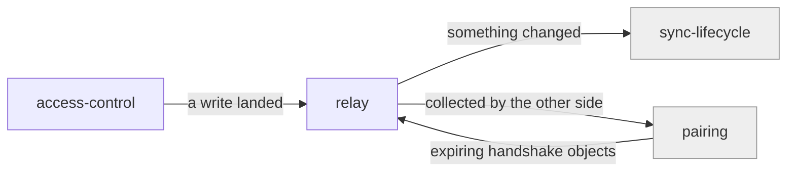

# relay

«service»

## Responsibility

Tell connected devices that something in a **mesh** changed, and carry the
short-lived objects a **pairing** needs.

## Bounded context

[Mesh Access](../../DOMAIN.md#mesh-access)

## Inputs and outputs

In: a write that landed, or handshake material from one side of a pairing. Out: a
batched announcement to whoever is listening, or the same material collected by
the other side. Announcements say _that_ something changed, never what.

## Depends on

- [`access-control`](../access-control/README.md) — nothing reaches it otherwise
- The [Cloudflare platform](../../../externals/cloudflare-platform.md)'s
  coordinated state

## Used by

- [`sync-lifecycle`](../../mailbox-sync/sync-lifecycle/README.md) — as a hint to
  collect sooner than polling would
- [`pairing`](../../trust/pairing/README.md) — as the rendezvous both devices can
  reach

## Boundary

Never a correctness requirement. A device that hears nothing still converges by
asking, only later; a missed announcement delays noticing a change and never
loses one. Announcements are batched deliberately, so being told is never the
fast path.

## Implementation coordinates

- `packages/workers/src/relay.ts` — the broadcast batch delay and the connection
  namespace

## Diagram

