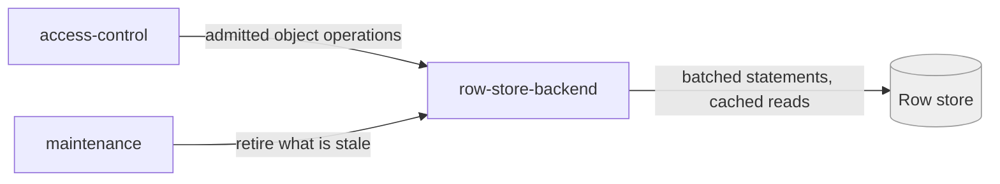

# row-store-backend

«repository»

## Responsibility

Hold a **mesh**'s exchange artifacts and their metadata in the deployment's own
row store, and serve them back as whole objects.

## Bounded context

[Artifact Exchange](../../DOMAIN.md#artifact-exchange)

## Inputs and outputs

In: admitted whole-object reads, writes, listings, and deletes at a path. Out:
bytes and listings that behave exactly as a file server's would — because a
device must not be able to tell the difference.

## Depends on

- [`access-control`](../access-control/README.md) — nothing reaches it otherwise
- The [Cloudflare platform](../../../externals/cloudflare-platform.md)'s row
  store and cache

## Used by

- [`maintenance`](../maintenance/README.md) — retires what a deployment no longer
  needs
- [`recovery`](../../trust/recovery/README.md) — stores the opaque **wrapper**
  under its locator

## Boundary

Does not merge rows, does not read protected payloads, and does not interpret a
**change file**. Its one concession to meaning is honouring each path type's
declared mutability — immutable objects are cached and never rewritten, mutable
ones are overwritten.

## Implementation coordinates

- `packages/workers/src/ops.ts` — batched statements and the immutable-object
  cache
- `packages/workers/src/{db-adapter,schema}.ts`
- `packages/workers/schema.sql`

## Diagram

