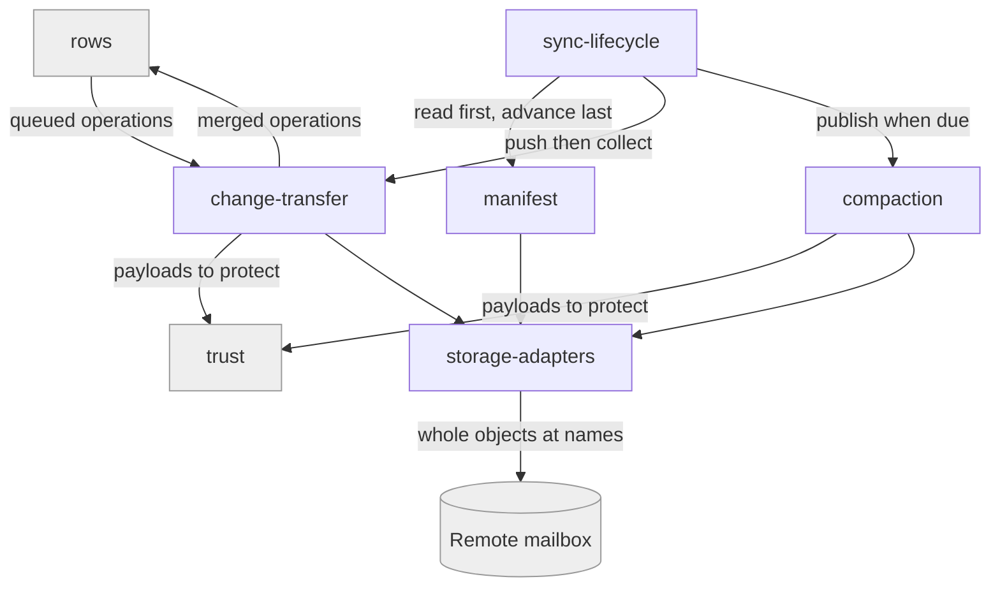

# mailbox-sync

## Responsibility

The protocol by which devices exchange row state through a **remote mailbox**
that never merges, queries, or reads what it carries.

## Logical role

Realizes the root's promise that commodity storage — anything that can hold a
named object — is enough to share a **mesh**, and that correctness never depends
on the storage being clever.

## Boundary

Does not decide how two versions of a row reconcile, does not choose or hold
keys, and does not decide who may reach a mailbox. It carries, names, orders,
and retires; it never interprets.

## Technology

TypeScript, Swift, and Python engines over pluggable **storage adapter**
implementations. TypeScript includes WebDAV, S3, Google Drive, Cloudflare, and
memory; the other runtimes implement their documented subsets.

## Implementation coordinates

- `packages/core/src/core/{sync-engine,pull,flush,manifest,compaction,change-observation,codec,retention,with-deadline,internals}.ts`
- `packages/core/src/adapters/`
- `packages/react/src/{context,use-connection-status}.ts`
- `packages/interocitor-swift/Sources/InterocitorSwift/{SyncEngine,StorageAdapter,WebDAVStorageAdapter,CloudflareStorageAdapter}.swift`
- `packages/interocitor-python/src/interocitor/{engine,adapters}.py`

## Communicates with

- → [`rows`](../rows/README.md) — collects pending row operations and this
  device's bookkeeping; hands back operations arriving from elsewhere
- → [`trust`](../trust/README.md) — payloads to make unreadable before they
  leave, and to make readable on arrival
- → [`mailbox-host`](../mailbox-host/README.md) — whole-object reads and writes
  over HTTP, when the mailbox is a hosted deployment
- ← [`durable-files`](../durable-files/README.md) — whole-object reads and writes
  at a path, reusing this block's adapter

## Uses

### [rows](../rows/README.md)

#### Why

This block must know what it carries well enough to name, order, and retire it —
not well enough to resolve it.

#### What I need from it

Operations that are self-describing and order-independent.

#### What would make me leave

A merge model where applying an operation twice differs from applying it once.

### [trust](../trust/README.md)

#### Why

The **encryption boundary** must sit before the write; putting it here would make
every adapter re-implement it.

#### What I need from it

Something that turns a payload into opaque bytes and back.

#### What would make me leave

A demand that this block hold key material. Cipher choice is a coordinate.

### [mailbox-host](../mailbox-host/README.md)

#### Why

Some deployments want one URL, an access decision, and a row store behind it
rather than a folder on a NAS — a different mailbox, not a different protocol.

#### What I need from it

Whole-object reads and writes at names this block chooses, and a refusal that is
recognizably a refusal rather than an empty **mesh**.

#### What would make me leave

Any behaviour that made the host necessary, so a plain WebDAV folder or S3
object prefix could no longer stand in.

## Components

| Component                                        | Responsibility                                                                                                |
| ------------------------------------------------ | ------------------------------------------------------------------------------------------------------------- |
| [sync-lifecycle](./sync-lifecycle/README.md)     | Bringing a device from cold to ready, and keeping it there under deadlines and outages                        |
| [manifest](./manifest/README.md)                 | The **manifest** and **generation** record: reading it first, advancing it last, never ahead of what it names |
| [change-transfer](./change-transfer/README.md)   | Writing **change files**, collecting them, and knowing by name which have been accounted for                  |
| [compaction](./compaction/README.md)             | Publishing a **snapshot** and retiring the history it covers, only when retiring is safe                      |
| [storage-adapters](./storage-adapters/README.md) | The one contract every kind of mailbox must satisfy, and the implementations that satisfy it                  |
| `packages/core/src/core/{types,errors}.ts`       | L5 — shared engine types and the typed error classes that are part of the public contract                     |

## Diagram

