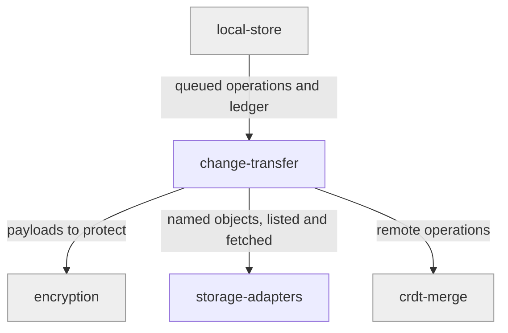

# change-transfer

«service»

## Responsibility

Write this device's queued operations to the mailbox as **change files**, collect
other devices' change files, and know by exact name which have already been
accounted for.

## Bounded context

[Artifact Exchange](../../DOMAIN.md#artifact-exchange)

## Inputs and outputs

In: the local queue, the observation ledger, and whatever objects the mailbox
currently lists. Out: named, immutable change files written remotely; merged
operations handed to [rows](../../rows/README.md); an updated ledger.

## Depends on

- [`storage-adapters`](../storage-adapters/README.md) — listing, reading, writing
- [`manifest`](../manifest/README.md) — paths and device metadata
- [`encryption`](../../trust/encryption/README.md) — payloads out and back
- [`crdt-merge`](../../rows/crdt-merge/README.md) — to apply what arrives
- [`local-store`](../../rows/local-store/README.md) — the queue and the ledger

## Used by

- [`sync-lifecycle`](../sync-lifecycle/README.md) — pushes, then collects, on
  every connect and every subsequent sync

## Boundary

Does not decide merge outcomes and does not retire history. It owns one
invariant and no more: an immutable change filename is what proves observation.
**HLC** values here are diagnostics and conflict order only, never receipts.

## Implementation coordinates

- `packages/core/src/core/flush.ts` — push queued operations
- `packages/core/src/core/pull.ts` — download and merge
- `packages/core/src/core/change-observation.ts` — the exact-filename ledger, and
  the single owner of the sync-completeness invariant
- `packages/core/src/core/codec.ts` — payload encode and decode

## Diagram

