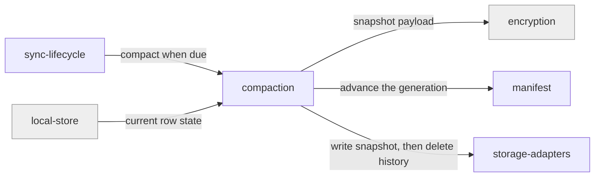

# compaction

«service»

## Responsibility

Publish a **snapshot** and retire the **change files** it covers, once retiring
them is safe for every device that has not caught up.

## Bounded context

[Artifact Exchange](../../DOMAIN.md#artifact-exchange)

## Inputs and outputs

In: current row state, the **manifest**, and the retention contract — how long
history is kept and how long a device may stay offline. Out: a published
snapshot, an advanced manifest **generation**, and deletions of history now
covered.

## Depends on

- [`manifest`](../manifest/README.md) — generation and pointer rotation
- [`storage-adapters`](../storage-adapters/README.md) — writing and deleting
- [`encryption`](../../trust/encryption/README.md) — snapshot payloads
- [`local-store`](../../rows/local-store/README.md) — the state being snapshotted

## Used by

- [`sync-lifecycle`](../sync-lifecycle/README.md) — invokes it when retention says
  it is due

## Boundary

Does not merge and does not decide what a row is. It publishes before it deletes,
never the reverse.

Known limit, recorded rather than hidden: there is no compare-and-swap on the
manifest pointer, so two devices compacting at once can race and overwrite it.
The mitigation is a remote lease and an abort on generation change, and it lives
in the code's own notes.

## Implementation coordinates

- `packages/core/src/core/compaction.ts` — snapshot publication and pointer
  rotation, with the concurrency note
- `packages/core/src/core/retention.ts` — the retention contract and its defaults

## Diagram

