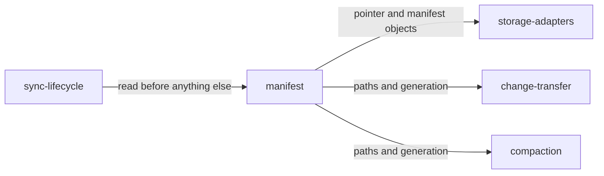

# manifest

«repository»

## Responsibility

Read, write, validate, and advance a **mesh**'s **manifest** — the unencrypted
record that says which **snapshot** is current and which **generation** the mesh
is in.

## Bounded context

[Artifact Exchange](../../DOMAIN.md#artifact-exchange)

## Inputs and outputs

In: a pointer read from the mailbox, a schema definition, device metadata. Out: a
validated manifest, the paths every other component addresses objects by, and a
refusal when a device finds itself behind a generation.

## Depends on

- [`storage-adapters`](../storage-adapters/README.md) — to read and write the
  pointer and the manifest object

## Used by

- [`sync-lifecycle`](../sync-lifecycle/README.md) — the first read of any connect
- [`change-transfer`](../change-transfer/README.md) — paths and device metadata
- [`compaction`](../compaction/README.md) — pointer rotation

## Boundary

Never carries row or file content and never carries key material — it is
deliberately readable by whoever holds the mailbox. Does not decide when to
compact; it only records that someone did.

## Implementation coordinates

- `packages/core/src/core/manifest.ts` — read, write, create, validate, device
  metadata
- `packages/core/src/core/internals.ts` — the cloud path layout every component
  shares

## Diagram

