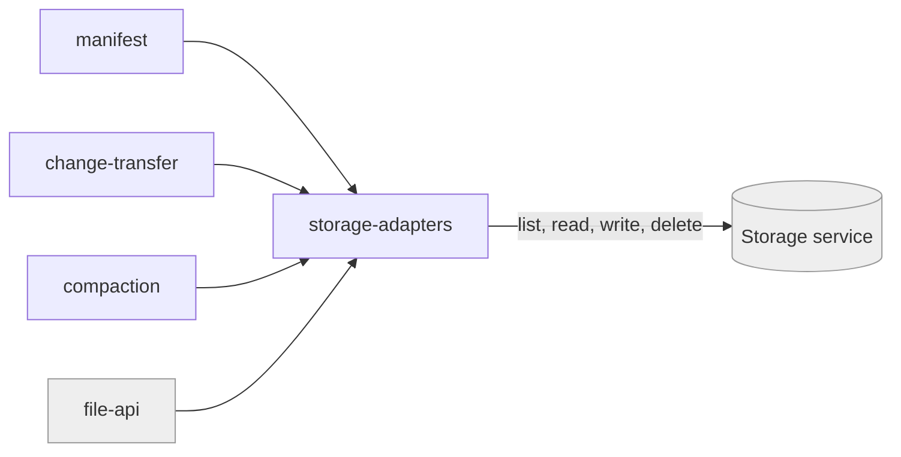

# storage-adapters

«gateway»

## Responsibility

The one contract every kind of **remote mailbox** must satisfy, and the
implementations that satisfy it.

## Bounded context

[Artifact Exchange](../../DOMAIN.md#artifact-exchange)

## Inputs and outputs

In: a path and, for writes, bytes. Out: listings, bytes, and honest failures. The
contract is deliberately file-like — list, read, write, delete — because that is
the smallest thing every candidate storage can do.

## Depends on

- The configured external storage service: a
  [WebDAV service](../../../externals/webdav-storage.md),
  [Google Drive](../../../externals/google-drive.md), the
  [Cloudflare platform](../../../externals/cloudflare-platform.md), or an
  in-memory stand-in

## Used by

- [`manifest`](../manifest/README.md), [`change-transfer`](../change-transfer/README.md),
  [`compaction`](../compaction/README.md), and
  [`file-api`](../../durable-files/file-api/README.md)

## Boundary

Never a source of key material, never a merger, and never a place where sync
rules live. An adapter that needed to understand a **change file** would be the
wrong shape.

## Implementation coordinates

- `packages/core/src/adapters/{webdav,google-drive,cloudflare,memory}.ts`
- `packages/interocitor-swift/Sources/InterocitorSwift/{StorageAdapter,WebDAVStorageAdapter,CloudflareStorageAdapter}.swift`
- `packages/interocitor-python/src/interocitor/adapters.py`

## Diagram

