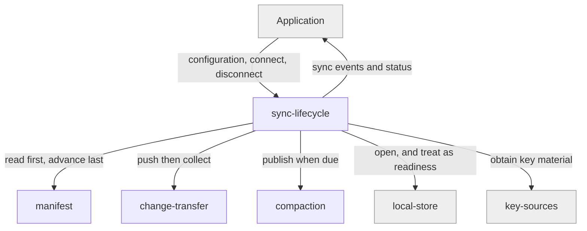

# sync-lifecycle

«service»

## Responsibility

Bring a device from cold to usable, keep it current afterwards, and decide what
"ready" means when the remote will not answer.

## Bounded context

[Artifact Exchange](../../DOMAIN.md#artifact-exchange)

## Inputs and outputs

In: the application's configuration — adapter, **key source**, stores, deadlines,
and the policy for joining a **mesh** that already exists. Out: a connected
engine, a stream of sync events, and a connection status the application can
show.

## Depends on

- [`manifest`](../manifest/README.md) — read first, always
- [`change-transfer`](../change-transfer/README.md) — push, then collect
- [`compaction`](../compaction/README.md) — publish when retention says it is due
- [`local-store`](../../rows/local-store/README.md) — the readiness that matters
  most
- [`key-sources`](../../trust/key-sources/README.md) — key material, before any
  payload moves

## Used by

- The consuming application, and the React connection bindings

## Boundary

Does not merge, does not encrypt, and does not name objects. It sequences and it
bounds: each stage carries a deadline, and exceeding one degrades to
locally-ready rather than failing the whole connect.

## Implementation coordinates

- `packages/core/src/core/sync-engine.ts` — connect, disconnect, stage
  sequencing, `connectStageTimeoutMs`, `joinExistingMeshPolicy`
- `packages/core/src/core/with-deadline.ts`
- `packages/react/src/{context,use-connection-status}.ts`
- `packages/interocitor-swift/Sources/InterocitorSwift/SyncEngine.swift`
- `packages/interocitor-python/src/interocitor/engine.py`

## Diagram

