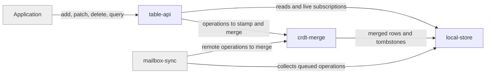

# rows

## Responsibility

What a **row** is, how two independently written versions of one become one, and
where a device keeps them.

## Logical role

Realizes the root's promise that data written on any device, at any time,
without coordination, becomes one agreed state everywhere — and that it is
readable and writable before anything remote has been reached.

## Boundary

Does not move anything between devices, does not encrypt, and does not decide
what may be discarded from remote history. It merges what it is handed and
records what it is asked to keep.

## Technology

TypeScript over IndexedDB and an in-memory store; Swift over SQLite; Python over
an in-memory store. React bindings expose live results.

## Implementation coordinates

- `packages/core/src/core/{crdt,hlc,table,row-id,schema-types,change-effects}.ts`
- `packages/core/src/storage/{local-store,memory-store}.ts`
- `packages/web/src/storage/`
- `packages/react/src/{use-live-query,use-row}.ts`
- `packages/interocitor-swift/Sources/InterocitorSwift/{CRDT,HLC,IndexedSQLiteStore,MemoryLocalStore}.swift`
- `packages/interocitor-python/src/interocitor/{crdt,hlc,memory,schema}.py`

## Communicates with

- ← [`mailbox-sync`](../mailbox-sync/README.md) — collects this device's pending
  row operations and the bookkeeping that says how far it has got, and hands back
  merged operations from other devices to apply
- ← [`trust`](../trust/README.md) — stored credentials to keep in the device
  database, under a key the sync path never reads

## Uses

This block depends on no other block. A device that never reaches a **remote
mailbox** still creates, merges, queries, and deletes rows correctly, and that is
the point: the merge rules are provable on one device with nothing else present.

## Components

| Component                              | Responsibility                                                                                     |
| -------------------------------------- | -------------------------------------------------------------------------------------------------- |
| [crdt-merge](./crdt-merge/README.md)   | The merge rules themselves: per-column last-write-wins, tombstones, and the stamps that order them |
| [table-api](./table-api/README.md)     | The surface an application writes and reads rows through, including live results                   |
| [local-store](./local-store/README.md) | The device database holding rows, the outbox, and sync bookkeeping as one atomic unit              |
| `packages/core/src/core/ids.ts`        | L5 — identifier generation and validation (device, row, checksummed) shared with other blocks      |

## Diagram

