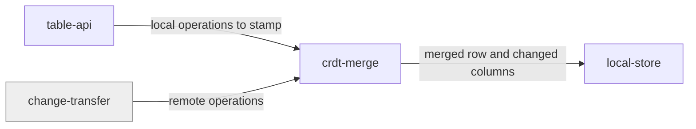

# crdt-merge

«service»

## Responsibility

Decide, for any two versions of a **row**, which value each column ends up
holding.

## Bounded context

[Row Convergence](../../DOMAIN.md#row-convergence)

## Inputs and outputs

In: an existing row and an incoming operation, each column carrying its own
**HLC** stamp. Out: the merged row, plus which columns actually changed. Deletes
enter as operations and leave as **tombstones**.

## Depends on

- Nothing inside this block. It is a pure function over the values it is handed,
  which is what makes convergence testable without a store or a mailbox.

## Used by

- [`local-store`](../local-store/README.md) — merges before it persists
- [`table-api`](../table-api/README.md) — stamps writes so they can be merged
- [`change-transfer`](../../mailbox-sync/change-transfer/README.md) — merges what
  arrives from other devices

## Boundary

Does not persist, does not order arrival, does not decide what may be forgotten.
A caller may supply its own per-column strategy, and this component holds it to
being deterministic, commutative, associative, and idempotent — it does not check
that claim.

## Implementation coordinates

- `packages/core/src/core/crdt.ts` — per-column strategies, default
  last-writer-wins, soft deletes
- `packages/core/src/core/hlc.ts` — stamp creation and comparison
- `packages/core/src/core/change-effects.ts` — which columns a merge actually
  moved
- `packages/interocitor-swift/Sources/InterocitorSwift/{CRDT,HLC}.swift`
- `packages/interocitor-python/src/interocitor/{crdt,hlc}.py`

## Diagram

