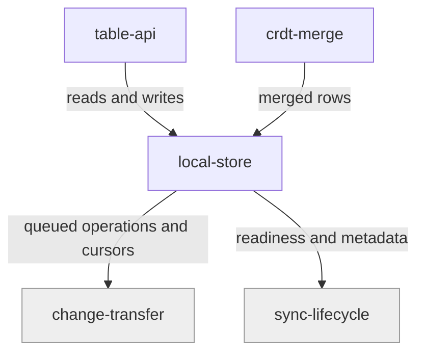

# local-store

«repository»

## Responsibility

Hold this device's rows, its queue of unpublished operations, and its sync
bookkeeping, and move them together or not at all.

## Bounded context

[Row Convergence](../../DOMAIN.md#row-convergence)

## Inputs and outputs

In: merged rows, queued operations, cursors, and engine metadata. Out: reads,
query results, change notifications, and the queue that
[change-transfer](../../mailbox-sync/change-transfer/README.md) drains. It also
lends a named lock so a correctness-critical sequence can be serialized across
wrappers.

## Depends on

- [`crdt-merge`](../crdt-merge/README.md) — to know what a write becomes before
  it is written

## Used by

- [`table-api`](../table-api/README.md) — all reads and writes
- [`sync-lifecycle`](../../mailbox-sync/sync-lifecycle/README.md) — readiness and
  metadata
- [`change-transfer`](../../mailbox-sync/change-transfer/README.md) — the queue
  and the observation ledger
- [`credential-custody`](../../trust/credential-custody/README.md) — sub-store
  credentials under a dedicated meta key

## Boundary

Does not encrypt — it sits inside the trusted device and may hold plaintext. Does
not reach the network, and does not decide when a queued operation is published.

## Implementation coordinates

- `packages/core/src/storage/local-store.ts` — the contract every backend
  satisfies
- `packages/core/src/storage/memory-store.ts`
- `packages/web/src/storage/{indexed-db-local-store,named-local-store,resilient-store,reset}.ts`
- `packages/interocitor-swift/Sources/InterocitorSwift/{IndexedSQLiteStore,MemoryLocalStore}.swift`
- `packages/interocitor-python/src/interocitor/memory.py`

## Diagram

