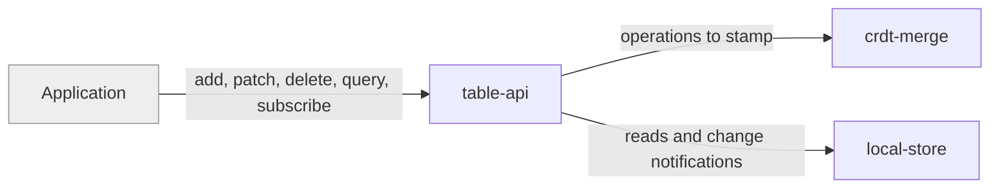

# table-api

«repository»

## Responsibility

The typed surface an application creates, amends, deletes, and queries **rows**
through, including results that stay current as they change.

## Bounded context

[Row Convergence](../../DOMAIN.md#row-convergence)

## Inputs and outputs

In: typed partial records, row identifiers, and query clauses. Out: plain
records with merge metadata stripped, and subscriptions that re-emit when a
matching row moves — whether it moved locally or arrived from another device.

## Depends on

- [`crdt-merge`](../crdt-merge/README.md) — to stamp a write so it can be merged
  anywhere
- [`local-store`](../local-store/README.md) — to read, write, and observe

## Used by

- The consuming application, directly or through the React bindings

## Boundary

Does not talk to a **remote mailbox**, does not resolve conflicts itself, and
does not promise that a write has been shared — only that it is durable locally
and queued.

## Implementation coordinates

- `packages/core/src/core/table.ts` — the typed handle
- `packages/core/src/core/{schema-types,row-id}.ts`
- `packages/react/src/{use-live-query,use-row}.ts`
- `packages/interocitor-python/src/interocitor/schema.py`

## Diagram

