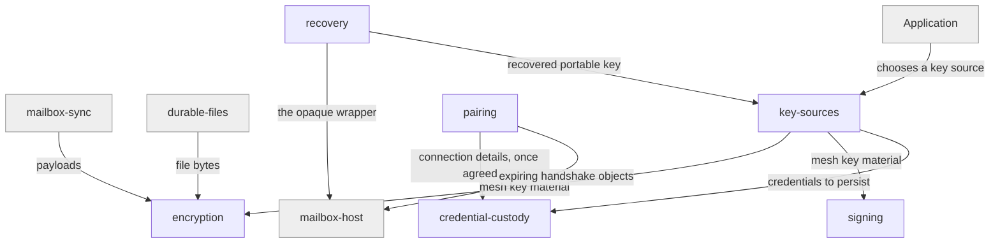

# trust

## Responsibility

The **encryption boundary**, and the life of the keys and credentials holding it:
obtained, held, handed over, regained.

## Logical role

Realizes the root's central claim: storage you do not control can hold your
**mesh** without being able to read it, and regaining access after losing a
device is a designed act, not an appeal to a provider.

## Boundary

Does not decide who may reach a mailbox, carry anything anywhere, or choose
custody on the application's behalf. It makes bytes unreadable and manages the
secrets that reverse that; it authenticates nobody.

## Technology

Web Crypto in TypeScript, CryptoKit in Swift, and the Python standard library —
AES-GCM for content, ECDH for pairing, a password-hardening KDF for recovery.

## Implementation coordinates

- `packages/core/src/crypto/`
- `packages/core/src/handshake/`
- `packages/core/src/storage/credential-store.ts`
- `packages/core/src/core/connected-stores.ts`
- `packages/web/src/{credential-store,secret-store,webauthn}.ts`
- `packages/react/src/use-connected-stores.ts`
- `packages/interocitor-swift/Sources/InterocitorSwift/Crypto.swift`
- `packages/interocitor-python/src/interocitor/{crypto,key_source,recovery}.py`

## Communicates with

- ← [`mailbox-sync`](../mailbox-sync/README.md) — payloads to make unreadable
  before they leave, and to make readable on arrival
- ← [`durable-files`](../durable-files/README.md) — file bytes, under the **mesh
  key** or a caller's own
- → [`mailbox-host`](../mailbox-host/README.md) — short-lived **pairing** relay
  objects, and the stored **wrapper** that a **recovery phrase** unlocks
- → [`rows`](../rows/README.md) — the device database this block keeps stored
  credentials in

## Uses

### [mailbox-host](../mailbox-host/README.md)

#### Why

Two acts need somewhere neither device controls: a pairing needs a rendezvous
that expires, and a recovery needs a stored **wrapper** findable by someone who
remembers only a phrase. Both are storage; neither is readable by its holder.

#### What I need from it

A short-lived place for handshake material, and a durable place for an opaque
wrapper under a locator that is not the **mesh ID**.

#### What would make me leave

Any requirement that the host understand what it holds. The moment recovery
needed a server that could decrypt, this relationship would be the wrong shape.

### [rows](../rows/README.md)

#### Why

Stored credentials must survive a reload, and the device already has exactly one
database whose writes are atomic.

#### What I need from it

A keyed record that persists per device and is never carried to a mailbox.

#### What would make me leave

Any move that put this store's contents into the sync path.

## Components

| Component                                            | Responsibility                                                                         |
| ---------------------------------------------------- | -------------------------------------------------------------------------------------- |
| [encryption](./encryption/README.md)                 | Turning payloads and file bytes into opaque envelopes and back                         |
| [signing](./signing/README.md)                       | Proving a piece of mesh material came from a device that held the key                  |
| [key-sources](./key-sources/README.md)               | Where a device's **mesh key** material comes from, and the **portable key** form of it |
| [credential-custody](./credential-custody/README.md) | Where a device's mesh credentials live at rest, and what it takes to unlock them       |
| [pairing](./pairing/README.md)                       | Admitting a second device without either party's secret crossing anything visible      |
| [recovery](./recovery/README.md)                     | Turning a human-recordable **recovery phrase** into the ability to reopen a mesh       |

## Diagram

