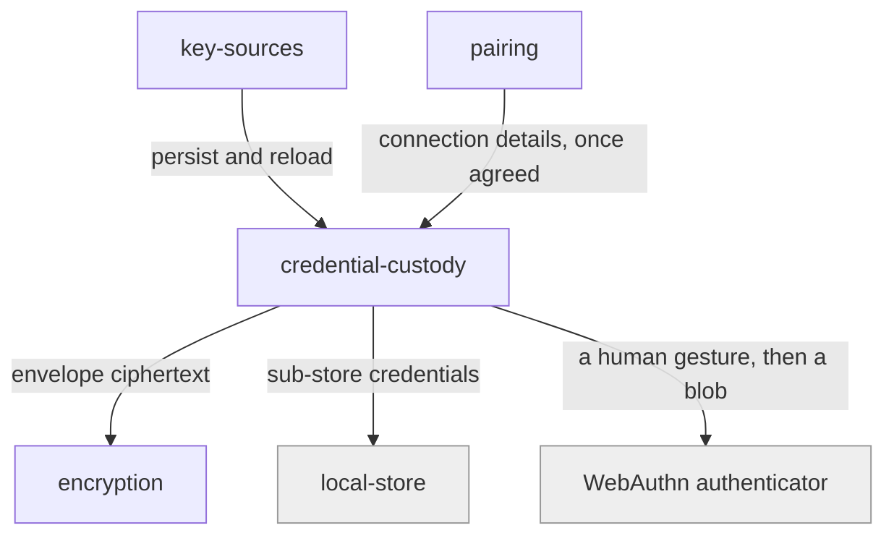

# credential-custody

«repository»

## Responsibility

Hold this device's mesh credentials at rest, and decide what it takes to get them
back.

## Bounded context

[Trust and Custody](../../DOMAIN.md#trust-and-custody)

## Inputs and outputs

In: a **portable key**, a device identity, and the **mesh ID** the credentials
were minted for. Out: the same record on a later session, or — deliberately —
nothing, when the store is memory-only or the human declines a passkey gesture.

## Depends on

- [`encryption`](../encryption/README.md) — for the **credential envelope** shape
- The [WebAuthn authenticator](../../../externals/webauthn-authenticator.md),
  when the application chooses passkey custody
- [`local-store`](../../rows/local-store/README.md) — for credentials of
  sub-stores a mesh owns, kept under a dedicated meta key

## Used by

- [`key-sources`](../key-sources/README.md) — reload before asking again
- [`pairing`](../pairing/README.md) — where a completed pairing lands

## Boundary

Does not derive or generate key material, and does not decide who may reach a
**remote mailbox**. How a copy is guarded here says nothing about how mesh
content is protected; the two are deliberately separable.

Recorded asymmetry: credentials for sub-stores flow one way by construction. A
parent holds its children's credentials; no child knows it has a parent.

## Implementation coordinates

- `packages/core/src/storage/credential-store.ts` — the stored-credential record
- `packages/web/src/credential-store.ts` — memory, session, local, passkey-only,
  and envelope modes
- `packages/web/src/{secret-store,webauthn}.ts` — `largeBlob` custody behind a
  WebAuthn ceremony
- `packages/core/src/core/connected-stores.ts` and
  `packages/react/src/use-connected-stores.ts` — sub-store credentials

## Diagram

