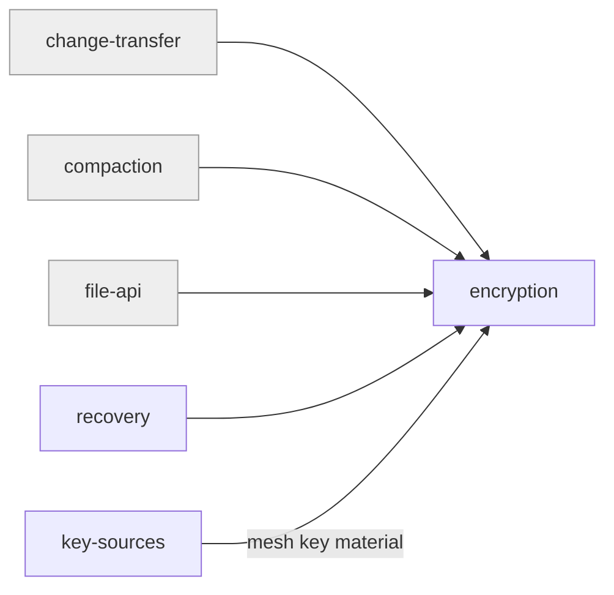

# encryption

«service»

## Responsibility

Turn a payload into an opaque envelope under a given key, and turn it back.

## Bounded context

[Trust and Custody](../../DOMAIN.md#trust-and-custody)

## Inputs and outputs

In: bytes and a 256-bit symmetric key. Out: an envelope carrying its version, a
fresh per-entry initialisation vector, and the ciphertext — and, on the way back,
either the plaintext or a clear failure. Nothing partially decrypts.

## Depends on

- [`key-sources`](../key-sources/README.md) — for the **mesh key** when the
  caller does not supply its own
- The runtime's own cryptographic primitive, which is an engine rather than an
  external system

## Used by

- [`change-transfer`](../../mailbox-sync/change-transfer/README.md) — **change
  file** payloads
- [`compaction`](../../mailbox-sync/compaction/README.md) — **snapshot** payloads
- [`file-api`](../../durable-files/file-api/README.md) — file bytes, under the
  mesh key or a **sealed file**'s own
- [`recovery`](../recovery/README.md) — the stored **wrapper**

## Boundary

Does not choose, derive, store, or transport keys, and does not decide what is
worth encrypting. It also does not hide names, sizes, or timings — that limit is
published in the [encryption boundary](../../DOMAIN.md#trust-and-custody), not
worked around here.

## Implementation coordinates

- `packages/core/src/crypto/encryption.ts` — the envelope format and per-entry IV
- `packages/core/src/crypto/keys.ts` — key generation and the base58 form
- `packages/interocitor-swift/Sources/InterocitorSwift/Crypto.swift`
- `packages/interocitor-python/src/interocitor/crypto.py`

## Diagram

