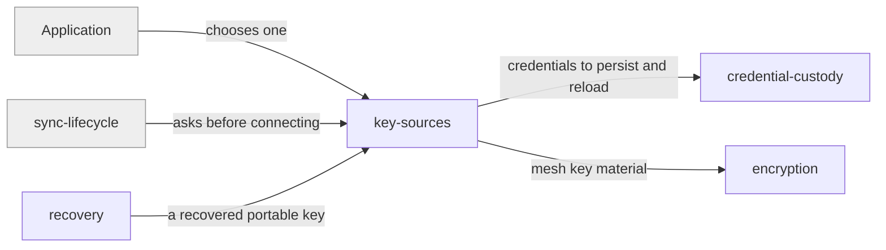

# key-sources

«factory»

## Responsibility

Answer, for one device and one **mesh**, where the **mesh key** material comes
from.

## Bounded context

[Trust and Custody](../../DOMAIN.md#trust-and-custody)

## Inputs and outputs

In: the mesh's identity, this device's identity, and whatever the application
configured. Out: mesh key material, plus the credentials to persist so the next
session need not ask again. A **key source** may legitimately produce nothing,
and an unprotected mesh is one of the answers.

## Depends on

- [`credential-custody`](../credential-custody/README.md) — where the answer is
  kept between sessions

## Used by

- [`sync-lifecycle`](../../mailbox-sync/sync-lifecycle/README.md) — before any
  payload moves
- [`encryption`](../encryption/README.md) — the key itself
- [`recovery`](../recovery/README.md) — reinstates a **portable key** through here

## Boundary

Does not encrypt, does not transport, and does not choose on the application's
behalf. Two shapes ship: one where the portable key _is_ the mesh key, and one
where the application derives the mesh key from its own inputs.

## Implementation coordinates

- `packages/core/src/crypto/key-source.ts` — the contract and its key context
- `PortablePassphraseKeySource` and `BoundSharedKeySource` in
  `packages/core/src/crypto/`
- `packages/interocitor-python/src/interocitor/key_source.py`

## Diagram

