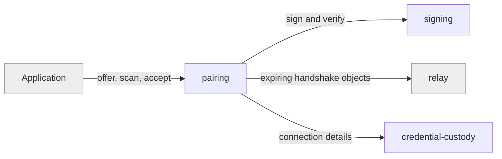

# pairing

«service»

## Responsibility

Let a device already in a **mesh** admit another, without either party's secret
crossing anything a bystander can see.

## Bounded context

[Trust and Custody](../../DOMAIN.md#trust-and-custody)

## Inputs and outputs

In: a scannable offer from the generating device and an intent that says what it
wants. Out: mesh connection details on the joining device — or an expiry. The
offer itself never carries the **portable key**.

## Depends on

- [`signing`](../signing/README.md) — authenticity of what crosses
- [`credential-custody`](../credential-custody/README.md) — where the result lands
- [`relay`](../../mailbox-host/relay/README.md) — the short-lived rendezvous both
  devices can reach

## Used by

- The consuming application, which drives the ceremony and shows the offer

## Boundary

Does not choose the **mesh key**, does not persist anything itself, and does not
outlive the ceremony. The agreed key protects the handshake only, is unrelated to
the mesh key, and is discarded when the pairing ends.

Recorded constraint: capability identifiers stay strings on the wire so a
deployment can require something a peer has never heard of, and an unknown
required capability must fail closed rather than be dropped in decoding.

## Implementation coordinates

- `packages/core/src/handshake/channel.ts` — ephemeral ECDH over a relay, and the
  generator/scanner roles
- `packages/core/src/handshake/{qr,qr-public,handshake-id}.ts` — the offer's two
  intents and its encoding
- `packages/core/src/handshake/capabilities.ts` — fail-closed capability
  negotiation

## Diagram

