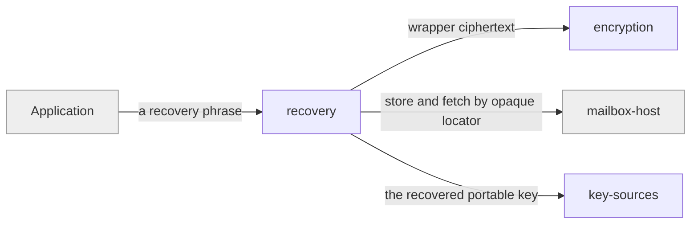

# recovery

«service»

## Responsibility

Turn a human-recordable **recovery phrase** into the ability to reopen a **mesh**
whose devices are gone.

## Bounded context

[Trust and Custody](../../DOMAIN.md#trust-and-custody)

## Inputs and outputs

In: a phrase the application generated and the person wrote down. Out,
deterministically from it: an opaque locator that says where the **wrapper**
lives, and a **KEK** that opens it — yielding the **portable key**, the **mesh
ID**, and the remote path.

## Depends on

- [`encryption`](../encryption/README.md) — the wrapper is an envelope like any
  other
- [`mailbox-host`](../../mailbox-host/README.md) — somewhere durable to leave it
- [`key-sources`](../key-sources/README.md) — where a recovered key is reinstated

## Used by

- The consuming application, which owns the phrase's word list, generation, and
  validation

## Boundary

Never sends the phrase, the KEK, or the unwrapped key anywhere — the remote sees
only an opaque locator and ciphertext. Restores access to mesh content, not to a
storage-provider login or a deployment's route address, and it is a separate
mechanism from the pairing agreement.

## Implementation coordinates

- `packages/core/src/crypto/recovery.ts` — recovery root, locator derivation, KEK,
  and wrapper handling
- `packages/interocitor-python/src/interocitor/recovery.py`

## Diagram

