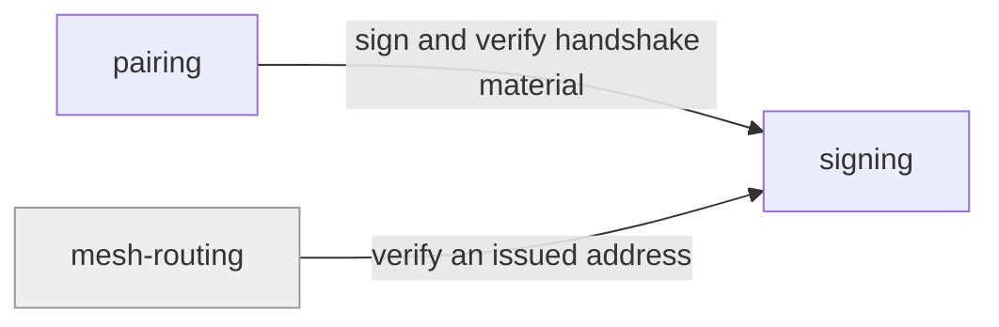

# signing

«service»

## Responsibility

Prove that a piece of **mesh** material was produced by someone holding the
matching private key, and verify that proof.

## Bounded context

[Trust and Custody](../../DOMAIN.md#trust-and-custody)

## Inputs and outputs

In: bytes and a key pair, or bytes, a signature, and a public key. Out: a
signature, a compact signed token, or a verdict. Signed payloads are not secret —
anyone with the public key can read them.

## Depends on

- The runtime's own cryptographic primitive

## Used by

- [`pairing`](../pairing/README.md) — authenticity of what crosses a handshake
- [`mesh-routing`](../../mailbox-host/mesh-routing/README.md) — checksummed
  **mesh address** values a deployment chooses to issue

## Boundary

Does not provide confidentiality, and is deliberately a different mechanism from
both the symmetric **mesh key** and the ephemeral pairing agreement. Mixing the
three is the mistake this separation exists to prevent.

## Implementation coordinates

- `packages/core/src/crypto/signing.ts` — signatures and the compact token form

## Diagram

