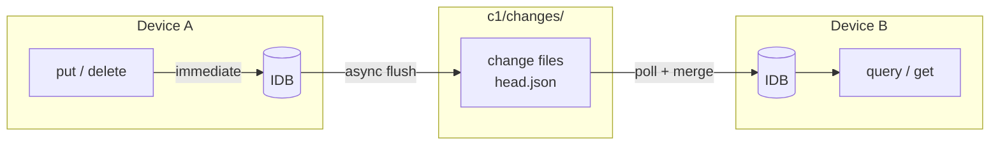
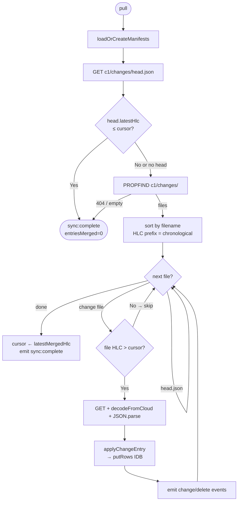
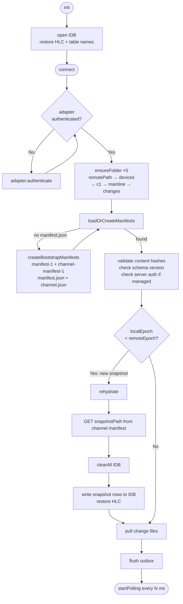
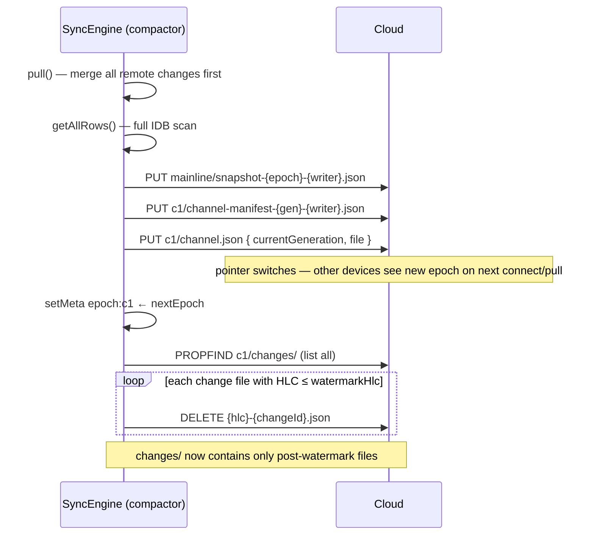
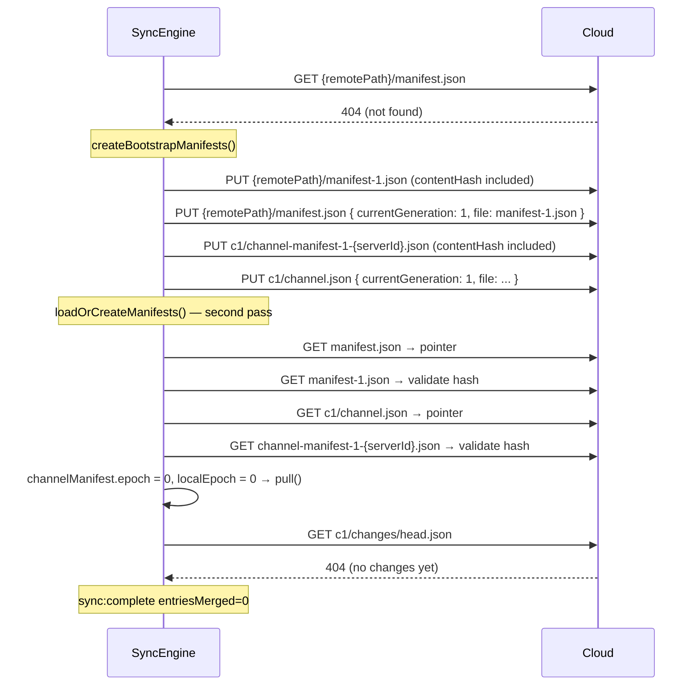

# interocitor

> ☢️ work in progress ☢️

Sync structured data across devices using a cloud folder you already own. CRDT merge, E2E encryption, no purpose-built sync backend.

## Why

You want local-first sync. You look at the options.

[Dexie Cloud](https://dexie.org/cloud/) — great IndexedDB wrapper, mature CRDT sync. But sync goes through their servers. Per-seat pricing. If they shut down, your sync is gone. [Firebase](https://firebase.google.com/), [Supabase](https://supabase.com/), [Convex](https://www.convex.dev/) — same dependency, different logo.

Those are real-time collaborative sync platforms. They move your bytes through their servers, under their Terms of Service.

Interocitor is **privacy-first**. It gives you total data ownership by syncing over storage you already control. The zero-infrastructure baseline uses background polling, but this isn't a hard limit — sync can be configured to run faster, or even become push-based with an optional relay.

The strongest use case: syncing your own stuff across your own devices — laptop, phone, tablet — without anyone else touching your data. For this, you don't need a heavy sync service. You just need a *transport* — a place where one device writes and another reads.

You already have one. Google Drive gives you 15 GB for free. A Nextcloud on a $5 VPS gives you whatever your disk holds. These aren't databases, they're dumb file stores. That's exactly what a CRDT log needs.

**Interocitor uses a shared cloud folder as the sync transport.** Each device writes changes as JSON files into its own subfolder. Other devices poll the folder, download new files, merge via LWW-per-column CRDTs. All reads hit local IndexedDB — never the cloud. The cloud folder is a mailbox, not a runtime dependency.

What falls out of this design:

- No purpose-built sync backend. No WebSocket. No vendor lock-in.
  - Swap Google Drive for WebDAV mid-session. Data survives.
  - Optional AES-256-GCM encryption — cloud provider sees ciphertext.
  - Browser clears IndexedDB? App rehydrates from cloud on next open.
  - Zero runtime dependencies — Web Crypto API, IndexedDB, `fetch`.

To be precise: Google Drive is still an API with auth, rate limits, quotas, and ToS. WebDAV on a VPS is a server you maintain. The claim is **no custom sync server** in your architecture — not "no servers involved."

## Quick start

```ts
import { SyncEngine } from 'interocitor';
import { GoogleDriveAdapter } from 'interocitor/adapters/google-drive';
import { generateKey, keyToPassphrase } from 'interocitor/crypto/keys';

interface AppSchema {
  tasks: { title: string; status: 'open' | 'in-progress' | 'done'; assignee: string };
  notes: { content: string };
}

const adapter = new GoogleDriveAdapter({ clientId: 'YOUR_GOOGLE_CLIENT_ID' });
const engine = new SyncEngine<AppSchema>(adapter, {
  remotePath: '/MyApp',
  dbName: 'myapp',
});

// encryption is optional — skip these three lines if you don't need it
const key = await generateKey();
const passphrase = await keyToPassphrase(key); // ~43 char base58, share it
engine.setEncryptionKey(key);

await engine.init();    // open local IndexedDB
await engine.connect(); // authenticate, pull, start polling

const tasks = engine.table('tasks');

await tasks.put('task_1', {
  title: 'Review PR #42',
  status: 'open',
  assignee: 'marina',
});

const task = await tasks.get('task_1');
const all  = await tasks.query();

const unsub = engine.on((event) => {
  if (event.type === 'change') {
    console.log(`Updated: ${event.table}/${event.rowId}`);
  }
});

await engine.disconnect();
```

The schema generic is optional. Without it, pass a type param per table or go fully untyped:

```ts
const engine = new SyncEngine(adapter, { remotePath: '/App', dbName: 'app' });
const tasks  = engine.table<{ title: string; status: string }>('tasks');
const notes  = engine.table('notes'); // untyped, anything goes
```

Indexed querying uses Dexie-like where clauses on `Table`:

```ts
const openTasks = await engine.table('tasks').where('status').equals('open');
const mine      = await engine.table('tasks').where('assignee').anyOf(['marina', 'anton']);
const high      = await engine.table('tasks').where('priority').aboveOrEqual(3);
const recent    = await engine.table('tasks').where('priority').between(2, 5);
```

Queries against un-indexed fields fall back to a full-table scan automatically. For schema definition (`types.index`, `types.enum`, migrations), see [interocitor-architecture.md](interocitor-architecture.md).

Backends are swappable at runtime — pending writes flush first:

```ts
await engine.setRemoteStorage(new WebDAVAdapter({ baseUrl: '...', auth: { ... } }));
```

## Local TODO demo (WebDAV)

A user-facing demo app is available at `examples/todo-webdav/index.html`.

It runs against the local e2e WebDAV server (`/__webdav__`) and generates a copy-pastable join token that includes:

- `remotePath`
  - encryption key passphrase
  - WebDAV base URL

Use one browser tab to create a session and copy token, then paste that token in another tab and connect both.

This lets you quickly test:

- two tabs syncing in the same mesh (same token)
  - isolated meshes on one server (different `remotePath` values)

Run locally:

```bash
yarn demo:todo
```

The local demo server persists WebDAV files under `examples/todo-webdav/webdav-data/`, so you can inspect sync artifacts directly next to the example app.

Then open:

- `http://127.0.0.1:4173/examples/todo-webdav/index.html`

Optional test-only entrypoint (same app via compatibility shim):

- `http://127.0.0.1:4173/tests/e2e/fixtures/todo-webdav.html`

Playwright e2e still uses in-memory mode (`yarn test:e2e:*`) for deterministic tests. The server code has a storage seam intended for a future SQLite/D1-backed implementation.

The join-token flow is intentionally simple: create a session, copy token, paste in another tab, both contexts converge.

## How sync works



Writes land in local IDB immediately — reads never touch the cloud. Flushing uploads one JSON file per change to the shared `changes/` folder. A single `head.json` carries the latest HLC so readers can skip listing the folder entirely when nothing is new. On pull, each reader downloads files above its local cursor, merges with HLC-ordered LWW-per-column CRDTs, and advances the cursor.

No locks, no coordination. Each device writes only its own files.

## Protocol flows

### Pull — fast-skip and merge



### Connect and engine lifecycle



### Compaction



Other devices detect the epoch advance on the next `connect()` or `pull()` via `loadOrCreateManifests`:
`remoteEpoch > localEpoch` → `rehydrate()` → load snapshot → pull deltas above watermark.

### Bootstrap (first-ever connect)



## Adapters

**Google Drive** — uses `drive.file` scope (app only sees its own files). Mesh members share via Drive's native sharing.

```ts
import { GoogleDriveAdapter } from 'interocitor/adapters/google-drive';
const adapter = new GoogleDriveAdapter({ clientId: 'YOUR_CLIENT_ID' });
```

**WebDAV** — Nextcloud, ownCloud, any WebDAV endpoint. The self-hosted path.

```ts
import { WebDAVAdapter } from 'interocitor/adapters/webdav';
const adapter = new WebDAVAdapter({
  baseUrl: 'https://cloud.example.com/remote.php/dav/files/alice',
  auth: { username: 'alice', password: 'APP_PASSWORD' },
});
```

**Memory** — for tests.

```ts
import { MemoryAdapter } from 'interocitor/adapters/memory';
const adapter = new MemoryAdapter();
```

**Custom** — implement `StorageAdapter` (`authenticate`, `ensureFolder`, `listFiles`, `listFolders`, `readFile`, `writeFile`, `deleteFile`, `getFileMetadata`).

## Encryption

AES-256-GCM via Web Crypto API. Key is generated on the first device, shared to others as a base58 passphrase (~43 chars), a URL fragment (`#key=…`, never hits the server), or a QR code.

```ts
import { generateKey, keyToPassphrase, passphraseToKey } from 'interocitor/crypto/keys';

const key = await generateKey();
const passphrase = await keyToPassphrase(key);

// on another device
const sameKey = await passphraseToKey(passphrase);
engine.setEncryptionKey(sameKey);
```

Key never leaves devices. Cloud folder only contains ciphertext. All devices lose the key → data is unrecoverable. That's the point. Print it.

## CRDT strategy

LWW-per-column. Each field carries its own HLC timestamp. On merge, highest HLC wins per field independently.

```
Device A: task.title  = "Review PR"  at T1
Device B: task.status = "done"       at T2

→ { title: "Review PR" (T1), status: "done" (T2) }
```

Different fields → both preserved. Same field → latest wins. Deletes are tombstones with a bounded retention window (default 90 days).

Tombstone cleanup happens during compaction. Any device can trigger `engine.compact()` in the default mode; in server-managed mode (`serverManaged: true`), only the configured `serverId` may compact. If two devices compact concurrently, manifest generations determine which snapshot wins.

No ordered-list CRDTs, no rich-text merge. For tabular data this is enough, and you can reason about it on a napkin.

## Events

```ts
engine.on((event) => {
  switch (event.type) {
    case 'change':             // row upserted
    case 'delete':             // row tombstoned
    case 'sync:start':         // pull cycle begins
    case 'sync:complete':      // pull done, N entries merged
    case 'sync:error':
    case 'flush:start':        // push cycle begins
    case 'flush:complete':
    case 'flush:error':
    case 'rehydrate:start':    // rebuilding from snapshot
    case 'rehydrate:complete':
    case 'auth:required':      // cloud token expired
    case 'auth:complete':
    case 'schema:mismatch':    // remote schema newer
  }
});
```

## Cloud folder layout

```
{remotePath}/                                    e.g. /Interocitor/MyApp
  manifest.json                                  ← pointer: { currentGeneration, file }
  manifest-{generation}.json                     ← immutable once written; validate contentHash
  devices/
    {deviceId}.json                              ← heartbeat: lastSeenAt, userId
  {channelId}/                                   ← default: c1
    channel.json                                 ← pointer: { currentGeneration, file }
    channel-manifest-{gen}-{writer}.json         ← epoch + snapshotPath + watermarkHlc
    mainline/
      snapshot-{epoch}-{writer}.json             ← full IDB snapshot at watermarkHlc
    changes/
      head.json                                  ← { latestHlc } — fast poll-skip hint
      {hlc}-{changeId}.json                      ← one file per flush batch (all devices)
```

**Write ordering in `compact()`:** snapshot → channel-manifest → channel.json pointer.
Readers loading `channel.json` always see a consistent pair; the snapshot file exists before any reader is directed to it.

**Retention policy:** only the current generation is needed at runtime.
Old `channel-manifest-*` and old `snapshot-*` files are safe to delete after the pointer moves.
Change files `≤ watermarkHlc` are pruned automatically by `compact()`.

## What this is not

A sync layer for structured JSON across a small device mesh. Not:

- **A multiplayer gaming backend** — it synchronizes durable state through files, it is not optimized for ephemeral push updates (e.g. mouse pointers).
  - **A query engine** — supports simple secondary indexes + where clauses, not SQL joins/aggregations
  - **A blob store** — small JSON records, not images
  - **Multi-tenant** — one mesh, one folder, everyone sees everything

## Tests

Playwright e2e in a real browser. Covers manifest bootstrap, writer-authority, file-per-change writes, cross-device sync, encrypted round-trips, WebDAV contract, multi-context isolation.

```bash
yarn test:e2e:install   # Chromium
yarn test:e2e           # run
yarn test:e2e:headed    # watch
yarn test:e2e:debug     # Playwright UI
```

## Planned: optional reactive backend

A drop-in Cloudflare Worker / Durable Object backed by D1. You own it, pay almost nothing, and it enables reactive push updates. Google Drive / WebDAV remains the zero-infrastructure path.

## License

MIT
