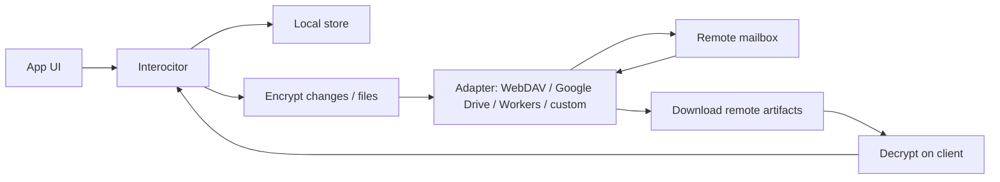

<p align="center">
  <a href="https://github.com/TheUiTeam/interocitor">
    
  </a>
</p>

<p align="center">
  <strong>A mailbox that can't read your mail.</strong>
</p>

<p align="center">
  End-to-end encrypted local-first sync, durable file storage, and image display primitives for apps that should keep user data readable only on the client.
</p>

## What Interocitor is

Interocitor is a local-first data engine. Your app reads and writes local state first, then syncs encrypted artifacts through storage you control: WebDAV, Google Drive, Cloudflare Workers/R2, or a custom adapter.

The remote is a mailbox, not a trusted database:

- row data is encrypted before upload
- devices keep working offline
- sync converges when devices see the same remote files
- app files and images can live beside the mesh without entering CRDT compaction
- Cloudflare Workers can add server-side abuse controls without getting plaintext

## What you get

- **Typed local data.** Tables, rows, live queries, schema inference.
- **Encrypted sync.** Change files and snapshots are encrypted with the mesh key by default.
- **Durable file storage.** `PUT`, `GET`, `DELETE` style file APIs for blobs that do not merge and do not compact.
- **First-class images.** Store `Blob`, `File`, bytes, data URLs, or SVG strings; read back bytes, `Blob`, or a revokable `blob:` URL.
- **React hooks.** `useLiveQuery`, `useRow`, and `useImage` keep rendering decisions in app code.
- **Cloudflare backend.** D1 for sync metadata, R2 for durable file bodies, optional Durable Object realtime invalidation, upload quotas, and upload authorization callbacks.

## Install

```bash
yarn add @interocitor/core
# optional
yarn add @interocitor/react @interocitor/workers
```

## Quick start

```ts
import { Interocitor, types, type DatabaseSchemaDefinition, type InferSchemaType } from '@interocitor/core';
import { WebDAVAdapter } from '@interocitor/core/adapters/webdav';

const schema = {
  version: 1,
  tables: {
    todos: {
      fields: {
        text: types.string,
        done: types.boolean,
        avatarPath: types.string.optional(),
      },
    },
  },
} satisfies DatabaseSchemaDefinition;

type DB = InferSchemaType<typeof schema>;

const db = new Interocitor<DB>({
  appName: 'Todo',
  dbName: 'todo',
  schema,
  encrypted: true,
});

await db.init();

db.configureMesh({
  remotePath: '/Todo',
  encrypted: true,
  // In a real app: restore an existing passphrase or let the first device create one.
  passphrase,
});

await db.setRemoteStorage(new WebDAVAdapter({
  baseUrl: 'https://dav.example.com',
  auth: { username: 'user', password: 'pass' },
}));

await db.connect();

const todoId = await db.table('todos').add({
  text: 'Ship encrypted sync',
  done: false,
});

await db.table('todos').patch(todoId, { done: true });
```

## Files and images

Files are durable application objects. They are encrypted like row data, but they do not participate in CRDT merge, change-log compaction, or snapshots. A file just exists at a path until overwritten or deleted.

```ts
await db.putFile('receipts/2026-05-03.pdf', pdfBytes, 'application/pdf');

const bytes = await db.getFile('receipts/2026-05-03.pdf');
const metadata = await db.getFileMetadata('receipts/2026-05-03.pdf');

await db.deleteFile('receipts/2026-05-03.pdf');
```

Image helpers sit on top of file storage:

```ts
await db.putImage('avatars/me.png', file); // File, Blob, ArrayBuffer, Uint8Array, data URL, or SVG string

const image = await db.getImage('avatars/me.png');
console.log(image.blob, image.metadata?.uploadedByDeviceId);

const rendered = await db.getImageBlobUrl('avatars/me.png');
img.src = rendered.url;
rendered.revoke();
```

Metadata tracks who uploaded the current version, stored/plaintext size, upload time, content type, last access time, and total use count when the backend supports it.

## React

React bindings are deliberately small. App code owns engine lifecycle; hooks consume an already-created engine.

```tsx
import { createInterocitorContext, useImage, useLiveQuery, useRow } from '@interocitor/react';

export const [InterocitorProvider, useDb] = createInterocitorContext<DB>();

function TodoList() {
  const db = useDb();
  const { data: todos = [] } = useLiveQuery(() => db.table('todos').query(), [db]);
  return todos.map(todo => <TodoRow key={todo.id} id={todo.id} />);
}

function TodoAvatar({ path }: { path?: string }) {
  const db = useDb();
  const image = useImage(db, path);
  if (image.loading) return <span>Loading…</span>;
  if (image.error || !image.url) return null;
  return ;
}
```

## Cloudflare Workers backend

`@interocitor/workers` mounts Interocitor under your Worker. It can provide:

- D1-backed sync object storage
- R2-backed durable file storage
- upload size limits and per-mesh total byte quotas
- upload authorization callbacks that can reject by mesh, device, path, size, content type, or your app auth
- optional Durable Object realtime invalidation
- system ops for mesh ID issue/validation and maintenance

```ts
import { withInterocitor, InterocitorRelayDurableObject } from '@interocitor/workers';

interface Env {
  DB: D1Database;
  FILES: R2Bucket;
  RELAY: DurableObjectNamespace;
  INTEROCITOR_ACCESS_TOKEN: string;
}

const appWorker = {
  async fetch(request: Request) {
    return new Response('app');
  },
};

export { InterocitorRelayDurableObject };

export default withInterocitor(appWorker, {
  mountPrefix: '/sync',
  db: env => env.DB,
  files: env => env.FILES,
  relay: env => env.RELAY,
  runtime: {
    accessToken: env => env.INTEROCITOR_ACCESS_TOKEN,
    maxStoredFileBytes: () => 32 * 1024 * 1024,
    maxMeshStoredBytes: () => 512 * 1024 * 1024,
    authorizeFileUpload: async ({ uploadedByDeviceId, size, contentType }) => {
      if (!uploadedByDeviceId) return { allowed: false, status: 401, reason: 'missing device' };
      if (contentType?.startsWith('image/') && size > 8 * 1024 * 1024) {
        return { allowed: false, status: 413, reason: 'image too large' };
      }
      return true;
    },
  },
});
```

## How sync works

Interocitor keeps the working dataset local. Sync is a mailbox protocol:



For row data:

1. Local writes update the local store and queue change ops.
2. `flush()` uploads encrypted change files.
3. `pull()` downloads unseen changes and merges rows by CRDT rules.
4. `compact()` can collapse old change logs into an encrypted snapshot.

For files:

1. `putFile()`/`putImage()` encrypts the object and uploads it under the mesh `files/` namespace.
2. `getFile()`/`getImage()` downloads and decrypts it directly.
3. `deleteFile()` removes it directly.

Files are not replayed, merged, compacted, or stored in row snapshots.

## Guarantees and limits

Interocitor gives you:

- local reads and writes after `init()`
- background sync after `connect()`
- eventual convergence for row data when devices observe the same remote artifacts
- encrypted remote payloads when `encrypted: true`
- explicit restore/pairing instead of hidden account magic

Interocitor does not give you:

- a hosted backend
- server-authoritative conflict resolution
- hidden timing/size/device metadata
- per-device revocation without creating a new mesh/key
- protection from malicious code running on the user's device

## Adapters

| Package / adapter | Use when |
| --- | --- |
| `MemoryAdapter` | Tests and local demos. |
| `WebDAVAdapter` | You have a WebDAV server or want simple self-hosted storage. |
| `GoogleDriveAdapter` | User-owned Drive as the mailbox. |
| `CloudflareAdapter` + `@interocitor/workers` | You want a Worker endpoint with D1 sync storage, R2 file storage, quotas, auth callbacks, and optional realtime relay. |
| Custom `StorageAdapter` | You want to bring your own byte store. |

## Package map

- `packages/core` — `@interocitor/core`, engine, adapters, storage contracts, file/image APIs.
- `packages/react` — `@interocitor/react`, context and hooks.
- `packages/workers` — `@interocitor/workers`, Cloudflare Worker/D1/R2 runtime.
- `packages/interocitor-swift` — Swift client.
- `packages/webdav` — local WebDAV server for demos/tests.
- `examples/` — runnable demos.

## Deep dives

- Core API and protocol details: [`packages/core/README.md`](packages/core/README.md)
- Adapter contract: [`packages/core/docs/adapter-contract.md`](packages/core/docs/adapter-contract.md)
- Security model: [`packages/core/docs/security-model.md`](packages/core/docs/security-model.md)
- Compaction: [`packages/core/docs/compaction.md`](packages/core/docs/compaction.md)
- React bindings: [`packages/react/README.md`](packages/react/README.md)
- Cloudflare runtime: [`packages/workers/README.md`](packages/workers/README.md)
- Protocol flows: [`docs/flows.md`](docs/flows.md)

## Tests

```bash
yarn test
```

Package-specific checks live in each package `package.json`.

## License

MIT
