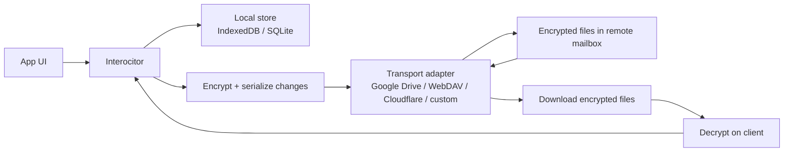

<p align="center">
  <a href="https://github.com/TheUiTeam/interocitor">
    
  </a>
</p>

<p align="center">
  <strong>A mailbox that can't read your mail.</strong>
</p>

<p align="center">
  Privacy-first, local-second sync for apps that should stay readable only on the client.
</p>

## Monorepo umbrella

This repository contains the core JavaScript package, a Swift port, transport runtimes, and runnable examples.

- `packages/interocitor` — the main JavaScript/TypeScript package
- `packages/interocitor-swift` — the Swift runtime for Apple platforms
- `packages/interocitor-webdav` — a local WebDAV server for development and testing
- `packages/interocitor-workers` — Cloudflare Workers runtime for Interocitor-native sync flows
- `examples/todo-webdav` — TODO demo over local/self-hosted WebDAV
- `examples/todo-cloudflare-do` — TODO demo over Cloudflare Worker + Durable Objects

Useful links:

- JS package: [`packages/interocitor`](https://github.com/TheUiTeam/interocitor/tree/main/packages/interocitor)
- Swift package: [`packages/interocitor-swift`](https://github.com/TheUiTeam/interocitor/tree/main/packages/interocitor-swift)
- WebDAV helper: [`packages/interocitor-webdav`](https://github.com/TheUiTeam/interocitor/tree/main/packages/interocitor-webdav)
- Workers runtime: [`packages/interocitor-workers`](https://github.com/TheUiTeam/interocitor/tree/main/packages/interocitor-workers)

## Why

You need a mailbox that can't read your mail.

Interocitor is **privacy-first, local-second**.

There are excellent local-first sync solutions. If you need real-time collaboration, rich queries, or operational transforms — use them. They will outperform Interocitor on almost every axis:

| If you need | Use |
| --- | --- |
| Real-time multiplayer | [Logux](https://logux.org/), [Automerge](https://automerge.org/), [Yjs](https://yjs.dev/) |
| Postgres ↔ local sync | [ElectricSQL](https://electric-sql.com/), [PowerSync](https://www.powersync.com/), [Zero](https://zero.rocicorp.dev/) |
| Full-stack local-first DB | [Triplit](https://www.triplit.dev/), [Dexie Cloud](https://dexie.org/cloud/) |
| Managed backend with offline | [Firebase](https://firebase.google.com/), [Supabase](https://supabase.com/), [Convex](https://www.convex.dev/) |
| Reactive local store | [TinyBase](https://tinybase.org/) |

Now you wonder why Interocitor exists.

Every system above merges data on the server — or needs the server to understand document structure for partial sync, conflict resolution, or query evaluation. The server must read the data to do its job. That makes client-side encryption structurally impossible. You can encrypt at rest, you can encrypt in transit, but you cannot encrypt *from the sync layer itself*. The moment your CRDT merge runs server-side, your plaintext — and your personal information — is there too.

Interocitor makes a different trade-off. All merge happens on the client. The transport — Google Drive, WebDAV, Cloudflare R2, a USB stick — is a dumb byte pipe. It never parses, queries, or merges your data. So you can encrypt at the edge with AES-256-GCM before anything leaves the device, and sync still works, because it was never going to look inside the payload anyway.

What you give up for this:

- No server-side queries — all reads hit local IndexedDB or SQLite
- No partial sync — every device gets the full dataset

What you get:

- **True end-to-end encryption** — cloud provider sees ciphertext, always
- **Zero-infrastructure sync** — no purpose-built server, no vendor dependency
- **Transport-agnostic** — swap Google Drive for WebDAV mid-session, add a Cloudflare Worker for push
- **Offline-native** — reads and writes never leave local storage

The strongest use case: syncing your own data across your own devices — laptop, phone, tablet — without anyone else touching your plaintext. For this you don't need a sync service. You need a mailbox that can't read your mail.

## Quick start

```ts
import { Interocitor } from 'interocitor';
import { MemoryAdapter } from 'interocitor/adapters/memory';

const engine = new Interocitor({
  dbName: 'demo-app',
  schema: {
    todos: {
      indexes: ['done', 'createdAt']
    }
  },
  adapter: new MemoryAdapter(),
  encryption: {
    passphrase: 'correct horse battery staple'
  }
});

await engine.init();

await engine.put('todos', {
  id: 'todo-1',
  text: 'Ship privacy-first sync',
  done: false,
  createdAt: Date.now()
});

const todos = await engine.query('todos');
await engine.sync();
```

## How sync works

Interocitor keeps the full working dataset local. Cloud storage only carries encrypted sync artifacts.



## Core API at a glance

- `await engine.init()` — open local storage and load state; no network required
- `await engine.put(table, row)` — insert or update a row locally
- `await engine.delete(table, id)` — tombstone locally
- `await engine.query(table, options?)` — read from local indexes only
- `await engine.sync()` — exchange encrypted artifacts with the remote adapter
- `engine.on('change', handler)` — subscribe to local or synced changes

## Offline guarantee

| Operation | Network? | Backing store |
| --- | --- | --- |
| `init()` | No | IndexedDB / SQLite |
| `put()` | No | IndexedDB / SQLite |
| `delete()` | No | IndexedDB / SQLite |
| `query()` | No | IndexedDB / SQLite |
| `sync()` | Yes, when adapter exists | Remote mailbox |

## Adapters

### Google Drive

Use Google Drive as the remote mailbox when you want zero new backend infrastructure and are comfortable with full-dataset replication.

### WebDAV

Use WebDAV when you want a self-hosted or locally inspectable byte pipe. Good for demos, debugging, and private infrastructure.

### Cloudflare (Interocitor-native, experimental)

Use the Cloudflare adapter when you want Interocitor-aware transport features like invalidation fanout while keeping merge and decryption on the client.

### Memory

Use the memory adapter for tests, local demos, and contract validation.

## Encryption

Interocitor is designed so encryption is compatible with sync, not bolted on after the fact.

- AES-256-GCM payload encryption on the client
- Remote transport only sees ciphertext and metadata needed for file exchange
- Merge, conflict resolution, and query evaluation remain local

### Client-side fingerprint verification

You can surface key fingerprints in the UI so users can verify that multiple devices joined the same encrypted dataset intentionally.

## CRDT strategy

Interocitor uses a client-side CRDT model with hybrid logical clocks. The key point is architectural: remote storage is not trusted to merge your state.

## Events

```ts
engine.on('change', (event) => {
  console.log(event.type, event.table, event.id);
});
```

## Cloud folder layout

```text
<remotePath>/
  snapshot.meta
  changes/
    0000000001.json
    0000000002.json
  blobs/
    ...encrypted payloads...
```

## Demos

### Local TODO demo (WebDAV)

```bash
yarn demo:todo
```

Then open:

- `http://127.0.0.1:4173/examples/todo-webdav/index.html`

### Cloudflare TODO demo

```bash
yarn test:e2e:cloudflare
```

See `examples/todo-cloudflare-do` for runtime and deployment details.

## What this is not

- **Not a multiplayer CRDT platform** — if you need real-time collaboration with server-assisted merge, use Automerge, Yjs, or Logux
- **Not a queryable backend** — remote storage is a mailbox, not a database
- **Not partial sync** — each device eventually holds the full dataset
- **Not a plaintext cloud cache** — remote artifacts are meant to stay unreadable to the transport

## Tests

From the repo root:

```bash
yarn build
yarn test:e2e
yarn test:e2e:todo
yarn test:e2e:cloudflare
```

## Package map

- [`packages/interocitor`](./packages/interocitor) — the main JavaScript/TypeScript engine with adapters and encryption helpers
- [`packages/interocitor-swift`](./packages/interocitor-swift) — Swift-native runtime for Apple platforms using the same client-side sync model
- [`packages/interocitor-webdav`](./packages/interocitor-webdav) — local WebDAV server for demos, testing, and artifact inspection
- [`packages/interocitor-workers`](./packages/interocitor-workers) — Cloudflare Workers runtime for Interocitor-native transport flows
- [`examples/todo-webdav`](./examples/todo-webdav) — manual playground showing two browser tabs syncing through WebDAV
- [`examples/todo-cloudflare-do`](./examples/todo-cloudflare-do) — Cloudflare Worker + Durable Object example with SSE invalidation

## License

MIT
