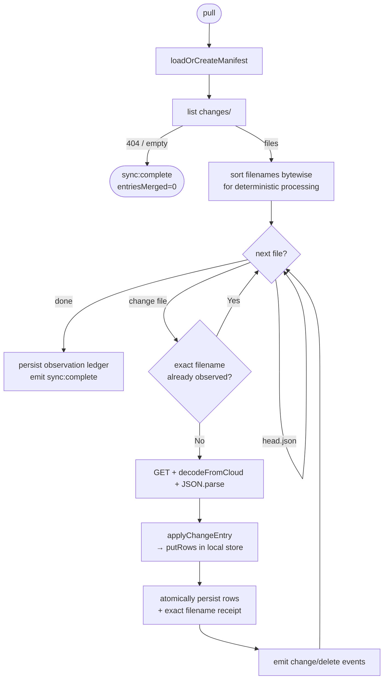
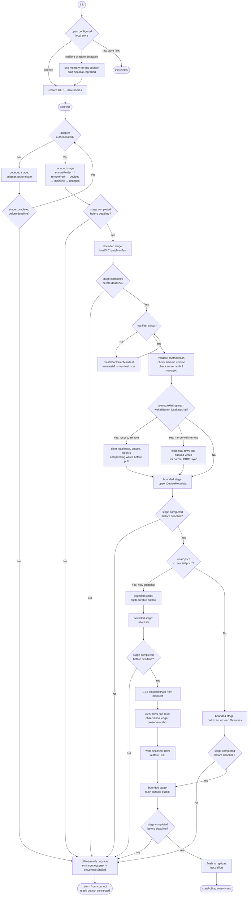
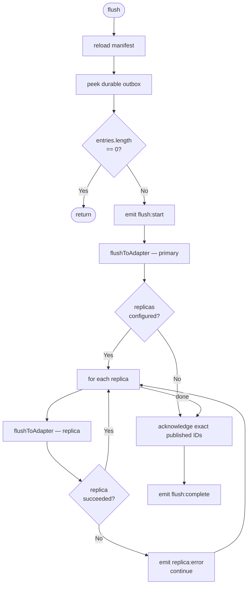
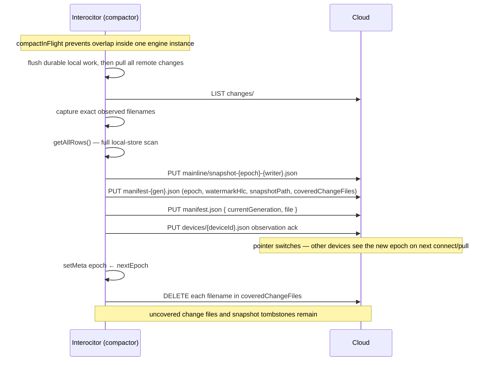
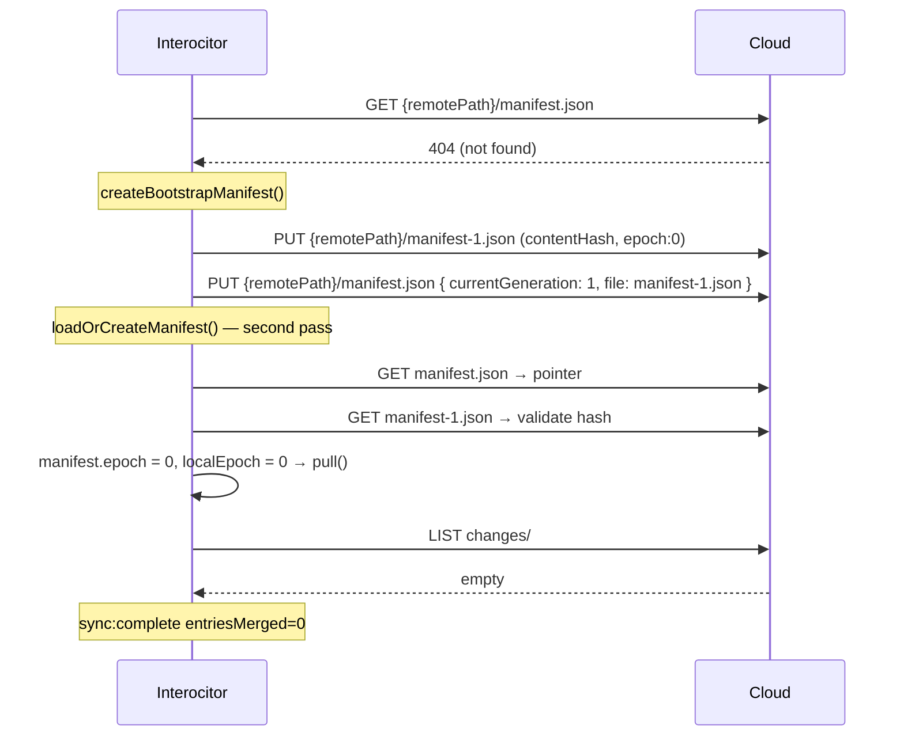
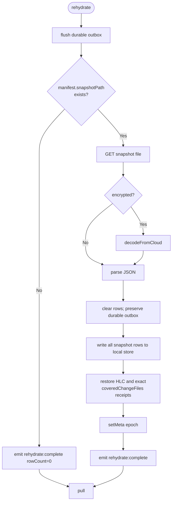

# Protocol flows

Detailed Mermaid diagrams for row-sync protocol paths. Durable files and
images use direct `putFile` / `getFile` / `deleteFile` operations under the
mesh `files/` namespace. They do not participate in the local row outbox,
pull, flush, or compaction, so callers need live transport and their own retry
policy. For the project overview, see [README.md](../README.md).

## Pull — exact receipt and merge



**Key invariant:** exact immutable filename identity is authoritative. HLCs
order conflicting CRDT operations deterministically, but neither a cursor nor
`head.json` proves that a lower-HLC file was previously observed.

## Connect and engine lifecycle



**Offline row behavior:** `init()` never touches the network. After the
configured local store initializes successfully, row operations through
`table(...)`—including `add`, `patch`, `replace`, `delete`, `row`, `query`, and
`where`—work against that store. Memory fallback is conditional: applications
must select the resilient local-store wrapper to degrade when its backing
store is blocked, closing, unavailable, or stalled. A raw
`IndexedDbLocalStore` does not provide that fallback. Durable file methods are
direct adapter operations and do not share the offline row behavior.

**Connect stage deadlines:** `connect()` begins the row-sync network
lifecycle. Authentication, folder setup, manifest loading, device metadata,
rehydration, pull, and flush use `connectStageTimeoutMs` (15s by default). A
timeout in one of those guarded stages emits `connect:error`, calls
`onConnectStalled`, and returns offline-ready so the app can retry later.

**Join-existing-mesh policy:** after `connect()` loads an existing remote
manifest and before device metadata, pull, or flush, the engine compares the
remote `meshId` with local mesh metadata. If they differ,
`joinExistingMeshPolicy` applies. The default `reset-to-remote` clears local
rows, outbox, pending writes, cursors, and stale mesh metadata before pulling
remote data. `merge-with-remote` keeps local rows and queued writes so normal
CRDT pull/flush can merge them into the joined mesh.

**Failure semantics:** local-store degradation and connect-stage stalls are
availability fallbacks, not successful sync. A degraded local store may lose
session-only writes on reload until they have flushed remotely. An
offline-ready `connect()` means the engine is ready for local work but is
disconnected from the remote. Validation errors such as encryption
mismatch, poison, or schema incompatibility are not availability fallbacks;
they still surface as hard correctness/security errors.

**Disaster recovery:** the durable local database name is a cache
namespace, not mesh identity. If a browser keeps a DB blocked or a handle
keeps closing, applications can rotate to a new versioned local DB name and
continue. Old DB names are cleaned up opportunistically when the platform
supports IndexedDB enumeration; cleanup must never block app startup.

## Flush (local → cloud)



Each `flushToAdapter` call writes one JSON file per change entry,
then updates `changes/head.json` with the latest HLC.

## Compaction



**Write ordering:** snapshot → manifest file → manifest pointer.
Readers loading `manifest.json` always see a consistent pair; the
snapshot file exists before any reader is directed to it.

Other devices detect epoch advancement on the next `connect()` or `pull()`.
If `remoteEpoch > localEpoch`, an old client first publishes durable local
work, then rehydrates from the snapshot and pulls every remaining filename not
present in the snapshot's exact receipt set. A new client has no local work and
can restore immediately.

The adapter contract does not provide CAS/ETag writes, so compaction is not
strictly race-safe across concurrent devices: one valid manifest pointer can
overwrite another. A single in-flight guard only deduplicates work within one
Interocitor instance. Use a server-managed single compactor when strict
coordination is required; see
[Compaction coordination](../packages/core/docs/compaction.md#coordination--locking).

## Bootstrap (first-ever connect)



## Rehydration (after compaction by another device)



## Replica flush

Replicas are write-only mirrors of the primary remote. The engine
writes the same change files + head.json to each replica on every flush.
Replica failures are non-fatal — the primary write must succeed, but
replica errors only emit a `replica:error` event.

```mermaid
flowchart LR
    subgraph Primary
        A[changes/head.json]
        B[changes/{hlc}-{id}.json]
    end

    subgraph Replica 1
        C[changes/head.json]
        D[changes/{hlc}-{id}.json]
    end

    subgraph Replica 2
        E[changes/head.json]
        F[changes/{hlc}-{id}.json]
    end

    FLUSH([flush]) --> Primary
    FLUSH -.->|best-effort| C
    FLUSH -.->|best-effort| E
```

Pull always reads from the primary adapter only.
