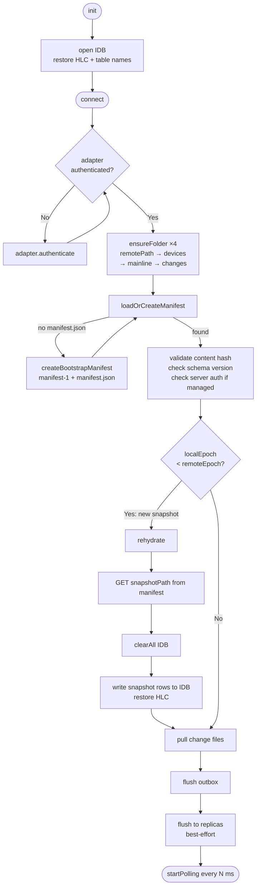
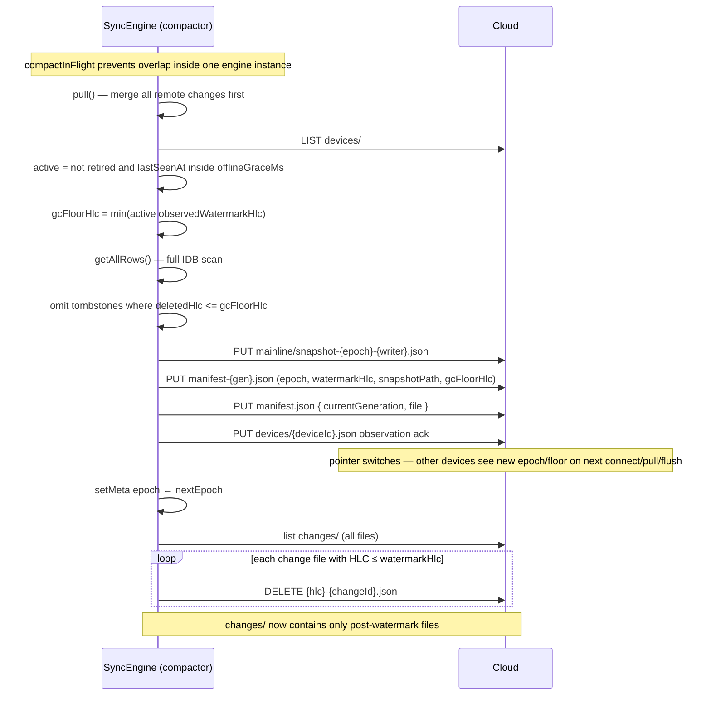
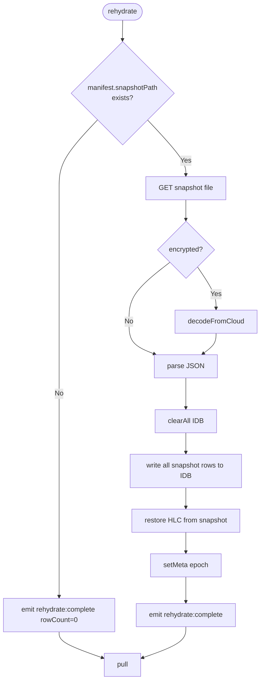

# Protocol Flows

Detailed Mermaid diagrams for row-sync protocol paths. Durable files/images use direct `putFile`/`getFile`/`deleteFile` operations under the mesh `files/` namespace and do not participate in pull/flush/compaction. For the bird's-eye overview see [README.md](../README.md).

## Pull — fast-skip and merge


**Key invariant:** the cursor is an HLC string. It advances monotonically.
Files whose HLC prefix sorts ≤ cursor are never downloaded — the filename
itself is enough to skip them.

## Connect and engine lifecycle



**Offline guarantee:** `init()` never touches the network. After `init()`,
`put()`, `delete()`, `get()`, `query()`, and `queryWhere()` all work
against local IndexedDB. `connect()` is the first network call.

## Flush (local → cloud)


Each `flushToAdapter` call writes one JSON file per change entry,
then updates `changes/head.json` with the latest HLC.

## Compaction



**Write ordering:** snapshot → manifest file → manifest pointer.
Readers loading `manifest.json` always see a consistent pair; the
snapshot file exists before any reader is directed to it.

Other devices detect epoch/floor advancement on the next `connect()`,
`pull()`, or `flush()` manifest reload. If `remoteEpoch > localEpoch`,
they `rehydrate()` from the snapshot and then pull deltas above the
watermark. If their outbox contains entries at or before `gcFloorHlc`,
flush is refused and the device aligns from the canonical snapshot.

## Bootstrap (first-ever connect)


## Rehydration (after compaction by another device)



## Replica flush

Replicas are write-only mirrors of the primary remote. The engine
writes the same change files + head.json to each replica on every flush.
Replica failures are non-fatal — the primary write must succeed, but
replica errors only emit a `replica:error` event.

```mermaid
flowchart LR
    subgraph Primary
        A[changes/head.json]
        B[changes/{hlc}-{id}.json]
    end

    subgraph Replica 1
        C[changes/head.json]
        D[changes/{hlc}-{id}.json]
    end

    subgraph Replica 2
        E[changes/head.json]
        F[changes/{hlc}-{id}.json]
    end

    FLUSH([flush]) --> Primary
    FLUSH -.->|best-effort| C
    FLUSH -.->|best-effort| E
```

Pull always reads from the primary adapter only.

