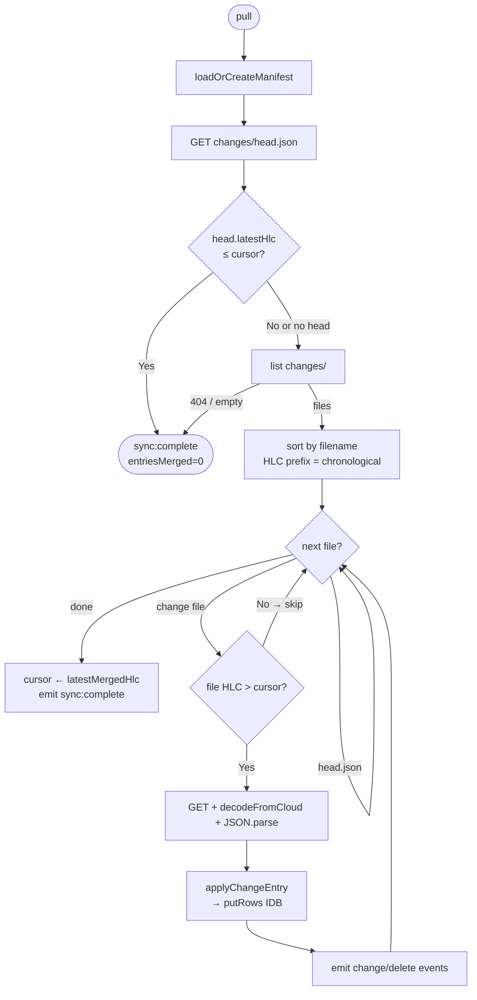
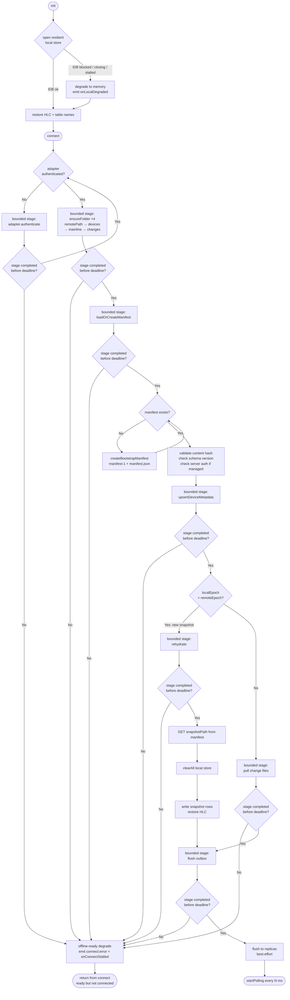
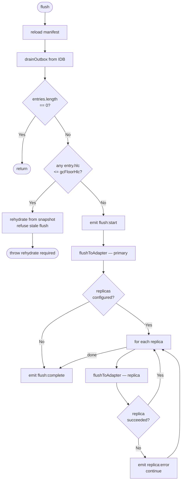
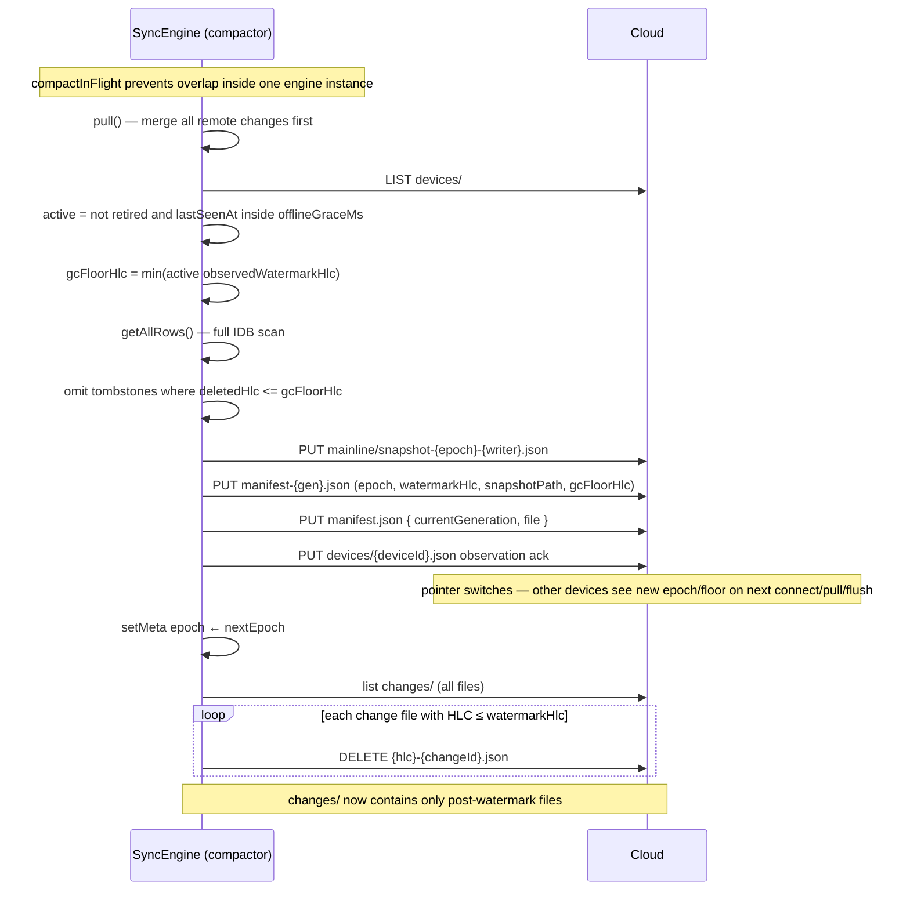

# Protocol Flows

Detailed Mermaid diagrams for row-sync protocol paths. Durable files/images use direct `putFile`/`getFile`/`deleteFile` operations under the mesh `files/` namespace and do not participate in pull/flush/compaction. For the bird's-eye overview see [README.md](../README.md).

## Pull — fast-skip and merge



**Key invariant:** the cursor is an HLC string. It advances monotonically.
Files whose HLC prefix sorts ≤ cursor are never downloaded — the filename
itself is enough to skip them.

## Connect and engine lifecycle



**Offline guarantee:** `init()` never touches the network. After `init()`,
`put()`, `delete()`, `get()`, `query()`, and `queryWhere()` all work
against the local store. IndexedDB is preferred but not required: if it is
blocked, closing, unavailable, or fails to make progress, the resilient
store degrades to memory so the app can continue.

**Bounded connect guarantee:** `connect()` is the first network call. Each
cloud stage has a bounded-progress deadline (`connectStageTimeoutMs`, 15s
by default). A stalled stage emits `connect:error` and calls
`onConnectStalled`, then returns offline-ready: `init()` remains complete,
local writes keep queuing, and the app can retry `connect()` later.

**Failure semantics:** local-store degradation and connect-stage stalls are
availability fallbacks, not successful sync. A degraded local store may lose
session-only writes on reload until they have flushed remotely. An
offline-ready `connect()` means the engine is ready for local work but is
not yet connected to the remote. Validation errors such as mesh mismatch,
encryption mismatch, poison, or schema incompatibility are not availability
fallbacks; they still surface as hard correctness/security errors.

**Disaster recovery:** the durable local database name is a cache
namespace, not mesh identity. If a browser keeps a DB blocked or a handle
keeps closing, applications can rotate to a new versioned local DB name and
continue. Old DB names are cleaned up opportunistically when the platform
supports IndexedDB enumeration; cleanup must never block app startup.

## Flush (local → cloud)



Each `flushToAdapter` call writes one JSON file per change entry,
then updates `changes/head.json` with the latest HLC.

## Compaction



**Write ordering:** snapshot → manifest file → manifest pointer.
Readers loading `manifest.json` always see a consistent pair; the
snapshot file exists before any reader is directed to it.

Other devices detect epoch/floor advancement on the next `connect()`,
`pull()`, or `flush()` manifest reload. If `remoteEpoch > localEpoch`,
they `rehydrate()` from the snapshot and then pull deltas above the
watermark. If their outbox contains entries at or before `gcFloorHlc`,
flush is refused and the device aligns from the canonical snapshot.

## Bootstrap (first-ever connect)


## Rehydration (after compaction by another device)


## Replica flush

Replicas are write-only mirrors of the primary remote. The engine
writes the same change files + head.json to each replica on every flush.
Replica failures are non-fatal — the primary write must succeed, but
replica errors only emit a `replica:error` event.

```mermaid
flowchart LR
    subgraph Primary
        A[changes/head.json]
        B[changes/{hlc}-{id}.json]
    end

    subgraph Replica 1
        C[changes/head.json]
        D[changes/{hlc}-{id}.json]
    end

    subgraph Replica 2
        E[changes/head.json]
        F[changes/{hlc}-{id}.json]
    end

    FLUSH([flush]) --> Primary
    FLUSH -.->|best-effort| C
    FLUSH -.->|best-effort| E
```

Pull always reads from the primary adapter only.

