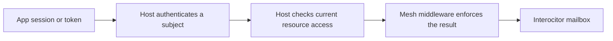

## Name the four locks {#model}

An Interocitor **mesh** is one shared row database and its remote history. In a Cloudflare deployment, a **Worker** is the HTTP gate in front of that remote mailbox.

Reaching the data crosses four independent boundaries:

| Boundary                | The question it answers                                                                           |
| ----------------------- | ------------------------------------------------------------------------------------------------- |
| **Authentication**      | Who is making this request? The host application verifies a session, token, or device credential. |
| **Mesh authorization**  | May that subject use this mesh now? Worker middleware checks current application policy.          |
| **Mesh-key possession** | Can this endpoint decrypt the mesh’s rows and ordinary files?                                     |
| **Tainted-file key**    | Can this endpoint decrypt one durable file whose audience is narrower than the mesh?              |

These boundaries deliberately disagree sometimes. A signed-in user can be denied a mesh. An admitted request can fetch ciphertext the endpoint cannot decrypt. A device holding the key can still be refused by the Worker.

A mesh address is routing, not authentication. A mesh key is a decryption capability, not a login token.

## Keep authentication outside Interocitor {#middleware}

The normal multi-user design uses the identity system the application already trusts:

The host owns provider login, callback handling, sessions, membership, and revocation freshness. It must produce a stable, server-verified subject; a name or author field claimed by the client is not identity.

Interocitor’s `meshMiddleware` is the integration point for IO and live-notify requests. Its standard authorization layer translates host policy into `none`, `readonly`, `full`, or `deny`, then enforces that result before mailbox storage runs. `readonly` is a raw Worker permission, not a complete read-only client mode: a normally connected client also writes small device records.

Keep a stable mesh address when ordinary application membership already answers who belongs. Removing a member then blocks later requests and new live connections without changing the mesh name.

Provider login can run in framework middleware before the Interocitor mount, or an earlier custom `meshMiddleware` can issue a sign-in challenge. Recovery, health, and administration are separate routes and need their own host policy. “Auth lives outside Interocitor” means the host establishes identity and policy while Interocitor supplies an enforcement boundary around its routes.

## Twelve words recover a key, not an account {#recovery}

A recovery phrase restores portable mesh credentials after local key loss. It does not sign the person in.

Interocitor accepts any non-empty normalized phrase; the application owns its format and validation. Twelve random BIP-39 words are one sensible choice: 128 bits of entropy plus a checksum. User-chosen words are not safe.

The phrase is processed on the client. It derives an opaque remote locator and the key that opens a recovery wrapper. That wrapper contains the portable mesh key, mesh identity, and remote path. The remote receives neither the words nor the mesh key.

Recovery does not restore the application session, Google or WebDAV credentials, or a separately provisioned Worker address. The Worker recovery route is also outside mesh middleware by default. A deployment that wants account-gated recovery must wrap that route in host authentication or issue a dedicated recovery credential.

A copied wrapper permits offline phrase guesses, so high entropy matters. Removing the wrapper closes that recovery path; it cannot revoke a mesh key that was already recovered or copied.

## Use taints for a narrower file audience {#taints}

The mesh key opens the complete row database and ordinary durable files. When one file needs fewer readers, Interocitor can seal it with an additional key. A **taint** is the real name for the label that tells the application which extra key is required, such as `legal` or `incident-command`.

The authoritative taint lives in the row that references the file. That lets an offline client show the file and its locked state before downloading the bytes. File metadata repeats the taint as a safety check.

A taint is not an ACL. Interocitor does not decide what `legal` means or who receives that key. The host application owns the mapping from authenticated subject to taint group to wrapped key, plus the unlock experience and key rotation. Worker authorization can govern the download request; the extra key governs decryption after download.

Use a separate mesh when the rows also need a smaller audience. Use a taint when the rows may remain shared but one attachment cannot. [Read the tainted-file model](/tainted-files).

## Add protected grants only for delegation {#grants}

Most applications need no Interocitor-specific grant system. Stable mesh addresses plus host membership are simpler and make ordinary removal immediate on the next request.

Protected mesh control exists for products that issue authority of their own: expiring access, delegation with a bounded depth, narrowing `full` access to `readonly`, revoking a child without changing normal membership, or replacing a subject’s public route.

Authentication still stays outside Interocitor. The host first verifies the subject. Grant middleware then loads and validates that subject’s current grant chain before each IO or notify request.

This creates a small server-readable control plane containing subjects, routes, permissions, expiry, and revocation. Protected application rows remain encrypted. The host owns the control store, trusted roots, approval UI, and grant lifecycle; Interocitor supplies the enforcement rules. Do not use the protected CRDT mesh itself as live authorization state—the Worker cannot read it, and a mailbox may be stale or rolled back.

## Revoke both network and cryptographic access {#revocation}

Revocation has two different edges:

- Host membership, middleware policy, grant revocation, and route removal control future Worker access. They do not necessarily close a live connection that was admitted earlier.
- Those actions cannot erase plaintext or keys already copied to an endpoint. A compromised mesh key requires a new mesh and data migration.
- Removing one tainted-file reader may also require a new extra key and resealing the affected files.
- Deleting a recovery wrapper removes future recovery through it, not keys recovered earlier.

Middleware controls the network path. Key rotation controls what old key material can decrypt. A complete revocation plan needs both.

Continue with [key custody and recovery](/trust), [tainted files](/tainted-files), or [the security boundary](/security).

## Decision summary {#summary}

| Need                         | Recommended composition                                                                   |
| ---------------------------- | ----------------------------------------------------------------------------------------- |
| **Ordinary multi-user auth** | Stable mesh + host identity and current resource policy enforced through mesh middleware. |
| **Lost-device recovery**     | High-entropy recovery phrase; twelve BIP-39 words are an application choice, not a login. |
| **One file, fewer readers**  | Taint label + additional application-managed file key.                                    |
| **Delegated mesh authority** | Host authentication + grant middleware + host-owned, server-readable control state.       |
