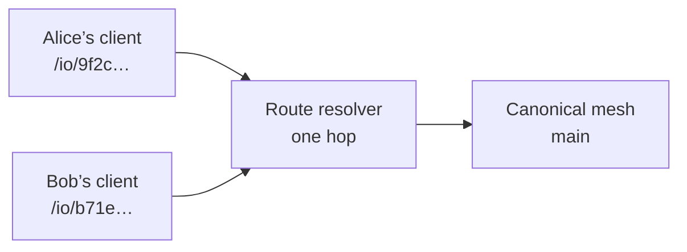
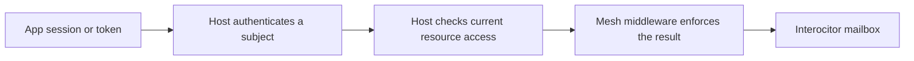

## Interocitor manages encrypted data, not access {#job}

Interocitor has one job: keep application data encrypted on trusted endpoints, exchange it through a mailbox, and merge it back into a consistent local database. Controlling **who** may reach that mailbox is not its job.

That is the same arrangement you already accept with Google Drive. Google decides which account may open a folder. The files inside know nothing about it. Interocitor keeps the same separation for every storage medium it supports:

| Mailbox               | Who controls access                            | Interocitor’s part                                                          |
| --------------------- | ---------------------------------------------- | --------------------------------------------------------------------------- |
| **Google Drive**      | The user and their Google account              | Uses the OAuth token the application obtained; never asks for the password. |
| **WebDAV / NAS**      | The user and the server’s login                | Sends the credential the application configured.                            |
| **Cloudflare Worker** | The host application and its identity provider | Runs the host’s middleware decision before the mailbox route.               |

An application can sit behind any provider it already trusts:

- **Cloudflare Zero Trust.** Cloudflare Access authenticates the person and the device before the request reaches the Worker. The Worker verifies the Access JWT and maps the identity to a mesh. Interocitor sees an admitted or rejected request, nothing more.
- **Google account.** A Drive mailbox is protected by Google sign-in and the scope the user granted. A Worker deployment can verify a Google ID token in the host’s middleware instead.
- **GitHub.** A host using a GitHub App can authenticate the person with a user-to-server token and map current repository, organization, or team membership to a mesh.

In each case the provider owns login, sessions, membership, and revocation. The host translates that into a decision. Interocitor enforces the decision and keeps the data encrypted regardless of how it came out.

## Strengthen access with per-user mesh aliases {#aliases}

Access control stays with the provider, but Interocitor can make the host’s job easier. A Worker can hand each user a **virtual mesh alias**: an opaque, user-specific address that resolves in one hop to the real mesh.



The canonical mesh, its D1 rows, file bodies, and relay never move. Only the alias is personal:

- Revoking Bob means deleting Bob’s alias binding. Alice’s address, the mesh name, and the mesh key are untouched.
- A leaked alias identifies one user, not the whole mesh, and can be replaced without re-keying.
- Aliases combine with middleware. The resolver maps the alias to a mesh; the host’s authorization still decides whether this request may use it now.

An alias is still routing, not authentication. It does not replace the identity provider, and it does not prove who is holding it. [Protected grants](#grants) below and the [Worker mesh-control guide](https://github.com/Machine-Garden/interocitor/blob/main/packages/workers/docs/mesh-control.md) describe the route resolver and the control store the host owns.

## Let the client understand 4xx and react {#client}

Because access lives outside Interocitor, the client must recognise an access decision when it arrives. A denied request is not transport noise to retry. It is an event the application needs to hear.

The Worker answers with ordinary HTTP status codes, and the client treats each one as a distinct outcome:

| Status  | Meaning                                                   | What the application should be able to do                   |
| ------- | --------------------------------------------------------- | ----------------------------------------------------------- |
| **401** | No valid identity. The provider wants a sign-in.          | Open the provider’s login flow, then reconnect.             |
| **403** | Identified, but this mesh or this write is not allowed.   | Show read-only state, or explain that access was removed.   |
| **404** | The address is unknown, or denial is deliberately hidden. | Treat as “no such mesh for you”; drop or replace the alias. |
| **429** | Quota or rate limit.                                      | Back off; this is not an access change.                     |
| **503** | The host’s policy service failed.                         | Retry later; the decision is unknown, not negative.         |

Three rules follow from this table:

1. **Classify, do not swallow.** A `401` or `403` must surface with its code intact, not collapse into a generic sync failure that the application cannot act on.
2. **Stop blind retries on 4xx.** Retrying a denied request will not make the provider change its mind. The client pauses publishing and collecting for that mesh until the application reacts.
3. **Emit an event the host can react to.** Local-first work continues; the application subscribes to the engine’s event stream, prompts for sign-in, switches to a read-only view, or leaves the mesh. Interocitor performs none of those steps itself. It has no login page, no token refresh, and no redirect.

This is the contract that keeps the boundary honest. The provider decides. The Worker enforces. The client understands the answer and gives the application a clear moment to respond.

In code, the moment is the `remote:access` event. The Cloudflare, WebDAV, and Google Drive adapters turn the statuses above into a `RemoteAccessError` with `status`, `kind` (`unauthenticated`, `forbidden`, `not-found`, `rate-limited`, `policy-unavailable`), the adapter, the operation, and the path. When the decision is a denial, the engine pauses polling and publishing for that mesh, flips `connected` to false, and emits the event with `paused: true`. Local reads and writes continue.

```ts
db.on((event) => {
  if (event.type !== "remote:access" || !event.paused) return;
  if (event.kind === "unauthenticated") {
    const token = await signInWithProvider(); // Zero Trust, Google, GitHub: your flow
    adapter.setToken(token);
    await db.connect(); // emits remote:access:restored on success
  } else if (event.kind === "forbidden") {
    showReadOnlyBanner();
  } else if (event.kind === "not-found") {
    leaveMesh(); // the alias was revoked or never existed for this subject
  }
});
```

The current decision is also available synchronously through `db.getRemoteAccessError()`, in `db.getConnectionStatusDetails().remoteAccess`, and in React through `useRemoteAccess(db)`. Rate limits and policy outages arrive through the same event with `paused: false`; the engine backs polling off and stays connected.

## Name the four locks {#model}

An Interocitor **mesh** is one shared row database and its remote history. In a Cloudflare deployment, a **Worker** is the HTTP gate in front of that remote mailbox.

Reaching the data crosses four independent boundaries:

| Boundary                | The question it answers                                                                           |
| ----------------------- | ------------------------------------------------------------------------------------------------- |
| **Authentication**      | Who is making this request? The host application verifies a session, token, or device credential. |
| **Mesh authorization**  | May that subject use this mesh now? Worker middleware checks current application policy.          |
| **Mesh-key possession** | Can this endpoint decrypt the mesh’s rows and ordinary files?                                     |
| **Tainted-file key**    | Can this endpoint decrypt one durable file whose audience is narrower than the mesh?              |

These boundaries deliberately disagree sometimes. A signed-in user can be denied a mesh. An admitted request can fetch ciphertext the endpoint cannot decrypt. A device holding the key can still be refused by the Worker.

A mesh address is routing, not authentication. A mesh key is a decryption capability, not a login token.

## Keep authentication outside Interocitor {#middleware}

The normal multi-user design uses the identity system the application already trusts:



The host owns provider login, callback handling, sessions, membership, and revocation freshness. It must produce a stable, server-verified subject; a name or author field claimed by the client is not identity.

Interocitor’s `meshMiddleware` is the integration point for IO and live-notify requests. Its standard authorization layer translates host policy into `none`, `readonly`, `full`, or `deny`, then enforces that result before mailbox storage runs. `readonly` is a raw Worker permission, not a complete read-only client mode: a normally connected client also writes small device records.

Keep a stable mesh address when ordinary application membership already answers who belongs. Removing a member then blocks later requests and new live connections without changing the mesh name.

Provider login can run in framework middleware before the Interocitor mount, or an earlier custom `meshMiddleware` can issue a sign-in challenge. Recovery, health, and administration are separate routes and need their own host policy. “Auth lives outside Interocitor” means the host establishes identity and policy while Interocitor supplies an enforcement boundary around its routes.

## Twelve words recover a key, not an account {#recovery}

A recovery phrase restores portable mesh credentials after local key loss. It does not sign the person in.

Interocitor accepts any non-empty normalized phrase; the application owns its format and validation. Twelve random BIP-39 words are one sensible choice: 128 bits of entropy plus a checksum. User-chosen words are not safe.

The phrase is processed on the client. It derives an opaque remote locator and the key that opens a recovery wrapper. That wrapper contains the portable mesh key, mesh identity, and remote path. The remote receives neither the words nor the mesh key.

Recovery does not restore the application session, Google or WebDAV credentials, or a separately provisioned Worker address. The Worker recovery route is also outside mesh middleware by default. A deployment that wants account-gated recovery must wrap that route in host authentication or issue a dedicated recovery credential.

A copied wrapper permits offline phrase guesses, so high entropy matters. Removing the wrapper closes that recovery path; it cannot revoke a mesh key that was already recovered or copied.

## Use taints for a narrower file audience {#taints}

The mesh key opens the complete row database and ordinary durable files. When one file needs fewer readers, Interocitor can seal it with an additional key. A **taint** is the real name for the label that tells the application which extra key is required, such as `legal` or `incident-command`.

The authoritative taint lives in the row that references the file. That lets an offline client show the file and its locked state before downloading the bytes. File metadata repeats the taint as a safety check.

A taint is not an ACL. Interocitor does not decide what `legal` means or who receives that key. The host application owns the mapping from authenticated subject to taint group to wrapped key, plus the unlock experience and key rotation. Worker authorization can govern the download request; the extra key governs decryption after download.

Use a separate mesh when the rows also need a smaller audience. Use a taint when the rows may remain shared but one attachment cannot. [Read the tainted-file model](/tainted-files).

## Add protected grants only for delegation {#grants}

Most applications need no Interocitor-specific grant system. Stable mesh addresses plus host membership are simpler and make ordinary removal immediate on the next request.

Protected mesh control exists for products that issue authority of their own: expiring access, delegation with a bounded depth, narrowing `full` access to `readonly`, revoking a child without changing normal membership, or replacing a subject’s public route.

Authentication still stays outside Interocitor. The host first verifies the subject. Grant middleware then loads and validates that subject’s current grant chain before each IO or notify request.

This creates a small server-readable control plane containing subjects, routes, permissions, expiry, and revocation. Protected application rows remain encrypted. The host owns the control store, trusted roots, approval UI, and grant lifecycle; Interocitor supplies the enforcement rules. Do not use the protected CRDT mesh itself as live authorization state—the Worker cannot read it, and a mailbox may be stale or rolled back.

## Revoke both network and cryptographic access {#revocation}

Revocation has two different edges:

- Host membership, middleware policy, grant revocation, and route removal control future Worker access. They do not necessarily close a live connection that was admitted earlier.
- Those actions cannot erase plaintext or keys already copied to an endpoint. A compromised mesh key requires a new mesh and data migration.
- Removing one tainted-file reader may also require a new extra key and resealing the affected files.
- Deleting a recovery wrapper removes future recovery through it, not keys recovered earlier.

Middleware controls the network path. Key rotation controls what old key material can decrypt. A complete revocation plan needs both.

Continue with [key custody and recovery](/trust), [tainted files](/tainted-files), or [the security boundary](/security).

## Decision summary {#summary}

| Need                         | Recommended composition                                                                    |
| ---------------------------- | ------------------------------------------------------------------------------------------ |
| **Ordinary multi-user auth** | Stable mesh + host identity and current resource policy enforced through mesh middleware.  |
| **Per-user revocation**      | Virtual mesh alias per user, resolved in one hop; delete the binding to revoke.            |
| **Sign-in and denial UX**    | Client surfaces 401/403/404 as distinct events; the application reacts, Interocitor waits. |
| **Lost-device recovery**     | High-entropy recovery phrase; twelve BIP-39 words are an application choice, not a login.  |
| **One file, fewer readers**  | Taint label + additional application-managed file key.                                     |
| **Delegated mesh authority** | Host authentication + grant middleware + host-owned, server-readable control state.        |
