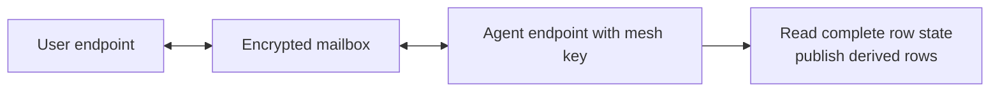

## Treat the agent as a trusted endpoint {#room}

An agent or background worker joins a mesh in the same security role as a user device. It opens a local store, receives or derives the mesh key, synchronizes rows, and publishes changes through the mailbox.

The mailbox does not schedule work or assign meaning to a row. The application defines which row transitions should trigger automation, how retries work, and where results are recorded.

## Do not mistake query scope for isolation {#privacy}

A key-bearing agent can read the complete row database even when its normal query selects one table or tenant. A filter limits expected behavior; it is not a confidentiality boundary.

Use a separate mesh when an agent should see only one tenant, when compromise needs a smaller blast radius, or when its external actions carry materially different risk. Moving data between meshes then becomes an explicit trusted operation owned by the application.

## Coordinate effects outside the CRDT {#duplicate}

CRDT merge rules make row replicas converge. They cannot make an external side effect happen exactly once. Two agents may both observe an unclaimed task before either change reaches the other, then both send the email or charge the payment.

Choose coordination by consequence:

| Requirement                              | Appropriate control                                           |
| ---------------------------------------- | ------------------------------------------------------------- |
| Repetition is harmless                   | Stable idempotency key accepted by the external receiver.     |
| One worker should usually act            | A visible claim or lease with owner, expiry, and retry rules. |
| Exactly one effect is a hard requirement | A central transactional coordinator that owns the effect.     |
| A result can be recomputed               | Deterministic result identity derived from the input.         |

“One claim eventually wins” does not prove that only one external action occurred.

## Define the processing loop {#routine}

For each automated workflow:

1. define the row state that makes work eligible;
2. reread the durable row immediately before acting;
3. assign a stable identity to each external effect;
4. record attempts, results, and failures;
5. bound retries and route repeatedly failing work for inspection;
6. monitor the agent and mailbox as separate dependencies.

Protect the agent’s key with the same care as any other trusted endpoint.

## Plan revocation and replacement {#last-day}

Removing mailbox access blocks later connections. It cannot erase a copied key, local rows, or secrets already sent to another service.

If the agent or mesh key is compromised, disable the agent, preserve evidence, create a new mesh and key, and migrate from an endpoint that remains trusted. Before launch, identify who can perform each step.

Continue with [endpoint trust](/trust), [mesh boundaries](/data-boundaries), or [the security model](/security).

## Decision summary {#summary}

|                      |                                                                                 |
| -------------------- | ------------------------------------------------------------------------------- |
| **Trust**            | A key-bearing agent can read the complete mesh and publish changes.             |
| **Containment**      | Use separate meshes for different readers and compromise boundaries.            |
| **External effects** | Add idempotency, leases, or a transactional owner; merge alone is insufficient. |
