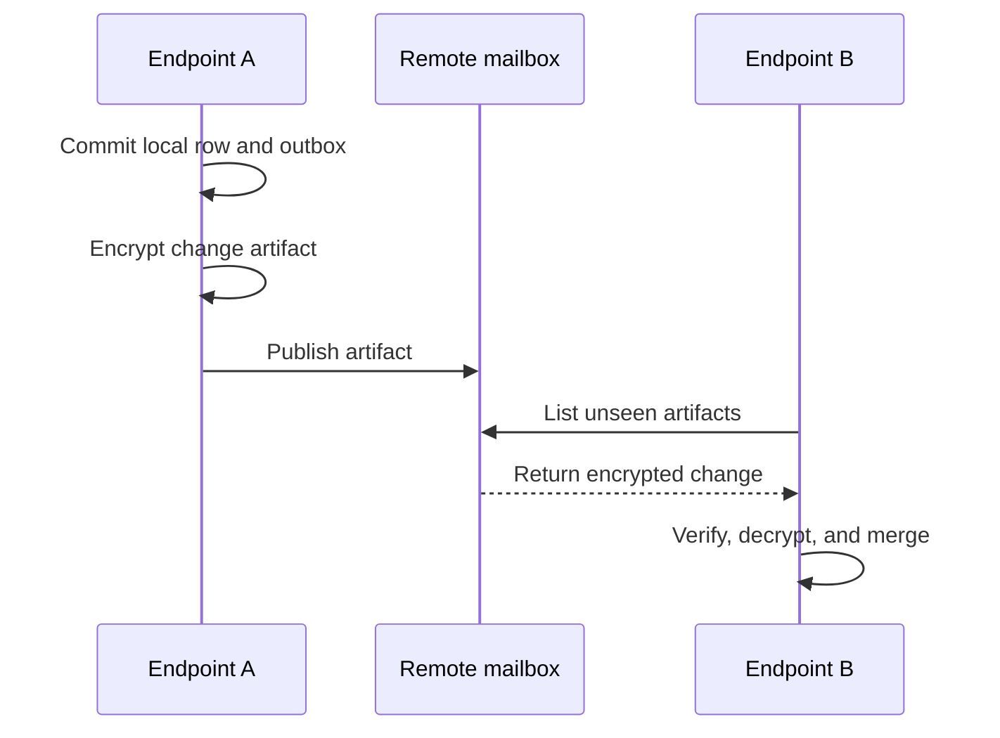
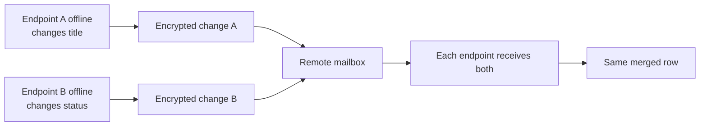
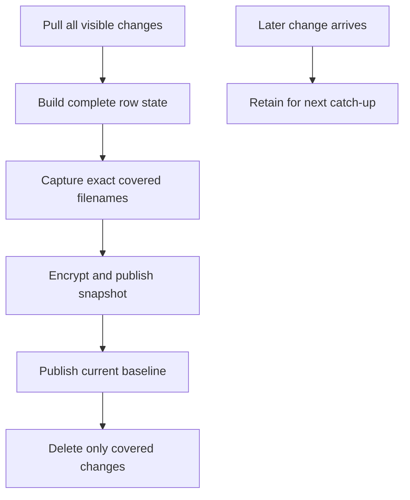
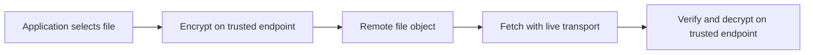
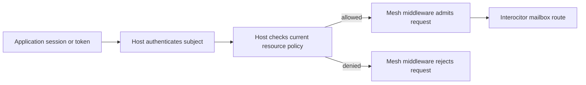

## Synchronize one row change {#edit}

The first endpoint commits a row change to its local store and outbox. When connected, it encrypts and publishes a change artifact. The second endpoint downloads the unseen artifact, decrypts it, and merges the operation into its own local store.

The mailbox never queries the row or selects a conflict winner. Trusted endpoints apply the schema’s merge rules.

## Merge two offline edits {#offline}

Two endpoints can change different fields of the same row while disconnected. After both artifacts are visible, each endpoint applies the same CRDT rules and reaches the same row state.

If both endpoints change the same field, the schema’s configured merge rule settles the conflict. Local-first operation does not imply arrival-order conflict resolution.

## Compact row history {#snapshot}

One trusted compactor reconstructs the complete known row state, records the exact change artifacts it covers, and publishes an encrypted snapshot before deleting anything.

This ordering is the core [compaction](/compaction) guarantee. Coverage is based on exact artifact identity, not a timestamp guess.

## Transfer a durable file directly {#file}

Durable files do not use the local row outbox. A trusted endpoint encrypts a file, sends it directly to the remote adapter, and fetches it directly when needed.

A row can retain the file path and metadata offline. The file bytes require transport unless the application adds its own cache.

## Authorize a mesh request {#access}

Authentication and encryption are separate. The host verifies a stable subject and evaluates current resource access; mesh middleware enforces that decision before Interocitor handles the request.

The mesh address selects storage and the mesh key decrypts protected data. Neither authenticates the requester. [The authentication guide connects recovery, grants, and tainted-file keys](/auth).

Continue with [the complete system model](/how-it-works) or [the security boundary](/security).
