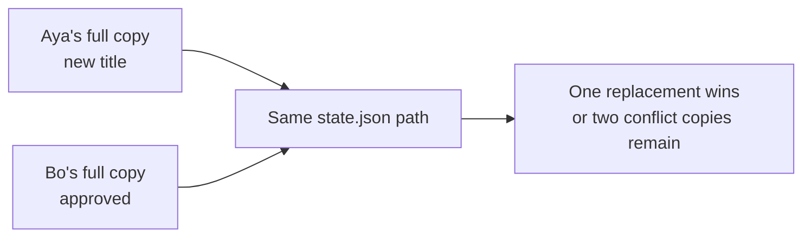
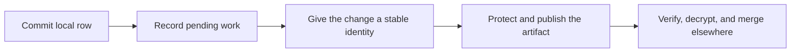
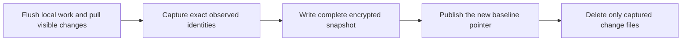

## Let’s begin with the problem Interocitor solves {#begin}

Most applications make a remote database the authority. Every read and write crosses the network, and the server decides what the current state means. That is a sensible design when the server is always reachable and is allowed to see, query, and coordinate the data.

Interocitor starts with a different storage promise: protected application data is encrypted on the trusted endpoint, **before the remote stores it**. The mesh key stays on trusted endpoints. Whether the mailbox is carried by WebDAV, Google Drive, or a Cloudflare Worker, protected payloads arrive as ciphertext and remain ciphertext while at rest there or in a remote backup.

The storage service does not need the mesh key to list, keep, or return those artifacts. Only the trusted endpoints you admit hold the key and plaintext. This does not make an endpoint invulnerable—a compromised endpoint can still expose both—but it removes remote storage from the plaintext trust boundary. Because Interocitor adds this protection at the application layer, its confidentiality boundary does not depend on how the storage platform encrypts disks or manages platform keys.

It becomes the wrong bargain when an application must keep working through a lost connection, when several endpoints may edit independently, or when the storage provider should carry protected data without receiving plaintext. Moving the same database into one shared file does not solve the coordination problem: two offline writers can each upload a complete but incomplete view, and one replacement can erase the other writer’s work.

Interocitor changes the unit of exchange. Each trusted endpoint owns a complete local row database and records each edit as a separate change. The remote stores those changes as protected artifacts. Trusted endpoints later collect the same facts and apply the same merge rules, so they can reach the same result without negotiating before every write.

> The network carries work between replicas. It is not permission to begin work.

This is why Interocitor is both **local-first** and **client-merged**. The application can respond from local state, while a remote mailbox can make artifacts available without becoming the application database or conflict authority.

## See why one shared state file fails {#evolution}

Aya changes a field report’s title while offline. Bo independently approves the same report. If both upload a complete `state.json` to one path, each file is based on a world that does not contain the other edit. The storage provider may keep the last upload or create a conflict copy, but it cannot infer that the new title and the approval belong together.



Interocitor publishes the two edits under distinct identities instead. Neither change replaces the other, and the trusted endpoints have the schema and key needed to combine their field-level intent.

## Identify the three responsibilities {#characters}

The design works because no component is pretending to be another one:

| Component                             | What it owns                                                                                                             | What it does not own                                     |
| ------------------------------------- | ------------------------------------------------------------------------------------------------------------------------ | -------------------------------------------------------- |
| **Application on a trusted endpoint** | Gives rows meaning, applies product policy, and decides which people and devices may participate.                        | Remote storage, synchronization, or generic merge logic. |
| **Interocitor runtime**               | Commits local row changes, records pending work, protects artifacts, and applies the schema’s deterministic merge rules. | The application UI, identity system, or product policy.  |
| **Remote mailbox**                    | Stores and returns change artifacts, snapshots, control records, and durable files.                                      | Row queries, application policy, or conflict resolution. |

Every participating endpoint has its own runtime and local row store. With a non-null key source, each key-bearing endpoint is trusted with the complete mesh: it may hold plaintext and can decrypt the rows and ordinary files it obtains. The mailbox is a rendezvous point for protected artifacts, not the database engine.

That boundary is the central trade-off. Interocitor removes the remote from the plaintext and merge path, but it places more responsibility on trusted endpoints and on the application that admits them.

## See how Interocitor stores data {#storage}

Interocitor does not copy one live database between machines. It keeps working rows and an outbox on each trusted endpoint, carries protected changes and snapshots through a remote sync mailbox, and stores durable files remotely on a separate path.

With protection configured, payloads are encrypted before the storage adapter receives them. The [storage chapter](/storage) shows exactly what rests locally, what remains visible remotely, and how WebDAV, Google Drive, Cloudflare + R2, and Cloudflare + S3 carry that model.

## Follow one row change from intent to convergence {#journey}

One edit crosses five boundaries. Each boundary exists for a reason:



### 1. Commit the row locally

The application writes to its local table. Interocitor commits the new row state and the pending description of that change together, before any remote publication begins. The application can immediately read the result from the same local store.

This is what makes the row path local-first: a temporary network failure does not become an application-write failure. Crash durability depends on the chosen local store. A durable browser or native store can preserve queued work across a reload or process restart; an in-memory store cannot.

### 2. Promote completed work to the outbox

Interocitor groups the completed local operation into pending work and promotes it to the local outbox. The outbox separates **accepted locally** from **published remotely**. With a durable local store, failed publication leaves the operation available for a later retry instead of asking the application to reconstruct the user’s intent.

This distinction also makes lifecycle boundaries honest. Opening the local store is enough for row work; connecting to the mailbox is a later step that catches the endpoint up and publishes queued work.

### 3. Give the change a stable identity and order

When the outbox is flushed, the operation becomes a uniquely named change artifact. Its identity prevents another writer from replacing it at the same path. Its hybrid logical clock, or **HLC**, supplies deterministic conflict order when two operations touch the same field.

Those jobs must not be confused. An HLC can answer “which value wins under this merge rule?” It cannot prove “every earlier change has been received.” Devices create changes independently and may publish an older-clocked artifact after another device has already advanced a newer clock.

### 4. Protect and publish the artifact

With a non-null key source, Interocitor encrypts and authenticates the row operation before handing it to the storage adapter. The adapter writes that opaque artifact to the mailbox. Object paths and control records remain visible so the mailbox can route and return data, but it does not receive the row schema or plaintext operation.

Publishing a separate artifact is what avoids the shared-file collision. Aya’s title change and Bo’s approval can coexist remotely even when neither writer knew about the other.

### 5. Pull, verify, and merge on another endpoint

Another endpoint lists the available change artifacts and subtracts the exact filenames it has already accepted. Head markers, cursors, and clocks can make work easier to find, but exact change identities are the observation record: a late file must remain eligible even when its HLC sorts behind the endpoint’s current frontier.

For every unseen artifact, the endpoint verifies and decrypts the payload, applies its CRDT operations to the local store, and records the artifact as observed. Only then can a later pull safely skip that identity.

The complete routine loop is therefore:

1. commit useful local state;
2. preserve the pending operation;
3. publish one protected, uniquely identified artifact;
4. discover every unseen artifact by identity;
5. merge accepted operations on each trusted endpoint.

The [core flow diagrams](/flows) show the same journey as message sequences.

## Resolve concurrent edits without arrival-order winners {#collision}

Suppose Aya changes a field report’s title while Bo, offline elsewhere, approves the same report:

| Aya changed               | Bo changed          | Result after both artifacts arrive |
| ------------------------- | ------------------- | ---------------------------------- |
| Title → “Northern lights” | Status → “Approved” | The new title and the approval     |

Changes to different fields normally preserve both intentions. If both writers change the same field, the schema’s configured CRDT rule decides the value. The built-in last-write-wins rule compares HLCs; a custom rule must be deterministic, commutative, associative, and idempotent. The direction of synchronization—push or pull—and the order in which files happen to arrive do not choose a different winner.

Deletion follows the same model. A delete becomes a **tombstone**, a small operation that records that the row incarnation was removed. Erasing that fact too early could let an old offline update bring the row back.

Convergence applies to row data, not arbitrary external effects. Two endpoints can converge on the same “email sent” row after both have already sent the email. Payments, notifications, and jobs still need an application-owned claim, lease, or idempotency rule. [Trusted automation explains that separate coordination problem](/automation).

## Fold growing history into a safe baseline {#history}

The change-per-artifact design prevents writers from overwriting one another, but it creates an append-only history. A device that follows along only processes new artifacts. A new or long-absent device has no such starting point and would eventually need to replay every change ever published.

**Compaction** bounds that catch-up work. One trusted compactor reconstructs the complete current row state, captures the exact artifact filenames represented in it, and publishes the result as an encrypted snapshot.



The order is the safety argument:

1. publish the compactor’s own pending work;
2. pull every remote change currently visible;
3. capture the exact identities included in the snapshot;
4. write the complete snapshot before advertising it;
5. switch the current baseline to that complete generation;
6. delete only the captured change files.

A change that appears after the capture is absent from the deletion set and remains for the next pull, even if its HLC is lower than the snapshot watermark. Tombstones remain inside the snapshot because a scalar clock cannot prove that every independently publishing endpoint has exhausted its older work.

Ordinary adapters do not provide the compare-and-swap or distributed lease needed to make concurrent compaction safe. Two compactors can race the current pointer and delete different covered sets, so a deployment must arrange one compaction publisher at a time. [The compaction guide covers ownership, retention, late return, quarantine, and failure recovery](/compaction).

Compaction changes the cost of joining, not the meaning of the rows. A snapshot is the same converged state expressed as a new baseline followed by a shorter tail of changes.

## Keep rows and durable files on different roads {#roads}

The story so far applies to structured rows. Durable files share the protection boundary but deliberately use a different availability model:

| Surface           | Why it exists                                                                | Availability and change model                                                                                              |
| ----------------- | ---------------------------------------------------------------------------- | -------------------------------------------------------------------------------------------------------------------------- |
| **CRDT rows**     | Structured state must remain useful and mergeable while endpoints are apart. | Reads and writes use the local store; protected changes synchronize later and merge by field.                              |
| **Durable files** | Exact bytes should remain one application-addressed object.                  | Put, get, overwrite, and delete call the remote adapter directly; Core adds no offline queue, cache, merge, or compaction. |

A row names a file with a [file reference](/data-boundaries#file-ref): its path plus the SHA-256 of its plaintext. The reference is ordinary row data, so it merges and remains available offline, while the bytes are fetched only when transport is available and verified against the digest on arrival. Because the reference names content, an application may cache the bytes on any layer, from memory to the browser’s own storage, without ever invalidating them. Core adds no cache or retry policy of its own, and deleting a row does not delete the file it references.

[Rows, files, and meshes](/data-boundaries) helps choose the correct surface before implementation.

## Keep keys, plaintext, and merge decisions at the ends {#boundaries}

```text
trusted endpoint  →  protected remote mailbox  →  trusted endpoint
plaintext + key              ciphertext             plaintext + key
```

With a non-null key source, protected row changes, snapshots, and ordinary durable files are encrypted before the mailbox receives them. A mailbox or database dump therefore does not reveal their protected contents, and modified ciphertext fails integrity verification instead of becoming valid plaintext.

That promise has sharp edges:

- object paths, sizes, timing, request identity, device records, and control metadata remain visible;
- local row stores contain plaintext, and every endpoint with the mesh key can read the complete mesh data it obtains;
- the remote can withhold, delete, or replay valid artifacts, remain unavailable, or restore an older consistent state;
- encryption cannot repair a compromised trusted endpoint or prove that the remote disclosed every change.

Interocitor protects confidentiality and per-object integrity across the adapter boundary. It does not turn remote storage into an available, monotonic, or cryptographically complete history. [The security model follows each threat and recovery consequence](/security).

## Separate encryption from authorization {#protection}

Encryption and authorization work together, but answer different questions:

| Boundary               | Question                                                                |
| ---------------------- | ----------------------------------------------------------------------- |
| **Mesh key**           | Can this endpoint decrypt the mesh’s protected rows and ordinary files? |
| **Mesh authorization** | May this authenticated subject reach this remote mesh now?              |
| **Application policy** | Should this person or workflow perform this product action?             |

A mesh address selects a namespace; it is not a credential. Possessing a mesh key is a decryption capability; it is not proof that a current network request should be admitted. Conversely, passing Worker authorization does not give the Worker the mesh key or plaintext.

Neither boundary creates a built-in per-row or per-file ACL. Use separate meshes when row audiences differ, or an application-owned tainted-file key when one file needs a narrower audience. [Authentication and access explains how host identity, middleware, recovery, grants, and keys compose](/auth).

Access control itself is not Interocitor’s job. It belongs to the user and their identity provider, exactly as Drive access belongs to the user and Google. Interocitor enforces that decision, can hand each user a [virtual mesh alias](/auth#aliases), and makes the client [understand a 401 or 403 as an event the application reacts to](/auth#client).

## Keep backend choice behind one storage contract {#adapter-title}

WebDAV, Google Drive, and a protocol-aware Cloudflare Worker all perform the same fundamental mailbox role: store and return artifacts without merging rows or receiving the mesh key. They differ in physical placement, account ownership, availability, recovery, and the guardrails they can enforce.

The [storage chapter](/storage) explains those layouts, including Cloudflare with R2 or S3 file bodies. [Mailbox operations](/mailbox) helps choose the operational owner and plan access, limits, backup, and restore. Package documentation owns exact adapter and deployment configuration.

## Decision summary {#summary}

Interocitor repeats one idea at every scale: preserve independently created facts, interpret them only where the schema and keys live, and replace long history only with a complete baseline whose exact coverage is known.

| Stage                   | Why it exists                                                                                |
| ----------------------- | -------------------------------------------------------------------------------------------- |
| **Change locally**      | Keep the application responsive and useful without a remote round trip.                      |
| **Queue locally**       | Preserve accepted work according to the local store’s durability until publication succeeds. |
| **Protect and publish** | Let ordinary storage carry independent artifacts without receiving row plaintext.            |
| **Pull and merge**      | Let trusted endpoints resolve field intent and converge independently of arrival.            |
| **Compact carefully**   | Bound future catch-up without deleting late or unobserved work.                              |

This is a fit when trusted endpoints may hold a complete local row replica, offline progress matters, and the product can own endpoint admission, key custody, mailbox operations, and any coordination for side effects. It is not a server-side query engine, selective row-sharing system, exactly-once job queue, or guarantee that an untrusted remote stays available.

Continue by the decision you control: examine [storage placement](/storage), follow [security and failure](/security), choose [row, file, and mesh boundaries](/data-boundaries), design [authentication and key custody](/auth), select a [mailbox owner](/mailbox), or inspect the [exact core flows](/flows).
