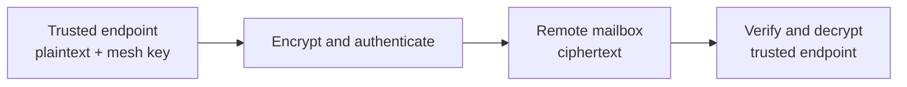

## Trace the encryption boundary {#courier}

A sealed envelope is a useful first model: the carrier can store it without reading the message. The precise mechanism is client-side authenticated encryption. A trusted endpoint encrypts row changes, snapshots, and ordinary durable files before sending them to the remote mailbox; another trusted endpoint decrypts them after download.

A copy of the remote mailbox does not reveal protected payload contents. Modified ciphertext fails integrity verification instead of being accepted as valid plaintext.

## Account for visible metadata {#visible}

Payload encryption does not hide the transport envelope. The remote can observe object paths, sizes, timing, request identity, mesh activity, device records, and the control metadata needed to locate the current snapshot.

A path such as `medical-report-alex.pdf` reveals information even when the file bytes are encrypted. Use opaque paths when names are sensitive.

If activity timing, device count, or traffic volume must also be hidden, payload encryption is insufficient. That requires a transport designed to conceal traffic patterns.

## Treat key-bearing endpoints as trusted {#trusted}

Every endpoint that can derive the mesh key can read the complete row database and ordinary durable files it can obtain. A browser, phone, server, or agent has the same cryptographic authority once it holds the key.

Protect those endpoints accordingly:

- keep devices patched, and rely on full-disk encryption and OS account separation for the local row database, which no built-in local store encrypts at rest;
- choose whether browser credentials persist beyond the session;
- give automation only the meshes it must read;
- separate unrelated reader groups into different meshes;
- prepare and test recovery before the last key is lost.

Encryption protects data in remote storage and transit through the adapter. It does not hide plaintext from the application that must use it, and it does not reach the endpoint's own database: rows, the fields indexed over them, and changes not yet uploaded are stored unencrypted on the device.

## Model a failed or malicious remote {#trouble}

Authenticated encryption detects corrupted protected objects. It cannot force the remote to disclose every change, preserve the latest snapshot, remain online, or retain data.

A failed or malicious mailbox can withhold changes, replay older valid state, delete artifacts, or disappear. Choose storage with acceptable durability, keep independent backup or version history, test a complete restore, and stop synchronization when protected data fails verification.

## Respond to mesh-key compromise {#stolen-key}

Blocking an account can stop later network access. It cannot revoke a key or plaintext already copied to an endpoint.

After suspected mesh-key compromise:

1. deny future remote access where possible;
2. create a new mesh with a new key;
3. migrate data from an endpoint that remains trusted;
4. retire the old remote location;
5. record which historical data the old key could decrypt.

This is cryptographic migration, not merely an authorization change.

## Continue by boundary {#next}

- [Choose which endpoints may hold the mesh key](/trust).
- [Compose host authentication, middleware, recovery, and keys](/auth).
- [Give one durable file a narrower key boundary](/tainted-files).
- [Publish snapshots without losing uncovered changes](/compaction).

## Decision summary {#summary}

|                   |                                                                        |
| ----------------- | ---------------------------------------------------------------------- |
| **Protected**     | Row values and ordinary file contents encrypted before upload.         |
| **Still visible** | Paths, sizes, timing, request identity, devices, and control metadata. |
| **Still trusted** | Every key-bearing endpoint, plus the remote for availability.          |
| **Unprotected**   | The endpoint's own row database, which is stored without encryption.   |
