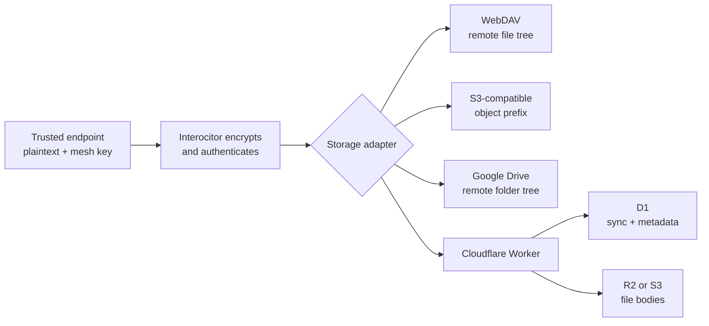

## Start with Interocitor’s storage promise {#promise}

Data is **at rest** when its bytes are sitting in persistent storage: a WebDAV file, a Google Drive file, a D1 row, an R2 or S3 object, or a backup of any of them.

With a non-null key source, Interocitor protects application payloads before they reach that storage. The remote receives ciphertext, but it does not receive the mesh key that opens it. A storage service can list, retain, copy, back up, and return the protected artifacts without reading their application contents.

This is an application-layer promise. It does not depend on how the storage platform encrypts its own disks or manages platform keys. Those controls can add another layer, but Interocitor’s confidentiality boundary is already in place before the adapter uploads a byte.

> The remote stores the sealed artifact. Trusted endpoints keep the key and interpret what is inside.

## Separate working storage from carrying storage {#surfaces}

Interocitor does not move one live database between machines. It gives storage three deliberately different jobs:

| Storage surface                 | What rests there                                                                      | How it behaves                                                                                     |
| ------------------------------- | ------------------------------------------------------------------------------------- | -------------------------------------------------------------------------------------------------- |
| **Local row store and outbox**  | Materialized rows, pending operations, and exact observations on one endpoint.        | The application reads and changes rows locally, including while disconnected.                      |
| **Remote sync mailbox**         | Protected changes and snapshots, plus the visible control envelope used to find them. | Endpoints publish and collect artifacts; the mailbox does not query or merge rows.                 |
| **Remote durable-file storage** | Protected file bodies and the visible paths and metadata used to retrieve them.       | File operations call the remote directly; Core adds no offline queue, cache, merge, or compaction. |

The local row store is inside the trusted endpoint. Its rows are plaintext while the application uses them. Interocitor’s remote-payload protection does not encrypt that local database; device protection and local-store encryption remain application and platform responsibilities.

Rows and durable files share the same remote confidentiality boundary, but not the same availability promise. [Choose between local-first rows and directly remote files before deciding where to store either](/data-boundaries).

## Follow the protection boundary {#boundary}

Protection happens before backend selection:

For a row change, the endpoint first commits useful local state and records pending work. When publishing, Interocitor encodes that work as a uniquely named change artifact, encrypts and authenticates its payload, and only then gives the resulting bytes to the adapter. A receiving endpoint downloads the artifact, verifies it, decrypts it, and merges the operation into its own local store.

Snapshots cross the same boundary. Ordinary durable files are also protected before upload, although they travel directly rather than through the row outbox. A [tainted file](/tainted-files) can use a separate application-held key when one file needs a narrower reader group.

[How it works](/how-it-works#journey) follows the complete row-change journey. [The security model](/security) owns the full threat boundary and key-compromise consequences.

## Choose the smallest storage home every endpoint can reach {#profiles}

Every option below keeps the same protection boundary: Interocitor seals the payload before storage receives it. The choice changes who operates the mailbox, where it can be reached, and which operational guardrails are available.

### Local NAS

A NAS that exposes WebDAV can hold the complete mailbox on hardware at home or in a small office. This is the smallest private setup when every participating endpoint can reach that network directly or through a VPN.

If the NAS is unreachable, local-first row work continues on each endpoint, but publishing, collecting, and directly remote file operations wait. The NAS owner is responsible for its account, network boundary, capacity, backup, and restore.

### Privately held WebDAV

A privately operated WebDAV service makes the same complete mailbox reachable beyond one local network. It can be a compatible hosted server, Nextcloud, ownCloud, or another WebDAV implementation under the owner’s control.

This buys reach without making the server a plaintext authority. It also makes the owner responsible for TLS, login policy, updates, rate limits, monitoring, availability, and recovery. The generic WebDAV server stores files; it does not understand Interocitor meshes or enforce Interocitor-specific quotas and authorization.

### Direct S3-compatible storage

A browser can put the complete mailbox in an AWS S3 or compatible bucket. This fits a NAS or hosted object store that exposes the S3 API, provided it supports browser CORS and the application can obtain short-lived credentials limited to its mailbox prefix.

The browser signs each list, read, write, metadata, and delete request directly. The credential issuer, bucket policy, CORS policy, lifecycle rules, capacity, backup, and restore remain the operator's responsibility. Never embed a long-lived bucket secret in a shipped browser application; [the core S3 guide](https://github.com/Machine-Garden/interocitor/blob/main/packages/core/docs/s3-browser.md) covers the required boundary.

### Family Google Drive

A family application can place its mailbox in one clearly owned Google Drive account instead of operating a server. Google carries the complete Interocitor folder tree, while each trusted endpoint still needs both the mesh key and OAuth access to that same tree.

A Google family group can [share storage capacity without automatically sharing files](https://support.google.com/googleone/answer/9004015?hl=en), so it does not turn every member’s Drive into one shared mailbox. Interocitor’s adapter starts from the authenticated user’s Drive and uses the narrow `drive.file` scope. Plan one mailbox-owning account, or make the application explicitly provision and authorize a folder that every participating account can reach.

### Cloudflare Free for personal or light use

A small deployment can use the protocol-aware Cloudflare layout without operating a server machine: a Worker receives mailbox requests, D1 holds row history and control state, and R2 holds durable file bodies. This is still remote storage at Cloudflare; “Free” describes the billing tier, not a local-only mode.

For a family or small business, the free tier could be enough. Application reads still come from each endpoint’s local row store, so even a million application reads need not become a million Worker or D1 reads. Local writes are batched before publication, repeated remote listings can be served from the Worker’s cache, and already-observed changes are not downloaded again.

The optional Durable Object relay removes most blind polling from the active path. It keeps hibernating WebSocket connections, coalesces bursts into invalidation signals, and wakes endpoints to pull when something changed. Pull remains the correctness mechanism, with a slower safety poll while the relay is healthy. The relay therefore reduces traffic without becoming a second source of row state.

Depending on the mix of reads, writes, active endpoints, and files, tens of thousands to hundreds of thousands of application operations can fit because they do not translate one-for-one into remote operations. The [numbers and planning math are collected in the annex](#cloudflare-free-numbers).

### Advanced setups use Cloudflare

Choose the Cloudflare Worker when the mailbox must participate in the application’s operating policy. It is the current built-in path for host-owned authorization, per-mesh quotas, upload limits, audit hooks, scheduled cleanup, and optional realtime invalidation.

Advanced placement still keeps D1 as the sync and metadata store. R2 is the direct Cloudflare file-body destination; an S3-compatible bucket can replace R2 for those bodies only. Neither choice gives the Worker the mesh key.

These profiles answer “where should it live?” [Mailbox operations](/mailbox) turns the chosen profile into named ownership, access, quota, backup, restore, and incident-response decisions.

## See where the bytes land {#backends}

The adapter preserves the same Interocitor storage contract while mapping it to a different physical backend:

| Configuration       | Row history and control state                                         | Durable file bodies                                                      |
| ------------------- | --------------------------------------------------------------------- | ------------------------------------------------------------------------ |
| **WebDAV**          | Files beneath the configured remote path on the WebDAV server.        | Beneath the same remote path through the same adapter.                   |
| **Direct S3**       | Objects beneath the configured bucket prefix through the S3 adapter.  | Beneath the same bucket prefix through the same adapter.                 |
| **Google Drive**    | Files in the Interocitor folder hierarchy in the user’s Drive.        | In the same Drive hierarchy through the same adapter.                    |
| **Cloudflare + R2** | D1 stores changes, snapshots, control state, and file metadata.       | R2 stores the durable file bodies.                                       |
| **Cloudflare + S3** | D1 still stores changes, snapshots, control state, and file metadata. | The configured S3-compatible bucket stores only the durable file bodies. |

### WebDAV keeps one remote file tree

The WebDAV adapter uses ordinary folder, list, read, write, and delete operations. Sync artifacts, control records, and durable files all live beneath the configured remote path. Interocitor does not require the WebDAV server to understand the schema or the protected contents.

### Google Drive maps that tree into Drive folders

The Google Drive adapter presents the same path-and-file behavior while resolving Drive folder and file IDs internally. The application supplies an OAuth token for the user’s Drive account. Drive stores the protected artifacts; trusted endpoints still own decryption and merge.

### Direct S3 maps the tree into object keys

The S3 adapter stores sync artifacts, control records, and durable files beneath one bucket prefix. Prefixes stand in for folders; ListObjectsV2 supplies direct-child listings, and exact object requests supply the remaining mailbox operations. The browser signs those requests with credentials obtained by the host application.

### Cloudflare separates D1 from file bodies

The Cloudflare Worker is protocol-aware, but it is still outside the plaintext boundary. D1 stores sync artifacts and their operating state. Durable-file paths, quotas, sizes, content types, taints, and access counters also stay in D1, while the configured `FileBodyStore` holds the file bytes.

With R2 selected as the file-body store, those bodies live in R2. The Worker can apply route authorization, size limits, quotas, insert-once handling for immutable history, and some stale-control-write checks without receiving the mesh key.

### Cloudflare plus S3 changes only the file-body destination

With an S3-compatible file-body store, the Worker and D1 remain in place while durable file bodies go to the configured bucket. The S3 provider sees its bucket, access principal, object keys, stored sizes, content types, and timing, but protected file contents arrive as Interocitor ciphertext.

This is distinct from the direct S3 adapter. Selecting S3 behind the Worker does not move row history, snapshots, control state, or durable-file metadata out of D1. It changes one storage boundary: where durable file bodies rest.

## Keep the visible envelope honest {#envelope}

Encryption protects the payload, not everything needed to operate storage:

| Interocitor protects                               | The remote still sees or controls                                                       |
| -------------------------------------------------- | --------------------------------------------------------------------------------------- |
| Row values inside changes and snapshots.           | Mesh routes, object paths and names, sizes, timing, and request identity.               |
| Ordinary durable-file bytes.                       | File metadata, device records, control records, and activity patterns.                  |
| Integrity of each authenticated encrypted payload. | Whether artifacts are returned, delayed, deleted, or replaced with an older valid copy. |

A filename such as `medical-report-alex.pdf` can reveal meaning even when its bytes are protected. Use opaque application paths when names themselves are sensitive.

A mailbox or object-store dump therefore does not reveal protected application contents, but it is not an invisible or self-protecting archive. The remote remains trusted for availability, retention, and fresh disclosure.

## Back up every store that completes the mailbox {#recovery}

Confidentiality does not make storage disposable. Losing the mailbox can strand changes that existed on no other endpoint and can remove directly remote files entirely. Restoring an older mailbox can also hide changes or move control state backward without breaking ciphertext authentication.

For WebDAV, direct S3, and Google Drive, backup the complete Interocitor hierarchy or prefix. For Cloudflare + R2, recovery needs D1 and R2. For Cloudflare + S3, it needs D1 and the S3-compatible bucket. Restoring only the object bucket recovers file bodies without the D1 metadata and row history needed to operate them.

[Mailbox operations](/mailbox) turns these placement facts into ownership, authorization, quota, backup, restore, and incident-response decisions.

## Decision summary {#summary}

|                                  |                                                                                                                                                   |
| -------------------------------- | ------------------------------------------------------------------------------------------------------------------------------------------------- |
| **Interocitor protects**         | Application payloads before a remote adapter receives them.                                                                                       |
| **Trusted endpoints hold**       | Plaintext local rows and the keys needed to interpret protected remote contents.                                                                  |
| **Remote storage holds**         | Protected artifacts plus the visible envelope required to store and retrieve them.                                                                |
| **Start with**                   | A local NAS, private WebDAV or S3-compatible service, family-owned Drive account, or Cloudflare Free deployment according to reach and ownership. |
| **Use advanced Cloudflare when** | The mailbox must apply application authorization, limits, audits, maintenance, or realtime invalidation.                                          |
| **Backend choice changes**       | Physical placement, access, operations, availability, and recovery—not the protection point.                                                      |
| **Direct S3**                    | Stores the complete mailbox in one bucket prefix.                                                                                                 |
| **Cloudflare + S3**              | Changes only the Worker durable-file body destination; D1 remains the sync and metadata store.                                                    |

## Annex: Cloudflare Free numbers {#cloudflare-free-numbers}

These are external service limits, not Interocitor’s conceptual storage model. They are collected here because they can change independently. As of September 2026:

| Part                                                                                   | Free allowance                                                                                                                     | What happens at the boundary                                                                                                                                                                   |
| -------------------------------------------------------------------------------------- | ---------------------------------------------------------------------------------------------------------------------------------- | ---------------------------------------------------------------------------------------------------------------------------------------------------------------------------------------------- |
| [Workers](https://developers.cloudflare.com/workers/platform/limits/)                  | 100,000 Worker requests per UTC day and 10 ms of CPU time per request.                                                             | The daily count resets at midnight UTC. A fail-closed Worker returns error 1027 after the request allowance is exhausted; a request that consistently exceeds its CPU allowance is terminated. |
| [D1](https://developers.cloudflare.com/d1/platform/pricing/)                           | 5 million rows read and 100,000 rows written per UTC day; 500 MB per database and 5 GB across the account.                         | Daily read or write exhaustion makes D1 queries fail until midnight UTC. Reaching the storage limit prevents new data and schema writes until space is reclaimed or the account is upgraded.   |
| [R2 Standard](https://developers.cloudflare.com/r2/pricing/)                           | 10 GB-month of storage, 1 million Class A operations, and 10 million Class B operations per month.                                 | Going beyond the included R2 amounts is a billing boundary, not the same daily hard stop as Workers or D1. Egress remains free.                                                                |
| [Durable Objects](https://developers.cloudflare.com/durable-objects/platform/pricing/) | With the SQLite-backed namespace required on the Free plan: 100,000 requests and 13,000 GB-seconds of active duration per UTC day. | Further operations of an exhausted type fail until the daily reset. Interocitor uses the WebSocket Hibernation API, so an idle connected relay does not keep accumulating duration.            |

### How Interocitor changes the arithmetic

- **Local reads do not reach Cloudflare.** Reading a row or running a local query does not spend a Worker request or scan a D1 row. A read-heavy application can perform a million local reads while the remote remains idle.
- **A healthy relay suppresses routine polling.** Opening a relay connection consumes a Worker request and a Durable Object request. Each broadcast entering the relay consumes another Durable Object request, but outgoing WebSocket invalidations are free and the hibernating object does not accumulate duration while idle. Clients retain one safety pull every five minutes, or roughly 576 Worker requests per continuously open endpoint per day, plus pulls caused by actual changes.
- **Polling remains the fallback.** Without a healthy relay, an idle endpoint backs off to one pull per minute. A steady-state idle pull makes two Worker requests, or roughly 2,880 per continuously open endpoint per day. Ten such endpoints use about 28,800 requests; 30 use about 86,400 before writes, file access, connection setup, or other Worker traffic.
- **D1 counts rows, not application actions.** One remote request can read or write several D1 rows, while a cached listing can avoid D1 entirely. Measure Worker requests and D1 rows separately instead of treating either number as a fixed user limit.
- **Interocitor starts with lower file guardrails.** The Worker defaults to a 32 MiB maximum for one durable file and a 512 MiB durable-file quota per mesh. An operator can raise those application limits deliberately while keeping the R2 and Worker limits in view.

These figures are planning estimates, not a capacity guarantee. Local row work can continue after a remote allowance is exhausted. Publishing, collecting, and directly remote file access resume only when the relevant daily limit resets, storage is reclaimed, or capacity is upgraded.
