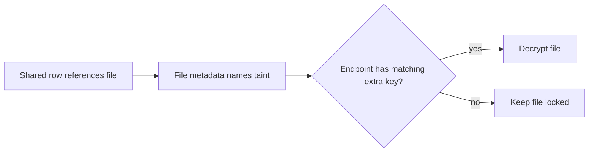

## Restrict one file without splitting the mesh {#story}

Consider a case-management application. Everyone on the case may know that a witness recording exists, while only two investigators may decrypt the recording itself.

Moving the case into another mesh would also split its rows. Instead, the application seals the recording with an additional group key. Interocitor calls the associated key label a **taint**.

Use a separate mesh when the rows need a narrower audience. Use a tainted file when shared rows may remain visible but one attachment cannot.

## Keep the taint with the file reference {#label}

The authoritative taint belongs in the synced row that references the file, for example `investigators`. The application can therefore show the file and its locked state while offline, before fetching any bytes.

Durable-file metadata repeats the taint. That echo protects callers that reach the object by path: they learn that another key is required instead of attempting ordinary mesh-key decryption.

The label identifies the required key policy. It is not a password and grants no access by itself.

## Let the application own key distribution {#owner}

Interocitor encrypts and decrypts file bytes, but it does not interpret taints, define groups, or run an ACL.

The application must own:

- what each taint means;
- which authenticated subjects may receive its key;
- how that key is wrapped, stored, and released;
- whether release requires a passkey, biometric, or another check;
- how locked and unavailable states appear;
- how keys and files are rotated after compromise.

A typical application directory maps a subject to a taint group and then to a wrapped key. Worker middleware can authorize the network request; possession of the extra key authorizes decryption.

## Plan for removal and compromise {#removal}

Removing someone from a group stops future key delivery. It cannot erase a key or plaintext already copied to a trusted endpoint.

If the extra key is compromised, generate a replacement and reseal the affected files for the remaining readers. Use opaque remote paths when the filename itself would reveal sensitive information.

## Keep three boundaries distinct {#boundaries}

- **Mesh authorization** controls whether a subject may reach the shared remote namespace.
- **Mesh-key possession** decrypts the complete row database and ordinary files.
- **Tainted-file key possession** decrypts the narrower durable file.

Compaction affects row history, not durable files. A taint label alone never grants access.

Continue with [the security model](/security) or [the complete authentication composition](/auth).

## Decision summary {#summary}

|                      |                                                               |
| -------------------- | ------------------------------------------------------------- |
| **Use it when**      | Shared rows are acceptable, but one file needs fewer readers. |
| **Application owns** | Taint meaning, key distribution, unlock policy, and rotation. |
| **It cannot do**     | Erase keys or plaintext already copied by a former reader.    |
