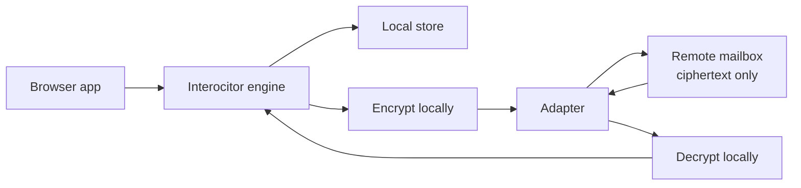

<p align="center">
  <a href="https://github.com/TheUiTeam/interocitor">
    
  </a>
</p>

<p align="center">
  <em>Encrypted local-first CRDT sync for browser apps.</em>
</p>

# @interocitor/core

End‑to‑end encrypted, local‑first sync over a remote folder you already
own (Google Drive, WebDAV, Cloudflare R2, your own server). The cloud is
a mailbox; merge happens on the device.

## What it is

- A sync engine, not a database. Local reads/writes go through an embedded
  store (IndexedDB in the browser). The engine ships diffs, not queries.
- A CRDT over per‑column HLC values. Every device converges to the same
  state without a central merge authority.
- An end‑to‑end encryption layer. The remote sees ciphertext blobs and
  enough metadata to route them; nothing else.
- A pluggable transport. Any backend that can list/read/write/delete
  files works. See `docs/adapter-contract.md`.

## Why

- **Offline‑first by construction.** Every read and write hits a local
  store. Network is needed only to share state with other devices.
- **No server you have to operate.** The remote is dumb storage. You can
  run the engine against a user's own Google Drive and ship zero
  backend.
- **End‑to‑end encryption by default.** The default config encrypts
  every change file and snapshot before it leaves the device.
- **Small, embeddable runtime.** No workers, no background services
  required.

## Quick start

```ts
import { Interocitor } from '@interocitor/core';
import { GoogleDriveAdapter } from '@interocitor/core/adapters/google-drive';

const adapter = new GoogleDriveAdapter({ clientId: 'YOUR_GOOGLE_CLIENT_ID' });

const db = new Interocitor(adapter, {
  dbName: 'my-app',          // local DB name; keep stable across reloads
  appName: 'My App',         // shown in biometric prompts / OS keychain
  remotePath: '/MyApp',      // mesh-scoped folder on the remote
  encrypted: true,           // E2E encryption (default)
});

await db.init();
await db.connect();

// Write — local-first, no network required
await db.table('todos').add(
  { text: 'Ship privacy-first sync', done: false },
  { prefix: 'todo' },
);

// Share with another device — see "New device / restore" below
console.log('Passphrase:', db.getPassphrase());
```

> The constructor accepts either `(adapter, config)` or `(config)` alone.
> Use the `(config)` form for local‑only mode (no remote). When you
> attach a remote later, call `setRemoteStorage(adapter)` and then
> `connect()`.

## Mental model



The remote is a mailbox. The engine puts encrypted change files into it
and pulls down change files from peers. All merging happens on the
device. There is no server‑side compute.

Three artifacts live on the remote:

- **change files** — one per write batch, named `<HLC>-chg_<id>.json`;
- **snapshots** — periodic full state, written by compaction;
- **a manifest** — pointer to the current generation, plus mesh metadata.

See `docs/adapter-contract.md` for the full layout.

## Security model

Encryption is on by default (`encrypted: true`). The engine uses
**AES‑GCM 256** with a key derived from a base58 passphrase.

What it protects:

- Row contents (field names, field values, table names) inside change
  files and snapshots.
- Integrity of each entry (AES‑GCM authentication tag).

What it does **not** protect:

- File names (they encode the HLC and a device id).
- Manifest contents (mesh id, schema version, epoch, encrypted flag,
  serverId).
- Sizes, write timing, device count.
- The local store on the device (IndexedDB / SQLite stores plaintext).

What a malicious remote can still do:

- Drop, withhold, replay, or roll back files.
- Observe activity timing and device identities.

For the threat model, the metadata table, and full mitigations see
`docs/security-model.md`.

## Offline guarantees

| Operation | Network? |
| --- | --- |
| `new Interocitor()` | No |
| `init()` | No |
| `table.add()` / `patch()` / `replace()` / `delete()` | No |
| `table.row()` / `table.query()` / `table.where()` | No |
| `connect()` | Yes (if adapter configured) |
| `flush()` / `pull()` / `compact()` | Yes |

Writes are persisted locally and queued in an outbox. They survive
reload, crash, and offline periods. On reconnect the engine drains the
outbox to the remote.

## Sync guarantees

- **Eventual convergence.** Two devices that have seen the same set of
  change files (in any order) reach byte‑identical local state.
- **Per‑column merge.** Conflicts are resolved field‑by‑field, not at
  the row level. Default strategy is `'remote-wins'` — see
  "Conflict resolution".
- **Idempotent merge.** Replaying an already‑applied change is a no‑op.
  Safe to re‑pull, safe to re‑process the same change file twice.
- **Per‑device HLC monotonicity.** A single device's HLCs strictly
  increase. Cross‑device order is total but only as wall‑clocks allow.
- **Restore via snapshot.** A device that joins late (or rehydrates after
  a long offline) loads the latest snapshot, then applies any change
  files newer than the snapshot watermark.

What we do **not** guarantee:

- Cross‑device atomicity. A `db.batch()` is one atomic remote file, but
  two unrelated batches from different devices are independent.
- Real‑time delivery. The default poll interval is 30 s; some adapters
  (Cloudflare) layer push notifications on top.
- Recovery if the remote silently lies (drops writes, rolls back the
  manifest). See `docs/security-model.md`.
- Recovery if the passphrase is lost — see "New device / restore".

## Setup lifecycle

```
new Interocitor(adapter?, config)
        │
        ▼
  configureMesh({...})       ← optional; pin meshId / passphrase upfront
        │
        ▼
       init()                ← opens local store, restores credentials
        │
        ▼
  setRemoteStorage(adapter)  ← only if no adapter passed to ctor
        │
        ▼
     connect()               ← loads/creates manifest, pulls, flushes, polls
```

`connect()` will auto‑`init()` if needed. App code should still treat
init as explicit so credential restore happens before any writes.

The `encrypted` flag is **pinned at mesh bootstrap** and cannot change
between sessions for the same `dbName`. Reconnecting with a different
mode throws a typed `MeshEncryptionMismatchError`.

```ts
import { MeshEncryptionMismatchError } from '@interocitor/core';

try {
  await db.connect();
} catch (err) {
  if (err instanceof MeshEncryptionMismatchError) {
    // err.expectedMode is the mode the remote was bootstrapped with
  }
  throw err;
}
```

## New device / restore

Joining a new device to an existing mesh requires three things:

1. The **`meshId`** of the existing mesh.
2. The **passphrase** that decrypts the mesh.
3. Access to the same **remote mailbox** (the same `remotePath` on a
   storage backend the new device can reach).

The pairing flow ships these three over an ECDH relay handshake (see
`generateShareQR` / `handleScannedQR` in the handshake module). After
the handshake the new device:

```ts
const db = new Interocitor(adapter, {
  dbName: 'my-app',
  appName: 'My App',
  remotePath: '/MyApp',
  passphrase: 'base58-from-handshake',
  encrypted: true,
});

await db.init();
await db.connect();   // pulls the manifest, rehydrates from snapshot, then catches up
```

On `connect()` the engine:

1. Reads `manifest.json` from the remote.
2. Compares stored `meshId` (from the credential store) against the live
   one. Mismatch → `MeshCredentialMismatchError`.
3. If local epoch < remote epoch, calls `rehydrate()` to load the
   latest snapshot.
4. Pulls any change files newer than the snapshot watermark.
5. Starts polling.

> **If the passphrase is lost and no other device holds it, the mesh is
> unreadable.** The engine has no recovery path — the data is end‑to‑end
> encrypted and the key is the passphrase. Treat the passphrase as the
> only thing that matters; back it up out of band (1Password, paper,
> another device's `WebAuthnCredentialStore`).

For the credential store details (records, anchors, biometric paths)
see `docs/credential-store.md`.

## Core API

```ts
const db = new Interocitor(adapter, {
  dbName: 'my-app',
  appName: 'My App',
  remotePath: '/MyApp',
  schema,
});
await db.init();

await db.table('tasks').add({ title: 'Ship it', done: false }, { prefix: 'task' });
await db.table('tasks').patch(taskId, { done: true });
await db.table('tasks').replace(taskId, fullTask);
await db.table('tasks').delete(taskId);

await db.table('tasks').row(taskId);                          // single row
await db.table('tasks').query();                              // all rows
await db.table('tasks').where('done').equals(false).orderBy('title');

await db.connect();                                           // attach + sync
await db.flush();                                             // force outbox drain
await db.pull();                                              // force pull
await db.compact();                                           // see docs/compaction.md
await db.disconnect();                                        // tear down

// Credentials
db.getPassphrase();
db.setPassphrase(passphrase);
await db.secureWithBiometrics();
await db.restoreWithBiometrics();
await db.clearCredentials();

// Batched writes — one ChangeEntry per batch
await db.batch(async () => {
  await db.table('todos').add({ title: 'a' });
  await db.table('todos').patch(otherId, { done: true });
});
```

### Schema typing

```ts
import { types } from '@interocitor/core';
import type { DatabaseSchemaDefinition } from '@interocitor/core';

const schema = {
  version: 1,
  tables: {
    todos: {
      fields: {
        text: types.string,
        done: types.boolean,
        createdAt: types.index(types.date),
        note: types.string.optional,
        items: types.typed<TodoItem[]>('json'),
      },
    },
  },
} satisfies DatabaseSchemaDefinition;

// Inferred row type:
// { text: string; done: boolean; createdAt: Date; note?: string; items: TodoItem[] }
```

`.optional` makes the field optional in the inferred type. Indexed and
unique fields cannot be optional. `types.index(...)` marks a field for
efficient `where`/`orderBy`.

### Conflict resolution

Per‑column CRDT with HLC. Default merge strategy: **`'remote-wins'`**.

> "Remote‑wins" is per‑column, not per‑row. When two devices write the
> same column on the same row, the merge keeps the value with the higher
> HLC. Because HLCs are timestamp‑first, this is "later wall‑clock
> wins, ties broken by device id". Calling it "remote‑wins" is a
> historical accident of where the merge runs (during pull); both sides
> apply the same rule and reach the same answer. Override per database,
> table, or field if you need `'lww'`, `'local-wins'`, or a custom
> `MergeFunction`.

Available strategies:

- `'lww'` — last‑write‑wins by HLC. Functionally identical to
  `'remote-wins'` for this CRDT but keeps semantics explicit.
- `'remote-wins'` (default).
- `'local-wins'` — keep local on tie; remote still wins on a strictly
  greater HLC.
- `MergeFunction` — `(local, remote, ctx) => result` for custom logic.

### Deletion semantics

`delete()` writes a **tombstone**, not an immediate unlink. Tombstones:

- carry `deletedHlc` like any other write;
- hide the row from public reads and queries;
- keep an empty payload, so deleted user data does not linger inside the
  tombstone;
- are needed so that slower devices cannot replay an older `add()` and
  resurrect the row.

Re-inserting the same row id after a delete starts a fresh row
incarnation. Columns from the old incarnation are not carried forward;
a partial insert only contains the new columns.

Compaction can later hard-delete tombstones from snapshots. The engine
tracks per-device acknowledgements in `devices/<deviceId>.json`; once
all active devices have observed a manifest watermark, compaction
publishes `manifest.gcFloorHlc` as a point of no return. Tombstones with
`deletedHlc <= gcFloorHlc` are omitted from the next snapshot.

Devices not seen within `offlineGraceMs` (default seven days) are
excluded from GC consensus. If one wakes up with local outbox entries at
or before `gcFloorHlc`, the engine refuses to flush those entries and
rehydrates from the canonical snapshot instead.

### Local store

The local store is a pluggable `LocalStoreAdapter`. Browser default is
IndexedDB. The Swift package ships SQLite. Tests use an in‑memory
implementation. Reads, writes, queries, and the outbox all go through
this interface.

## Adapters

| Adapter | Use when | Notes |
| --- | --- | --- |
| `GoogleDriveAdapter` | You want zero infrastructure | OAuth in the browser; the user owns the data |
| `WebDAVAdapter` | Self‑hosted (Nextcloud, OwnCloud, custom WebDAV) | Easy to inspect remotely |
| `CloudflareAdapter` | You operate a worker; want push invalidations | Experimental |
| `MemoryAdapter` | Tests and demos | No persistence |

Implementing your own adapter: see `docs/adapter-contract.md` for
required semantics, consistency assumptions, and the contract test
suite.

## Remote mailbox layout

For `remotePath: '/MyApp'`:

```
/MyApp/
├── manifest.json                           # pointer { currentGeneration, file }
├── manifest-1.json                         # generation 1
├── manifest-2.json                         # ...
├── changes/
│   ├── head.json                           # { latestHlc } — pull fast path
│   └── <HLC>-chg_<id>.json                 # encrypted change entries
├── devices/
│   └── <deviceId>.json                     # device metadata
└── mainline/
    └── snapshot-<epoch>-<serverId>.json    # encrypted snapshot
```

`remotePath` is **mesh‑scoped**. One folder = one mesh = one logical
database. Two meshes sharing the same folder will fight over the
manifest and poison the remote.

## Maintenance / compaction

Compaction collapses the change log into a snapshot, bumps the manifest,
prunes old change files, and advances the tombstone GC floor when active
devices have acknowledged the prior watermark. Sync works without it;
the remote folder just grows until *some* device compacts.

Two paths run automatically:

- **Immediate sampled** — after a flush of ≥ `compactAutoThreshold`
  (default 50) ops, with probability ≈
  `compactAutoSampleNumerator / compactAutoDeviceCount`.
- **Delayed two‑phase** — per‑write timer (10 ± 5 min) → check that
  remote change files exceed `compactRemoteChangeThreshold` (default 2)
  → second timer (15 ± 5 min) → run.

Both paths are deduped by a single in‑flight guard. You can also call
`db.compact()` manually.

> **The auto defaults and the recommended manual policy are different
> things.** The manual policy ("idle > 1 min, churn > 20") is what to
> gate a "Sync now" button on. The auto defaults are what runs without
> any button. See `docs/compaction.md`.

> **Compaction is not race‑safe across devices.** The adapter contract
> has no CAS/ETag write, so two simultaneous compactors can both
> overwrite the manifest pointer. Mitigations: rely on probabilistic
> avoidance for small meshes, or run with `serverManaged: true` and a
> single authorized writer.

Full protocol, events, lock story, device acknowledgement / GC-floor
rules, prune invariants, and tuning checklist: **`docs/compaction.md`**.

## Schema migration

Schema versions are integers in `manifest.schema`. The engine tracks the
current version on every write. There is **no in‑place rewrite of the
remote history** — change files written under v1 stay v1 ciphertext.

Recommended migration pattern:

1. Bump `schema.version` in your code.
2. Implement a one‑shot `onInit` migration that reads v1 rows from the
   local store and writes v2 rows back. Use `db.batch(...)` to keep it
   atomic per row group.
3. Trigger compaction after the migration so the snapshot is written
   under v2 and old v1 change files are pruned.
4. Devices that have not yet migrated will read v2 change files; your
   schema definitions need to handle the transition (e.g. accept both
   shapes during the rollout window).

For breaking changes that cannot be rolled out gradually, the
heavier path is to bootstrap a fresh mesh, replicate data over, and
retire the old mesh. The engine does not automate this.

## Events

```ts
db.on(event => {
  switch (event.type) {
    case 'sync:start':                /* pull began */ break;
    case 'sync:complete':             /* event.entriesMerged */ break;
    case 'change':                    /* event.table, event.rowId, event.row */ break;
    case 'delete':                    /* event.table, event.rowId */ break;
    case 'flush:start':               /* event.entryCount */ break;
    case 'flush:complete':            break;
    case 'flush:error':               /* event.error */ break;
    case 'remote:poisoned':           /* unrecoverable; see security-model.md */ break;
    case 'credentials:meshMismatch':  /* stored meshId != live; offer clearCredentials() */ break;
    case 'compact:warning':           /* outbox is large */ break;
    // compact:auto:start / complete / skip / error / delayed:* — see docs/compaction.md
  }
});
```

## What this is not

- not Firebase
- not Fireproof
- not PowerSync
- not Replicache
- not a hosted backend
- not a query engine over the cloud
- not a server‑trusted merge layer

## What can go wrong

A short field guide. Detailed mitigations in the linked docs.

| Symptom | Likely cause | Where to look |
| --- | --- | --- |
| `MeshCredentialMismatchError` on connect | Same `dbName`, new mesh; stale credential record | `engine.clearCredentials()` then reconnect; `docs/credential-store.md` |
| `MeshEncryptionMismatchError` on connect | App flipped `encrypted` between sessions | Pin `encrypted` per `dbName`, never change |
| `remote:poisoned` event | Decode failure on a manifest, change file, or snapshot | `docs/security-model.md` — usually wrong key, schema drift, or remote tampering |
| Writes never appear on peer | Peer never compacted, or peer's poll interval is long, or remote dropped writes | Check `flush:complete` events; check remote folder by hand |
| Local store has rows that are "old" after re‑pair | Engine kept local data when you re‑paired with a fresh mesh | Either delete local DB on re‑pair, or accept the merge |
| Lost passphrase | No recovery | Passphrase is the key. Back it up out of band |
| Long‑offline device "lost" recent edits | Rehydrate replaced local state with the snapshot | Local writes already in the outbox survive; in‑flight uncommitted UI state does not |
| Compaction never runs | `autoCompact: false`, or no remote, or `compactAutoThreshold` never reached | `docs/compaction.md` — subscribe to `compact:auto:skip` |
| Two compactors race | No CAS in the adapter; small probability in small meshes | Use `serverManaged: true` for large meshes |

## Tests

```bash
yarn workspace @interocitor/core test
```

Adapter contract tests (run for every adapter):

```bash
yarn workspace @interocitor/core test webdav.adapter.contract
```

## Package context

Part of the Interocitor monorepo. See:

- root `README.md` — monorepo overview
- `docs/security-model.md` — threat model
- `docs/adapter-contract.md` — adapter requirements
- `docs/compaction.md` — compaction protocol & tuning
- `docs/credential-store.md` — credential persistence

## License

MIT
