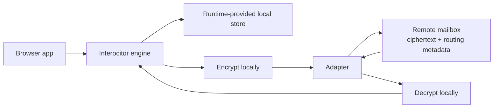

<p align="center">
  <a href="https://github.com/TheUiTeam/interocitor">
    
  </a>
</p>

<p align="center">
  <em>Runtime-neutral encrypted local-first CRDT database and durable byte file store.</em>
</p>

# @interocitor/core

End‑to‑end encrypted, local‑first app data over storage you already own.
`@interocitor/core` contains the runtime-neutral CRDT engine, sync protocol,
remote storage contract, local store contract, and path-addressed byte file
APIs. Runtime-neutral mailbox adapters live in core. Browser stores, browser
credentials, and image helpers live in `@interocitor/web`; React hooks live in
`@interocitor/react`.

## What it is

- A CRDT database for structured state. Local reads/writes go through an
  explicit `LocalStore`. The engine ships diffs, not queries.
- A durable byte file store for assets that belong to the same mesh.
  Files are encrypted, path-addressed, and overwritten/deleted explicitly;
  they do not merge or compact.
- A CRDT over per‑column HLC values. Every device converges to the same
  row state without a central merge authority.
- An end‑to‑end encryption layer. The remote sees ciphertext blobs plus
  routing and operational metadata such as object paths, mesh and device
  identifiers, sizes, and timing.
- A pluggable transport. Backends provide object storage operations for
  sync objects and, optionally, first-class durable file operations. See
  `docs/adapter-contract.md`.

## Why

- **Offline‑first rows by construction.** Row reads and writes hit a local
  store. Network is needed only to share row state with other devices.
  Durable file methods call the configured adapter directly.
- **No required backend shape.** The remote is dumb storage. Core adapters can
  run anywhere the required standard APIs are available.
- **Client-side encryption for protected meshes.** A non-null `keySource`
  encrypts every change file, snapshot, and durable file body before upload.
- **Small, embeddable runtime.** No workers, no background services
  required.

## Quick start

TypeScript blocks in this README are partial or illustrative API fragments
unless a section explicitly marks a runnable test command. They use exported
names but assume application schema, credentials, runtime objects, and error
handling.

```ts
import {
  Interocitor,
  MemoryAdapter,
  MemoryLocalStore,
  PortablePassphraseKeySource,
} from '@interocitor/core';

const portableKey = '...high-entropy-base58...';

const db = new Interocitor(new MemoryAdapter(), {
  dbName: 'my-app',
  remotePath: '/MyApp',
  localStore: new MemoryLocalStore(),
  keySource: new PortablePassphraseKeySource({
    portableKey,
  }),
});

await db.init();
await db.connect();

// Write — local-first, no network required
await db.table('todos').add(
  { text: 'Ship privacy-first sync', done: false },
  { prefix: 'todo' },
);
```

Most browser apps should start with [`@interocitor/web`](../web/README.md).
It provides the browser runtime pieces — IndexedDB local storage,
credential-store helpers, image helpers, and reset helpers — that you
compose into a `keySource`. Mailbox adapters still come from core.

## Public API

Documented entrypoints in this package:

| API | Use when |
| --- | --- |
| `Interocitor` | You want the runtime-neutral engine for local-first rows and durable files |
| `db.configureMesh(...)` | A remote path, passphrase, encryption mode, or device ID becomes known after construction but before `init()` |
| `db.init()` | The app wants local-first readiness before any remote session starts |
| `db.connect()` | The app wants to create/resume the remote mesh session |
| `db.table(name)` | The app wants typed row CRUD, queries, and row handles |
| `db.putFile`, `db.getFile`, `db.openFile`, `db.deleteFile`, `db.getFileMetadata` | The app stores durable encrypted attachments or sealed files in the same mesh |
| `PortablePassphraseKeySource`, `BoundSharedKeySource` | The app chooses how mesh key material is restored or derived |
| `createRecoveryWrapper`, `publishRecoveryWrapper`, `recoverMeshCredentials` | The app offers a client-provided recovery phrase for a portable-key mesh |
| `MemoryAdapter`, `WebDAVAdapter`, `GoogleDriveAdapter`, `CloudflareAdapter` | The app chooses a mailbox backend |
| `generateShareQR`, `generateJoinQR`, `handleScannedQR` | The app wants the high-level QR pairing flow |
| `createGeneratorSession`, `runScannerHandshake` | The app wants low-level control of the pairing handshake |

For lifecycle methods, table/file/cache handles, consequential `SyncConfig`
options, the `LocalStore` contract, key sources, events, and typed errors, use
the [Core API reference](docs/api-reference.md).

This README is the package landing page. The API reference and focused pages
under `docs/` own the behavioral contracts; exported TypeScript declarations
and their JSDoc provide the exact signatures.

> The constructor accepts either `(adapter, config)` or `(config)` alone.
> Use the `(config)` form for local‑only mode (no remote). Every runtime must
> pass `config.localStore`.

## Mental model



The remote is a mailbox. For rows, the engine puts encrypted change
files into it and pulls down change files from peers. For files/images,
the engine puts encrypted durable objects under `files/` and reads or
deletes them by app path. Row merging happens on the device. There is no
server-side compute required for correctness.

Four artifact families live on the remote:

- **change files** — one per write batch, named `<HLC>-chg_<id>.json`;
- **snapshots** — periodic full row state, written by compaction;
- **durable files** — app byte payloads under `files/`, addressed by app path;
- **a manifest** — pointer to the current generation, plus mesh metadata.

See [Adapter contract](docs/adapter-contract.md) for the full layout.

## Security model

Encryption is on whenever the mesh is configured with a non-null `keySource`. The engine uses
**AES-GCM 256** with a key supplied by the configured `keySource`.

What it protects:

- Row contents (field names, field values, table names) inside change
  files and snapshots.
- Durable file bodies.
- Integrity of each entry (AES‑GCM authentication tag).

What it does **not** protect:

- Remote object names and paths. Change filenames encode an HLC and device id;
  durable file paths are chosen by the application.
- Manifest contents (mesh id, schema marker, epoch, encrypted flag,
  serverId).
- Sizes, write timing, device count.
- The local store on the device (IndexedDB / SQLite stores plaintext).

What a malicious remote can still do:

- Drop, withhold, replay, or roll back files.
- Observe activity timing and device identities.

For the threat model, the metadata table, and full mitigations see
[Security model](docs/security-model.md).

## Offline guarantees

| Operation | Network? |
| --- | --- |
| `new Interocitor()` | No |
| `init()` | Core performs local initialization; application-provided key sources and `resolveInitialState` may prompt or perform external work |
| `table.add()` / `patch()` / `replace()` / `delete()` | No |
| `table.row()` / `table.query()` / `table.where()` | No |
| `connect()` | Yes (if adapter configured) |
| `flush()` / `pull()` / `compact()` | Yes |
| `putFile()` / `getFile()` / `openFile()` / `deleteFile()` | Yes |

The configured `LocalStore` atomically commits each row mutation with its
pending immutable batch, then atomically promotes completed batches to the
outbox. Flush reads without deleting, publishes idempotently, and acknowledges
only the exact published IDs. With a durable store, a crash therefore leaves
either retryable local work or an already-published immutable file.
`MemoryLocalStore` lasts for the current process/session and clears on close.

### Never-stuck principle

Core separates local row readiness from the remote sync session: once a
caller-provided `LocalStore` has opened, a failed remote connection does not
disable local row operations. Core does not create or replace that local store;
an `open()` or restore failure rejects `init()`.

For browser apps, `@interocitor/web` provides the recommended local-store
recovery hierarchy:

1. **Use durable local storage** when IndexedDB opens and behaves normally.
2. **Degrade to memory** when IndexedDB is unavailable, blocked, closing, or
   fails to make progress. The current session keeps working; durability
   across reloads is reduced until the app reconnects or rotates storage.
3. **Rotate the local database name** for persistent IndexedDB disasters.
   The DB name is a cache namespace, not identity. Mesh identity lives in
   credentials and the remote manifest.
4. **Stay offline-ready** when one of the full connect pipeline's deadline-
   wrapped stages stalls. `connect()` returns, `init()` remains complete,
   writes continue locally, and the app can retry `connect()` later.

Choose and configure that fallback in the runtime layer; it is not automatic
behavior of `@interocitor/core`.

## Sync guarantees

- **Eventual convergence.** Two devices that have seen the same set of
  change files (in any order) reach byte‑identical local state under LWW or a
  custom merge that satisfies the convergence laws below.
- **Per‑column merge.** Conflicts are resolved field‑by‑field, not at
  the row level. Configured and schema-less databases both default to
  `'lww'`. See "Conflict resolution".
- **Exact change observation.** A client records immutable change filenames;
  neither a global HLC nor one incomplete listing proves that an older file was
  observed. LWW replay is idempotent, and exact receipts prevent an observed
  custom change from being applied twice.
- **Per‑device HLC monotonicity.** A single device's HLCs strictly
  increase. Cross‑device order is total but only as wall‑clocks allow.
- **Restore via snapshot.** A device that joins late (or rehydrates after
  a long offline) loads the latest snapshot and its exact change-file receipts,
  then applies every remaining file not covered by the snapshot.
- **One compaction cut.** Local writes, explicit batches, pulls, flushes, and
  snapshot capture share the local-store sync lock. Compaction first publishes
  completed local work, then pulls, captures receipts and rows, and only then
  publishes the snapshot.

What we do **not** guarantee:

- Cross‑device atomicity. A `db.batch()` is one atomic remote file, but
  two unrelated batches from different devices are independent.
- Real‑time delivery. The default poll interval is 30 s; some adapters
  (Cloudflare) layer push notifications on top.
- Recovery if the remote silently lies (drops writes, rolls back the
  manifest). See [Security model](docs/security-model.md).
- Recovery if portable key material is lost — see "New device / restore".

For the completeness proof, comparison with established sync systems, checksum
boundary, and cryptographic integrity requirements, see
[Sync completeness, convergence, and integrity](docs/sync-completeness.md).
The protocol decision is recorded in
[Sync completeness and deterministic merge](docs/decisions/sync-completeness.md).

### Sync cadence

The engine adapts how often it polls the remote so it does useful work when
there is data to sync and stays out of the way otherwise. Applications choose
the base and relay-healthy intervals with `pollInterval` and
`relayHealthyPollInterval`; adaptive backoff operates within that lifecycle.

- **Adaptive backoff.** Polling starts at `pollInterval` (30 s by
  default). After every poll that merges zero entries the interval
  doubles, capped at 60 s. Any poll that merges ≥ 1 entry resets the
  interval back to base. The intent is to absorb idle bursts of clients
  without hammering the remote, while still recovering immediately when
  data starts flowing.
- **Runtime lifecycle hooks.** Core supports polling and explicit
  `pull()`/`flush()` calls. Browser visibility handling belongs in
  `@interocitor/web` or application code.
- **Push fallback.** Adapters that push invalidations (Cloudflare relay)
  trigger an immediate pull and bypass the polling cadence entirely.
  Polling is the safety net when the push channel is unavailable; the
  WS connection itself uses bounded retries with a long cooldown after
  repeated failed upgrades, so a misbehaving relay cannot DDoS itself.

## Setup lifecycle

```
new Interocitor(adapter?, config)
        │
        ▼
  configureMesh({...})       ← optional; supply late remotePath/passphrase before init
        │
        ▼
       init()                ← opens local store, restores credentials
        │
        ▼
  setRemoteStorage(adapter)  ← only if no adapter passed to ctor
        │
        ▼
     connect()               ← loads/creates manifest, pulls, flushes, polls
```

`connect()` will auto‑`init()` if needed. App code should still treat
init as explicit so credential restore happens before any writes.

The `keySource` mode is **pinned at mesh bootstrap** and should not change
between sessions for the same `dbName`. Reconnecting with a different
mode throws a typed `MeshEncryptionMismatchError`.

```ts
import { MeshEncryptionMismatchError } from '@interocitor/core';

try {
  await db.connect();
} catch (err) {
  if (err instanceof MeshEncryptionMismatchError) {
    // err.expectedMode is the mode the remote was bootstrapped with
  }
  throw err;
}
```

### Joining an existing mesh with local state

When `connect()` finds an existing remote mesh whose `meshId` differs from the
identity recorded in the local store, local rows and queued writes need an
explicit policy. `joinExistingMeshPolicy` controls that decision:

```ts
// `credentials` is the promise returned by generateJoinQR().
const receivedCredentials = await credentials;

const db = new Interocitor(adapter, {
  dbName: 'my-app',
  remotePath,
  localStore,
  keySource,
  joinExistingMeshPolicy: 'reset-to-remote', // default
});
```

- **`'reset-to-remote'` (default)** clears local rows, queued and pending
  writes, cursors, and stale mesh metadata before pulling the existing remote
  mesh. Unsynced local work is discarded.
- **`'merge-with-remote'`** retains local rows and queued writes. They enter
  normal CRDT merge and can be published to the joined mesh.

Before applying either consequential path, the engine emits
`join:existing-mesh` with the prior and next mesh IDs, selected policy, local
row count, and queued-change count. A genuinely empty fresh local store simply
records the remote mesh ID. The policy is not applied when `connect()`
bootstraps a new remote mesh.

Choose this before constructing the engine. If local work may matter, ask the
user or make an application-level backup before connecting; the event reports
what happened but is not a cancellable prompt.

## New device / restore

Joining a new device to an existing mesh requires three things:

1. The mesh **`remotePath`**.
2. The mesh's base58 **passphrase** for a protected portable-key mesh, or
   `null` for an unencrypted mesh.
3. Access to and authentication for the same **remote mailbox** on a
   storage backend the new device can reach.

The engine reads the authoritative `meshId` from the remote manifest during
`connect()`. Pairing transports `remotePath` and `passphrase`; it does not put
either value in the QR payload.

A production app should keep CRUD, sync lifecycle, and pairing separate:

```text
lib/interocitor-db.ts      engine, schema, local repository, credential primitives
lib/interocitor-sync.ts    mesh id lifecycle, adapter, connect/disconnect, recovery
lib/interocitor-pairing.ts QR handshake only
```

The pairing flow ships credentials over an ECDH relay handshake. The handshake
relay base and sync adapter base are different concepts: a relay base is the
temporary handshake-file path, such as `/Taska`; the Cloudflare adapter base
URL is the concrete Worker route, such as `/sync/io/{address}`. That address
may be a stable name or an application-provisioned identifier and is not
necessarily `manifest.meshId`. The engine `remotePath` is the mesh folder path
inside that adapter, such as `/Taska`.

### Pairing intents

**Join QR** is for a device that does not have credentials yet:

1. Joiner configures access to the handshake relay and calls
   `generateJoinQR()`.
2. Existing paired device scans and pushes `{ remotePath, passphrase }`.
3. Joiner awaits `credentials` on the result.
4. Joiner constructs a key source from the received passphrase and connects to
   the existing mesh.

**Share QR** is for an existing mesh member inviting a new device:

1. Existing device connects to the active mesh.
2. Existing device calls `generateShareQR()` with `remotePath` and
   `passphrase`.
3. New device scans and receives credentials from `handleScannedQR()`.
4. New device constructs its key source and connects using the adapter selected
   by the application or reconstructed from `adapterConfig`.

`handleScannedQR()` returns `null` for join intent because the scanner pushed its own credentials. It returns credentials for share intent because the scanner received credentials. Always handle the return value:

```ts
import { decodeQRPayload, handleScannedQR, parseQRFromUrl } from '@interocitor/core';
// Raw QR payload decoder is also available from '@interocitor/core/handshake/qr'.

const payload = parseQRFromUrl(location.hash) ?? decodeQRPayload(rawPastedPayload);
const received = await handleScannedQR({
  adapter,
  relayBase: '/Taska',
  payload,
  ...(payload.intent === 'join'
    ? { ownCredentials: { remotePath, passphrase: keySource.getPortableKey() } }
    : {}),
});

if (received) {
  const receivedKeySource = received.passphrase === null
    ? null
    : new PortablePassphraseKeySource({ portableKey: received.passphrase });
  // Application helper: construct a new engine with this path/key source.
  await connectFromPayload(received.remotePath, receivedKeySource);
}
```

For a received protected-mesh credential, the new device can construct the
engine directly:

```ts
const db = new Interocitor(adapter, {
  dbName: 'my-app',
  remotePath: receivedCredentials.remotePath,
  keySource: new PortablePassphraseKeySource({
    portableKey: receivedCredentials.passphrase!,
  }),
  localStore,
  joinExistingMeshPolicy: 'reset-to-remote',
});

await db.init();
await db.connect();   // pulls the manifest, rehydrates from snapshot, then catches up
```

On `connect()` the engine:

1. Reads `manifest.json` from the remote.
2. Compares stored `meshId` (from the credential store) against the live
   one. Mismatch → `MeshCredentialMismatchError`.
3. Checks offline eligibility before uploading queued work. An expired client
   quarantines its queue and restores remote state.
4. If an eligible client's local epoch < remote epoch, calls `rehydrate()` to
   load the latest snapshot after publishing its durable outbox.
5. Pulls every remaining change file not covered by the snapshot's exact
   receipts.
6. Starts polling.

> **If portable key material is lost and no other device holds it, the mesh is
> unreadable unless a recovery wrapper was created first.** Recovery phrases
> encrypt a backup of the portable key on the remote without storing the words
> there. See [Recovery phrases](docs/recovery.md).

For credential store details (records, anchors, biometric paths), see
[Credential store](docs/credential-store.md). For portable versus bound shared-key deployment modes, see
[Shared key scenarios](docs/shared-key-scenarios.md).

## Core API

```ts
const db = new Interocitor(adapter, {
  dbName: 'my-app',
  remotePath: '/MyApp',
  schema,
  localStore,
  keySource,
  joinExistingMeshPolicy: 'reset-to-remote',
  connectStageTimeoutMs: 15_000,
  onConnectStalled: ({ stage, timeoutMs }) => {
    console.warn(`connect stage stalled: ${stage}`, { timeoutMs });
  },
});
await db.init();

await db.table('tasks').add({ title: 'Ship it', done: false }, { prefix: 'task' });
await db.table('tasks').patch(taskId, { done: true });
await db.table('tasks').replace(taskId, fullTask);
await db.table('tasks').delete(taskId);

await db.table('tasks').row(taskId);                          // single row
await db.table('tasks').query();                              // all rows
await db.table('tasks').where('done').equals(false).orderBy('title');

await db.connect();                                           // attach + sync
await db.flush();                                             // force outbox drain
await db.pull();                                              // force pull
await db.compact();                                           // see docs/compaction.md
await db.disconnect();                                        // tear down

// Durable files — encrypted, not compacted, not merged
await db.putFile('receipts/may.pdf', pdfBytes, 'application/pdf');
const pdf = await db.getFile('receipts/may.pdf');
const fileMeta = await db.getFileMetadata('receipts/may.pdf');
await db.deleteFile('receipts/may.pdf');

// Batched writes — one ChangeEntry per batch
await db.batch(async () => {
  await db.table('todos').add({ title: 'a' });
  await db.table('todos').patch(otherId, { done: true });
});
```

### Files and images

Interocitor supports durable files alongside row-based state. Files are
not row fields and are not part of the CRDT table schema. They live in the
adapter-backed durable storage namespace under the mesh `files/` prefix and
are addressed by application-chosen string paths.

File operations call the adapter directly. They are not cached in the local
row store or queued in its outbox; callers need available transport and must
decide how to retry failed transfers.

Use rows for structured state that participates in schema typing, queries,
merge behavior, snapshots, and compaction. Use files for binary or large
opaque payloads such as images, attachments, exported blobs, or durable
assets that should move with the mesh.

Recommended pattern:

1. Store metadata and references in rows.
2. Store opaque payloads with `putFile`. Browser image helpers in
   `@interocitor/web` delegate to this API.
3. Store the file path in the row.

```ts
type TaskRow = {
  title: string;
  file_paths: string[];
};

const path = `tasks/${taskId}/files/${Date.now()}_${file.name}`;
await db.putFile(path, new Uint8Array(await file.arrayBuffer()), file.type);
await db.table('tasks').patch(taskId, {
  file_paths: [...task.file_paths, path],
});
```

Core file API:

```ts
const meta = await db.putFile('attachments/report.pdf', bytes, 'application/pdf');
const bytes = await db.getFile('attachments/report.pdf');
const metadata = await db.getFileMetadata('attachments/report.pdf');
await db.deleteFile('attachments/report.pdf');
```

`putFile(path, data, contentType?, seal?)` accepts `Uint8Array | string` and
returns `StoredFileMetadata`. `getFile(path)` returns decoded `Uint8Array`
bytes. `getFileMetadata(path)` returns `StoredFileMetadata | null` without
downloading the payload. `deleteFile(path)` treats a missing file as already
deleted.

#### Sealed files (group access / DLP)

By default a file is encrypted with the mesh key, so every mesh member can read
it. To make a file readable only by holders of an **extra** key — a "group"
key your app distributes out of band — pass a `seal`:

```ts
// Writer: seal the bytes under a group key and label them.
await db.putFile('docs/q3-strategy.pdf', bytes, 'application/pdf', {
  taint: 'group:leadership',   // human-readable label, never interpreted by core
  key: leadershipKey,          // the extra CryptoKey the bytes are sealed under
});
```

`taint` and `key` are a bound pair: a sealed file always has both. The `taint`
is echoed into `StoredFileMetadata.taint` so **any** member can discover that a
file exists and *that it is gated*, without being able to read it:

```ts
const meta = await db.getFileMetadata('docs/q3-strategy.pdf');
// meta.taint === 'group:leadership'  → "I need the leadership key"
```

Reading separates **download** from **unlock** so the key can be released by a
biometric/keychain prompt only at view time:

```ts
const sealed = await db.openFile('docs/q3-strategy.pdf'); // downloads, no key
// sealed.taint tells you which key to unlock
const bytes = await sealed.open(leadershipKey);           // decrypts now
```

`getFile()` refuses a sealed file (it would silently fail to decrypt); use
`openFile()` for anything that may be tainted. A plain `openFile()` on an
unsealed file returns a `SealedFile` whose `open()` needs no key.

> Core never resolves users, groups, or ACLs. The `taint` is just a string;
> your app maps it to a key (for example via an ECDH-wrapped grant — see
> [Tainted files](docs/tainted-files.md) and
> [Shared key scenarios](docs/shared-key-scenarios.md)).

`StoredFileMetadata` includes the adapter `FileEntry` fields (`name`,
`path`, `size`, `modifiedTime`, optional `etag` / `revision`) plus durable
file fields when known: `uploadedByDeviceId`, `uploadedAt`,
`lastAccessedAt`, `useCount`, `plaintextSize`, `storedSize`, and
`contentType`.

File semantics and caveats:

- Files are encrypted with the mesh key when encryption is enabled.
- File paths are metadata; choose paths as if the remote owner can observe
  them.
- Files are not CRDT-merged. A write to the same path replaces the object
  according to adapter semantics; coordinate path ownership in app code.
- Files are not included in row snapshots or compaction. A file exists until
  overwritten or deleted.
- Deleting a row does not automatically delete referenced files. Applications
  must perform that cleanup explicitly.
- File references are usually stored in rows as strings. Define a path
  convention such as `users/{userId}/avatar` or
  `tasks/{taskId}/files/{filename}`.

Browser image helpers are provided by `@interocitor/web` as convenience
wrappers over durable files:

```ts
import { getImage, getImageBlobUrl, putImage } from '@interocitor/web';

await putImage(db, 'avatars/me.png', file);

const image = await getImage(db, 'avatars/me.png');
// image.data: Uint8Array
// image.blob: Blob
// image.contentType: image/png, image/jpeg, ...

const view = await getImageBlobUrl(db, 'avatars/me.png');
img.src = view.url;
view.revoke();
```

`putImage(db, path, image, options?)` accepts `Blob`, `ArrayBuffer`,
`Uint8Array`, data URLs, and plain strings. Plain strings are encoded as text
and default to `image/svg+xml` unless `options.contentType` or the path
extension says otherwise. Explicit image content types must start with
`image/`.

Use core `putFile` for arbitrary bytes. Use `@interocitor/web`'s
`getImageBlobUrl` or `@interocitor/react`'s `useImage` for display scenarios
that need a browser `blob:` URL, and always revoke blob URLs you create
manually.

### Signing

Signing answers one question: **"did the right person produce this record, and
is it unchanged?"** A private key signs; the matching public key verifies.
Anyone can hold the public key, so anyone can *check* a signature, but only the
holder of the private key can *make* one. Algorithm is fixed to **ECDSA P-256 /
SHA-256 (ES256)**.

This is **identity without identity** — no accounts, no login, no central
authority. Consider a shared chore list: a parent signs the "allowance paid"
record with their private key. Every device in the mesh can verify it, but a
child cannot forge a signed record because they do not have the private key.
The mesh stays peer-to-peer and offline-first; authority comes from a key, not
a server.

```ts
import {
  generateSigningKeypair,
  exportPublicKey, importPublicKey,
  signToken, verifyToken,
} from '@interocitor/core';

// Parent device, once: create the authority key.
const { privateKey, publicKey } = await generateSigningKeypair();
// Publish the public key into the mesh (e.g. a row). It is safe to share.
const parentPublic = await exportPublicKey(publicKey);

// Parent signs a record so it cannot be faked by other devices.
const token = await signToken(privateKey, { task: 'chore-42', status: 'approved' });

// Any device verifies against the published public key.
const verifier = await importPublicKey(parentPublic);
const record = await verifyToken(verifier, token);
// → { iat, task: 'chore-42', status: 'approved' }  — or null if forged/altered
```

Signed payloads are **not secret** (that is the mesh key's job) — they are
*trustworthy*. There is no JOSE header and no algorithm negotiation, so a token
cannot be downgraded by rewriting a header. `verifyToken` returns `null` (never
throws) for a bad signature, malformed token, or expired `exp`; add an `exp`
with `signToken(..., { expiresInSeconds })`. Raw-byte `sign(key, bytes)` /
`verify(key, bytes, sig)` are also exported for non-token payloads. Full
reference: [Signing](docs/signing.md).

### Schema typing

```ts
import { types } from '@interocitor/core';
import type { DatabaseSchemaDefinition } from '@interocitor/core';

const schema = {
  tables: {
    todos: {
      fields: {
        text: types.string,
        done: types.boolean,
        createdAt: types.index(types.date),
        note: types.string.optional,
        items: types.typed<TodoItem[]>('json'),
      },
    },
  },
} satisfies DatabaseSchemaDefinition;

// Inferred row type:
// { text: string; done: boolean; createdAt: Date; note?: string; items: TodoItem[] }
```

`.optional` makes the field optional in the inferred type. Indexed and
unique fields cannot be optional. `types.index(...)` marks a field for
efficient `where`/`orderBy`.

### Conflict resolution

Conflict resolution is per column. Every database defaults to **`'lww'`**:
the mutation with the greater HLC wins, regardless of which peer discovers it
first. An equal HLC with a different value is rejected as protocol corruption.

Available strategies:

- `'lww'` — accept the incoming remote column only when its HLC is greater
  than the local HLC.
- `MergeFunction` — `(existing, incoming, ctx) => result` for custom logic.

An incoming column is accepted when no existing column exists. A custom merge
must be deterministic, commutative, associative, and idempotent; otherwise two
peers can derive different state from the same files. Perspective-dependent
policies such as “local wins” or “remote wins” are not valid in a peer mesh
because each peer assigns those labels differently.

### Deletion semantics

`delete()` writes a **tombstone**, not an immediate unlink. Tombstones:

- carry `deletedHlc` like any other write;
- hide the row from public reads and queries;
- keep an empty payload, so deleted user data does not linger inside the
  tombstone;
- are needed so that slower devices cannot replay an older `add()` and
  resurrect the row.

Re-inserting the same row id after a delete starts a fresh row
incarnation. Columns from the old incarnation are not carried forward;
a partial insert only contains the new columns.

Compaction preserves tombstones in snapshots. An HLC watermark cannot prove
that an offline device will never publish an older queued change, so it is not
a safe garbage-collection boundary. Hard deletion requires a future protocol
with contiguous per-writer publication progress or an equivalent publication
barrier.

### Local store

The local store is a required pluggable `LocalStore`. Reads, writes, queries,
outbox entries, cursors, and mesh metadata all go through this interface.
Core ships `MemoryLocalStore` for tests and demos.

Runtime packages own durable implementations:

- `@interocitor/web` exports `IndexedDbLocalStore`, resilient wrappers,
  named-store rotation, and reset helpers.
- Core does not ship a durable Node local store; Node runtimes supply an
  implementation of `LocalStore`.

Example:

```ts
import { createNamedLocalStore } from '@interocitor/web';

const db = new Interocitor(adapter, {
  keySource,
  localStore: createNamedLocalStore({
    baseName: 'CaseVaultInterocitor',
    schema,
    onLocalDegraded: ({ reason, error }) => report(reason, error),
    onRotated: ({ from, to, reason }) => reportRotation(from, to, reason),
  }),
});
```

### Connection status

Core exposes a small user-facing primitive status via
`db.getConnectionStatus()` and `connection:status` events:

```ts
const status = db.getConnectionStatus();
// 'offline' | 'connecting' | 'syncing' | 'idle'
```

- `offline` means local work is available but remote sync is not connected.
- `connecting` means `connect()` is in progress.
- `syncing` means a connected engine is pulling or flushing.
- `idle` means connected and no sync work is active.

For nuance, use the imperative details call:

```ts
const details = db.getConnectionStatusDetails();
// { status, solo, ready, connected, remotePath, meshId, deviceId }
```

`solo` is a separate gate: true means no remote mesh path is configured. It
is not a communication status and should not be shown as a sync banner.

React apps usually consume communication state through
`useConnectionStatus(db)` and the solo gate through `useIsSolo(db)` from
`@interocitor/react`.

### Connect-stage degradation

The full connect pipeline splits cloud work into stages (`authenticate`,
`ensureFolder`, `loadOrCreateManifest`, `upsertDeviceMetadata`, `pull`,
`rehydrate`, `flush`). Those stage-wrapped operations use
`connectStageTimeoutMs` (default 15s). If one stalls, `connect()` returns
without throwing, emits `connect:error`, calls `onConnectStalled`, and leaves
the engine ready but not connected. Local row operations continue and writes
stay queued for a future successful connect.

This is not a universal deadline around every adapter call. In particular, the
reload fast-path head probe occurs before the full staged pipeline. Adapters
must still impose their own request timeouts and reject stalled operations.

Apps should treat `onConnectStalled` like `onLocalDegraded`: telemetry and
user messaging only. Do not make app correctness depend on the callback.

## Adapters

| Adapter | Use when | Notes |
| --- | --- | --- |
| `MemoryAdapter` | Tests and demos | No remote persistence |
| `GoogleDriveAdapter` | You want zero infrastructure | Runtime supplies OAuth token; the user owns the data |
| `WebDAVAdapter` | Self‑hosted (Nextcloud, OwnCloud, custom WebDAV) | Easy to inspect remotely |
| `CloudflareAdapter` | You operate a worker; want push invalidations | Optional realtime relay |

Implementing your own adapter: see [Adapter contract](docs/adapter-contract.md) for
required semantics, consistency assumptions, and the contract test
suite.

## Remote mailbox layout

For `remotePath: '/MyApp'`:

```
/MyApp/
├── manifest.json                           # pointer { currentGeneration, file }
├── manifest-1.json                         # generation 1
├── manifest-2.json                         # ...
├── changes/
│   ├── head.json                           # { latestHlc } — pull fast path
│   └── <HLC>-chg_<id>.json                 # encrypted change entries
├── devices/
│   └── <deviceId>.json                     # device metadata
├── files/
│   └── <app path>                          # durable encrypted app files
└── mainline/
    └── snapshot-<epoch>-<serverId>.json    # encrypted snapshot
```

`remotePath` is **mesh‑scoped**. One folder = one mesh = one logical
database. Two meshes sharing the same folder will fight over the
manifest and poison the remote.

## Maintenance / compaction

Compaction publishes a snapshot, bumps the manifest, removes the exact change
files represented in that snapshot, and removes superseded snapshots. In
normal operation `mainline/` contains exactly the one snapshot named by the
current manifest; failed storage deletion can temporarily leave redundant
files, which later retention checks and compactions retry. Tombstones remain
in the snapshot. Server-managed mode publishes canonical checkpoints and
enables automatic compaction.

In server-managed mode, two paths run automatically. Peer mode supports manual
compaction but does not schedule it automatically:

- **Immediate sampled** — after a flush of ≥ `compactAutoThreshold`
  (default 50) ops, with probability ≈
  `compactAutoSampleNumerator / compactAutoDeviceCount`.
- **Delayed two‑phase** — per‑write timer (10 ± 5 min) → check that
  remote change files exceed `compactRemoteChangeThreshold` (default 2)
  → second timer (15 ± 5 min) → run.
- **Finite retention deadline** — compact when the oldest uploaded change
  reaches `retention.compactAfterMs` (default 7 days), even when
  `autoCompact` disables the two churn paths.

Both paths are deduped by a single in‑flight guard. You can also call
`db.compact()` manually.

> **The auto defaults and the recommended manual policy are different
> things.** The manual policy ("idle > 1 min, churn > 20") is what to
> gate a "Sync now" button on. The auto defaults are what runs without
> any button. See [Compaction](docs/compaction.md).

> **Compaction is not race‑safe across devices.** The adapter contract
> has no CAS/ETag write, so two simultaneous compactors can race the manifest
> pointer and covered-file deletion. Run with `serverManaged: true` and one
> active authorized writer, or otherwise serialize manual compaction.

Full protocol, events, lock story, deletion invariants, and tuning checklist:
[Compaction](docs/compaction.md).

Offline publication eligibility is finite too. After
`retention.maxOfflineDurationMs` (default 30 days), reconnect quarantines the
device's queued operations before restoring the current snapshot. Applications
can inspect them with `getQuarantinedOfflineChanges()` and choose whether to
export, discard, or reapply them. Both retention durations are configurable,
positive, and finite.

## Connected stores

`engine.connectedStores` is a small **credential vault** for sub-stores
that conceptually belong to this Interocitor (for example a "reviews"
store derived from a "family planner" store). It does **not** construct
or run child engines — it only stores credentials so apps don't have to
reinvent that storage themselves.

Direction is one-way by construction: the parent stores credentials for
sub-stores, and sub-stores have no awareness of the parent. Anyone with
read access to the parent inherits read access to the sub-store
credentials persisted here.

```ts
import type { ConnectedStoreCredentials } from '@interocitor/core';

await db.connectedStores.put({
  id: 'reviews',
  alias: 'family-reviews',
  remotePath: '/family/reviews',
  keySource: new PortablePassphraseKeySource({
    portableKey: 'review-pass',
  }),
  dbName: 'reviews-db',
  adapter: { kind: 'memory' },
  metadata: { icon: 'star' },
});

const all: ConnectedStoreCredentials[] = await db.connectedStores.list();
const reviews = await db.connectedStores.get('reviews');
await db.connectedStores.remove('reviews');
```

Notes:

- Credentials are persisted as a single JSON list under a dedicated meta
  key inside the parent's local store. Sub-stores never appear as parent
  tables or rows.
- `put(creds)` upserts by `id`, preserves `createdAt`, and refreshes
  `updatedAt` automatically.
- The engine never reads `keySource`/`adapter`/`remotePath` from these
  records — apps construct their own `Interocitor` instances from them.

## Application-owned data migrations

Interocitor is a low-level transport and persistence layer for CRDT changes
and durable files. You can build any migration model on top of it, but Core
does not prescribe one. A migration is application code that reads data and
writes the desired replacement through the normal table or file APIs.

The application decides what a version means, where to store it, when an
update runs, and how to handle old clients, concurrency, partial completion,
validation, and cleanup. The following are three equally valid patterns, not
special Interocitor migration APIs.

The snippets assume each task stores its Interocitor row ID in an
application-owned `id` field so a query result can be written back by ID.

### Example 1: one global data version

Store an application version in a well-known row and advance it after applying
the corresponding data update:

```ts
const meta = db.table('app_meta');
const tasks = db.table('tasks');
const state = await meta.row('data');

if (state?.version === 1) {
  const rows = await tasks.query();

  await db.batch(async () => {
    for (const task of rows) {
      await tasks.patch(task.id, {
        status: task.done ? 'done' : 'open',
      });
    }
    await meta.patch('data', { version: 2 });
  });
}
```

The application can run this from one designated client, behind its own lease,
or on every client if the transformation is safe to repeat. `batch()` writes
one `ChangeEntry`; it is not a distributed lock.

### Example 2: a table or row version

A version can belong to one table, or to each row when records may be upgraded
lazily and coexist at different versions:

```ts
const tasks = db.table('tasks');

async function readTask(taskId: string) {
  const task = await tasks.row(taskId);
  if (!task || task.dataVersion !== 1) return task;

  return tasks.patch(taskId, {
    dataVersion: 2,
    status: task.done ? 'done' : 'open',
  });
}
```

A table-wide variant stores the marker in a well-known metadata row for that
table. The application defines whether upgrades happen on read, on write, in a
background job, or during a coordinated release.

### Example 3: just update the data

Not every update needs a version. If the old representation is recognizable
and the transformation is safe to repeat, update matching rows directly:

```ts
const tasks = db.table('tasks');
const rows = await tasks.query();

await db.batch(async () => {
  for (const task of rows) {
    if (task.status === undefined) {
      await tasks.patch(task.id, {
        status: task.done ? 'done' : 'open',
      });
    }
  }
});
```

These writes have the same CRDT behavior as every other application write.
Core transports and merges them; it does not provide exactly-once execution,
elect a migration owner, or decide which concurrent transformation is
semantically correct. Make repeated execution deterministic and idempotent, or
provide application-level coordination.

Do not confuse application-owned version fields with `schema.version`.
`schema.version` is an optional remote-manifest compatibility gate: Core
records it when a mesh is created and later rejects clients that supply a
different value. It does not run a migration or advance an existing mesh's
version. It is not the `version` or `dataVersion` field in the examples. Local
`types.index(...)` changes are maintained separately and do not require an
application data version.

Run transformations that need current remote rows after `connect()` or an
explicit `pull()`. `onInit` runs before connection and only sees the current
local cache. Durable files are direct remote objects rather than CRDT rows;
file conversion, progress tracking, switchover, and deletion are likewise
application-owned, and file operations are not included in `batch()`.

## Events

```ts
db.on(event => {
  switch (event.type) {
    case 'sync:start':                /* pull began */ break;
    case 'sync:complete':             /* event.entriesMerged */ break;
    case 'change':                    /* event.table, event.rowId, event.row */ break;
    case 'delete':                    /* event.table, event.rowId */ break;
    case 'flush:start':               /* event.entryCount */ break;
    case 'flush:complete':            break;
    case 'flush:error':               /* event.error */ break;
    case 'connect:error':             /* event.stage, event.error; deadline-wrapped stage may degrade offline-ready */ break;
    case 'join:existing-mesh':        /* event.policy, localRowCount, queuedChangeCount */ break;
    case 'remote:poisoned':           /* unrecoverable; see security-model.md */ break;
    case 'credentials:meshMismatch':  /* stored meshId != live; require explicit re-pair/recovery */ break;
    case 'compact:warning':           /* outbox is large */ break;
    // compact:auto:* / compact:retention:* / offline:retention-expired — see docs/compaction.md
  }
});
```

## What this is not

- not Firebase
- not Fireproof
- not PowerSync
- not Replicache
- not a hosted backend
- not a query engine over the cloud
- not a server‑trusted merge layer

## What can go wrong

A short field guide. Detailed mitigations in the linked docs.

| Symptom | Likely cause | Where to look |
| --- | --- | --- |
| `MeshCredentialMismatchError` on connect | Same `dbName`, new mesh; stale credential record | Confirm the intended mesh, disconnect, clear credentials, then create a newly configured engine with the correct key source; [Credential store](docs/credential-store.md) |
| `MeshEncryptionMismatchError` on connect | App flipped key mode between sessions | Pin one `keySource` mode per `dbName`, never change |
| `remote:poisoned` event | Decode failure on a manifest, change file, or snapshot | [Security model](docs/security-model.md) — usually wrong key, schema drift, or remote tampering |
| Writes never appear on peer | Peer never compacted, peer's poll interval is long, remote dropped writes, or `connect()` is offline-ready after a stalled cloud stage | Check `flush:complete`, `connect:error`, `onConnectStalled`; check remote folder by hand |
| App is unusable after browser local-store error | Local cache is wedged, blocked by older tab, or connection is closing | In `@interocitor/web`, use `createResilientLocalStore` / `createNamedLocalStore`; log `onLocalDegraded`; offer `resetLocalDatabaseWithDeadline` repair |
| Local rows disappeared while joining an existing mesh | Default `joinExistingMeshPolicy: 'reset-to-remote'` cleared local rows and queued work | Use `'merge-with-remote'` only when publishing that retained work is intentional; see “Joining an existing mesh with local state” |
| Lost portable key | No other device or previously published recovery wrapper | Restore through another device or [recovery phrase](docs/recovery.md); otherwise the encrypted mesh is unreadable |
| Long‑offline device does not publish recent edits | Its last successful sync exceeded `retention.maxOfflineDurationMs` | Inspect `getQuarantinedOfflineChanges()`; export, discard, or reapply reviewed edits as fresh operations |
| Compaction never runs | No continuously connected authorized managed writer, peer compaction is not externally scheduled, or the remote is poisoned | [Compaction](docs/compaction.md) — subscribe to `compact:retention:error` and `compact:auto:skip` |
| Two compactors race | No CAS in the adapter; small probability in small meshes | Use `serverManaged: true` for large meshes |

## Tests

For product-level Jest and Playwright testing with either a local-only engine
or the real local WebDAV mailbox, see [Test an Interocitor product](docs/testing.md).

```bash
yarn workspace @interocitor/core test:unit
```

Run the current WebDAV adapter contract test:

```bash
yarn workspace @interocitor/core test:e2e webdav.adapter.contract.spec.ts
```

## Package context

Part of the Interocitor monorepo. See:

- [Root README](../../README.md) — monorepo overview
- [Dictionary](../../docs/dictionary.md) — terminology, including portable keys
- [Core API reference](docs/api-reference.md) — engine, configuration, local store, events, and errors
- [Recovery phrases](docs/recovery.md) — create and restore remote key wrappers
- [Recovery API reference](docs/recovery-reference.md) — functions, wrapper format, adapter modes, and failures
- [Security model](docs/security-model.md) — threat model
- [Shared key scenarios](docs/shared-key-scenarios.md) — portable and bound shared-key deployment modes
- [Pairing protocol](docs/pairing.md) — QR handshake and device-join flow
- [Adapter contract](docs/adapter-contract.md) — adapter requirements
- [Compaction](docs/compaction.md) — compaction protocol and tuning
- [Credential store](docs/credential-store.md) — credential persistence
- [Tainted files](docs/tainted-files.md) — per-group sealed files and access grants
- [Signing](docs/signing.md) — ECDSA authorship/attestation and capability tokens
- [Test an Interocitor product](docs/testing.md) — local-only, server-backed, and browser testing

## License

MIT
