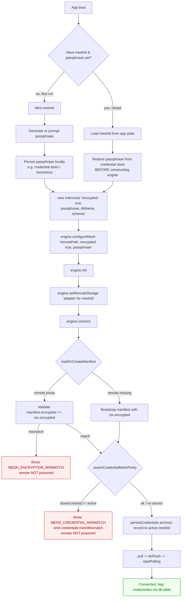

<p align="center">
  <a href="https://github.com/TheUiTeam/interocitor">
    
  </a>
</p>

<p align="center">
  <strong>The JavaScript mailbox that can't read your mail.</strong>
</p>

# @interocitor/core

Encrypted local-first CRDT sync for browser apps.

## Why

Interocitor is your app's __personal keychain__.
Your devices hold the key. The cloud is only a mailbox. It carries encrypted sync artifacts and cannot read your mail.

What this means:
- encryption on by default
- reads and writes are local-first
- sync uses a remote mailbox, not a trusted database
- restore is explicit app UI, not automatic magic

## Quick start

```ts
import { Interocitor } from '@interocitor/core';
import { WebDAVAdapter } from '@interocitor/core/adapters/webdav';

const db = new Interocitor({
  dbName: 'my-app',
  appName: 'My App',
  logLevel: 'debug',
  // encrypted by default; set encrypted: false to opt out
});

await db.init();

// local-only usage works after init
const id = await db.table('todos').add({
  text: 'Ship privacy-first sync',
  done: false,
}, { prefix: 'todo' });

// configure mesh before first remote connect
db.configureMesh({ remotePath: '/MyApp', encrypted: true });

// attach transport later, when app/backend is ready
await db.setRemoteStorage(new WebDAVAdapter({
  baseUrl: 'https://your-webdav-server.example.com',
  auth: { username: 'user', password: 'pass' },
}));
await db.connect();
```

## How sync works

```mermaid
flowchart LR
  A[Browser app] --> B[Interocitor engine]
  B --> C[Local store]
  B --> D[Encrypt changes locally]
  D --> E[Adapter]
  E --> F[Remote mailbox\n(ciphertext only)]
  F --> E
  E --> G[Download ciphertext]
  G --> H[Decrypt locally]
  H --> B
```

## Core API at a glance

```ts
const db = new Interocitor({ dbName: 'my-app', appName: 'My App', schema });
await db.init();

await db.table('tasks').add({ title: 'Ship it', done: false }, { prefix: 'task' });
await db.table('tasks').patch(taskId, { done: true });
await db.table('tasks').replace(taskId, fullTask);
await db.table('tasks').row(taskId);          // single-row handle (await for async fetch)
await db.table('tasks').query();
await db.table('tasks').where('done').equals(false).orderBy('title');

await db.connect();
await db.secureWithBiometrics();
await db.restoreWithBiometrics();
``` 

`init()` is explicit. `connect()` will auto-init if needed, but app code should treat engine setup as:

1. create engine
2. optionally `configureMesh(...)` or provide `resolveInitialState(...)`
3. attach remote adapter
4. `connect()`

## Setup & reload sequence

The engine pins `encrypted` at mesh bootstrap. **Do not flip the `encrypted`
flag between sessions** — the first session writes change files in that mode,
and a later session that connects with a different mode is rejected at
`connect()` with a typed `MeshEncryptionMismatchError` (the remote is **not**
poisoned). The recipe below is the supported lifecycle.

```ts
import { MeshEncryptionMismatchError } from '@interocitor/core';

try {
  await engine.connect();
} catch (err) {
  if (err instanceof MeshEncryptionMismatchError) {
    // err.code === 'MESH_ENCRYPTION_MISMATCH'
    // err.expectedMode → mode the remote mesh was bootstrapped with
    // err.actualMode   → mode the engine was constructed with
    // Rebuild the engine with `encrypted: err.expectedMode` and supply
    // the matching passphrase if expectedMode === true.
  }
  throw err;
}
```



**Rules to avoid the mismatch trap:**

- Decide `encrypted` once per `dbName` and never change it. Recommendation:
  always `encrypted: true`. The engine handles fresh-key generation, passphrase
  derivation, and credential restore on subsequent loads.
- Resolve the passphrase **before** constructing the engine on reload. If the
  passphrase is restored asynchronously (e.g. biometrics) after `init()`,
  prefer `restoreWithBiometrics()` / `setPassphrase()` *before* `connect()`,
  not after a write.
- One `dbName` ↔ one mesh ↔ one key. Listen for `credentials:conflict`,
  `credentials:meshMismatch`, and `remote:poisoned` events to surface real
  corruption to the user.
- On meshId switch, call `setRemoteStorage(newAdapter)` — the engine tears
  down the old transport before swapping. Do **not** rebuild the engine just
  to change adapters.

### MeshCredentialMismatchError

`connect()` throws this when the credential store has a record under the
engine's `dbName` whose `meshId` differs from the live mesh. Typical cause:
the app reused the same `dbName` for "create new mesh" and the old key is
still cached. The remote is **not** poisoned — the local credential record
is stale.

```ts
import { MeshCredentialMismatchError } from '@interocitor/core';

try {
  await engine.connect();
} catch (err) {
  if (err instanceof MeshCredentialMismatchError) {
    // err.code === 'MESH_CREDENTIAL_MISMATCH'
    // err.dbName, err.storedMeshId, err.activeMeshId
    await engine.clearCredentials(); // drops stale record, keeps deviceId
    // ...then retry connect, or use a different dbName per mesh
  }
  throw err;
}
```

### Credential store (LocalStorageCredentialStore) — TL;DR

- One JSON record per `dbName` at `localStorage["interocitor-creds:<dbName>"]`
  containing `{passphrase, deviceId, meshId}`. The engine wires this up
  automatically — apps almost never construct it directly.
- The engine writes `meshId` after the manifest is known. On the next load
  the engine compares stored `meshId` against the live `meshId` and refuses
  to silently reuse a stale key (throws `MeshCredentialMismatchError`).
- Reads still accept the legacy two-key format
  (`interocitor-key:<dbName>` + global `interocitor-device-id`); writes
  always upgrade to the new JSON record and drop the legacy keys.
- **`dbName` is the local DB name. Keep it stable.** One record per DB,
  forever. The mesh identity lives *inside* the record (`meshId` field), not
  in the key. Embedding `meshId` into `dbName` would pollute `localStorage`
  with one orphan record per mesh recreate — exactly the trap this design
  avoids.
- Re-pairing under the same `dbName` is supported: on `connect()` the engine
  detects the stale `meshId`, throws `MeshCredentialMismatchError`, and the
  app calls `engine.clearCredentials()` to overwrite the single record with
  the new mesh's anchor.

```ts
import { LocalStorageCredentialStore } from '@interocitor/core';

// Default: engine creates one for you. Override only for tests or to
// disable persistence (`credentialStore: null` in the engine config).
const store = new LocalStorageCredentialStore('meal-planner');

await store.save({
  passphrase: 'base58-passphrase',
  deviceId: 'dev_xyz',
  meshId: 'mesh_abc',         // optional but strongly recommended
});

const creds = await store.load();
// → { passphrase, deviceId, meshId? } or null

await store.clear(); // drops the record; deviceId global is intentionally kept
```

Disable persistence entirely:

```ts
const engine = new Interocitor(adapter, {
  dbName: 'meal-planner',
  credentialStore: null,      // no localStorage writes; passphrase lives in memory
});
```

Override with a custom backend:

```ts
const engine = new Interocitor(adapter, {
  dbName: 'meal-planner',
  credentialStore: new MyCustomStore(),  // implements CredentialStore
});
```

## Schema typing

```ts
const schema = {
  version: 1,
  tables: {
    todos: {
      fields: {
        text: types.string,
        done: types.boolean,
        createdAt: types.index(types.date),
        note: types.string.optional,
      },
    },
  },
} satisfies DatabaseSchemaDefinition;

// inferred row type:
// { text: string; done: boolean; createdAt: Date; note?: string }
```

`.optional` makes the property optional in the inferred row type.
Reading `row.note` gives `string | undefined`.
Indexed/unique fields cannot be optional.

Typed JSON:

```ts
items: types.typed<ReceiptItem[]>('json')
metadata: types.typed<Record<string, unknown>>('json').optional
```

## Row IDs

Use stable string IDs for synced rows. Do not use auto-increment IDs.

Usually app code should not import `createRowId()` directly. Prefer:

```ts
const id = await db.table('tasks').add({ title: 'Ship it' }, { prefix: 'task' });
```

If you need raw ID generation, `createRowId()` still exists and uses platform crypto.

## Offline guarantee

Every read and write hits the local store. No network required.
`connect()` and background sync are the only flows that touch the remote mailbox.

| Operation | Network? |
| --- | --- |
| `new Interocitor()` | No |
| `init()` | No |
| `table.add()` | No |
| `table.patch()` / `table.replace()` | No |
| `table.delete()` | No |
| `table.row()` / `table.query()` | No |
| `connect()` | Yes, if adapter configured |

## Device identity

```ts
const db = new Interocitor({
  dbName: 'meal-planner',
  appName: 'Meal Planner',
  deviceName: "Anton's laptop",
  deviceType: 'web',
  schema,
});
```

Device IDs are UUIDv7 — sortable, globally unique, auto-generated.
`deviceName` and `deviceType` are synced to the device manifest so peers can display them.

## Row ownership

Every write stamps `_owner` with the writing device's ID.
Automatic. Survives compaction. No opt-in needed.

```ts
const row = await db.table('tasks').row(taskId);
row?._owner; // device ID of last writer
```

Existing rows without `_owner` are fine — it stays `undefined` until next write.

## Mesh IDs and security

Device IDs are client-generated (UUIDv7). No server needed.

Mesh/team IDs should be worker-issued with an embedded HMAC tag:

```ts
import { createMeshSecret, issueMeshId, isValidMeshId } from '@interocitor/core';

// Worker holds the secret
const secret = await createMeshSecret();

// Issue a mesh ID
const meshId = await issueMeshId(secret);
// e.g. "0196745e-1234-7abc-9def-567890abcdef.AbCdEfGhIjK"

// Validate before accepting
const ok = await isValidMeshId(meshId, secret);
```

Format: `<uuidv7>.<base64url HMAC tag>`. Only workers with the secret can mint valid IDs. Clients validate on join.

ID validators:

```ts
import { isValidDeviceId } from '@interocitor/core';

isValidDeviceId(id); // true if UUIDv7 format
```

## Local-only mode

No adapter. No remote. Just IndexedDB.

```ts
const db = new Interocitor({
  dbName: 'meal-planner',
  appName: 'Meal Planner',
  encrypted: false,
  schema,
});
await db.init();

const rows = await db.table('weekPlans').query();
```

You can attach transport later with `setRemoteStorage()`.

## Adapters

### Google Drive
For zero new backend infrastructure where Google Drive is acceptable as the encrypted mailbox.

### WebDAV
For self-hosted sync, local demos, and inspectable remote artifacts.

### Cloudflare (experimental)
For Interocitor-native transport flows with invalidation fanout and maintenance endpoints while keeping decryption client-side.

### Memory
For tests and adapter-contract validation.

## Local store

Interocitor is a sync engine, not a database. The local store is a pluggable abstraction (`LocalStoreAdapter`). The browser default uses IndexedDB. The Swift package uses SQLite. You don't need to care which — reads, writes, and queries go through the engine API.

## CRDT strategy

Interocitor uses per-column CRDTs with hybrid logical clocks (HLC). All merge happens on the client. Remote storage is just a byte pipe.

Conflict default: `'remote-wins'`.
Override at database, table, or field level.

## Events

```ts
engine.on('change', (event) => {
  console.log(event.type, event.table, event.id);
});
```

## Local TODO demo (WebDAV)

From the monorepo root:

```bash
yarn demo:todo
```

## What this is not

- not Firebase
- not Fireproof
- not PowerSync
- not Replicache
- not a hosted backend
- not a query engine over the cloud
- not a server-trusted merge layer

## Tests

From the monorepo root:

```bash
yarn workspace @interocitor/core test
```

## Package context

This package is the main JavaScript/TypeScript runtime in the monorepo. See also:
- root `README.md` — monorepo overview
- `packages/interocitor-swift` — Swift client
- `examples/todo-webdav` — local demo app

## License

MIT
