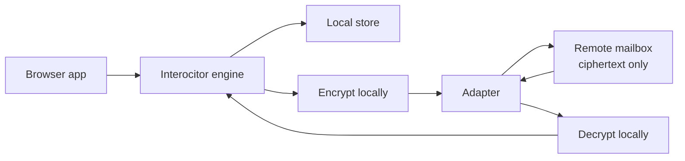

<p align="center">
  <a href="https://github.com/TheUiTeam/interocitor">
    
  </a>
</p>

<p align="center">
  <em>Encrypted local-first CRDT database and durable file store for browser apps.</em>
</p>

# @interocitor/core

End‑to‑end encrypted, local‑first app data over storage you already own
(Google Drive, WebDAV, Cloudflare R2, your own server). Interocitor gives
your app both structured CRDT rows and path-addressed files/images. The
cloud is a mailbox; merge and decryption happen on the device.

## What it is

- A client-side CRDT database for structured state. Local reads/writes go
  through an embedded store (IndexedDB in the browser). The engine ships
  diffs, not queries.
- A durable file store for blobs/images that belong to the same mesh.
  Files are encrypted, path-addressed, and overwritten/deleted explicitly;
  they do not merge or compact.
- A CRDT over per‑column HLC values. Every device converges to the same
  row state without a central merge authority.
- An end‑to‑end encryption layer. The remote sees ciphertext blobs and
  enough metadata to route them; nothing else.
- A pluggable transport. Backends provide object storage operations for
  sync objects and, optionally, first-class durable file operations. See
  `docs/adapter-contract.md`.

## Why

- **Offline‑first by construction.** Every read and write hits a local
  store. Network is needed only to share state with other devices.
- **No server you have to operate.** The remote is dumb storage. You can
  run the engine against a user's own Google Drive and ship zero
  backend.
- **End‑to‑end encryption by default.** The default config encrypts
  every change file and snapshot before it leaves the device.
- **Small, embeddable runtime.** No workers, no background services
  required.

## Quick start

```ts
import { Interocitor } from '@interocitor/core';
import { GoogleDriveAdapter } from '@interocitor/core/adapters/google-drive';

const adapter = new GoogleDriveAdapter({ clientId: 'YOUR_GOOGLE_CLIENT_ID' });

const db = new Interocitor(adapter, {
  dbName: 'my-app',          // local DB name; keep stable across reloads
  appName: 'My App',         // shown in biometric prompts / OS keychain
  remotePath: '/MyApp',      // mesh-scoped folder on the remote
  encrypted: true,           // E2E encryption (default)
});

await db.init();
await db.connect();

// Write — local-first, no network required
await db.table('todos').add(
  { text: 'Ship privacy-first sync', done: false },
  { prefix: 'todo' },
);

// Share with another device — see "New device / restore" below
console.log('Passphrase:', db.getPassphrase());
```

> The constructor accepts either `(adapter, config)` or `(config)` alone.
> Use the `(config)` form for local‑only mode (no remote). When you
> attach a remote later, call `setRemoteStorage(adapter)` and then
> `connect()`.

## Mental model



The remote is a mailbox. For rows, the engine puts encrypted change
files into it and pulls down change files from peers. For files/images,
the engine puts encrypted durable objects under `files/` and reads or
deletes them by app path. Row merging happens on the device. There is no
server-side compute required for correctness.

Four artifact families live on the remote:

- **change files** — one per write batch, named `<HLC>-chg_<id>.json`;
- **snapshots** — periodic full row state, written by compaction;
- **durable files** — app blobs/images under `files/`, addressed by app path;
- **a manifest** — pointer to the current generation, plus mesh metadata.

See `docs/adapter-contract.md` for the full layout.

## Security model

Encryption is on by default (`encrypted: true`). The engine uses
**AES‑GCM 256** with a key derived from a base58 passphrase.

What it protects:

- Row contents (field names, field values, table names) inside change
  files and snapshots.
- Integrity of each entry (AES‑GCM authentication tag).

What it does **not** protect:

- File names (they encode the HLC and a device id).
- Manifest contents (mesh id, schema version, epoch, encrypted flag,
  serverId).
- Sizes, write timing, device count.
- The local store on the device (IndexedDB / SQLite stores plaintext).

What a malicious remote can still do:

- Drop, withhold, replay, or roll back files.
- Observe activity timing and device identities.

For the threat model, the metadata table, and full mitigations see
`docs/security-model.md`.

## Offline guarantees

| Operation | Network? |
| --- | --- |
| `new Interocitor()` | No |
| `init()` | No |
| `table.add()` / `patch()` / `replace()` / `delete()` | No |
| `table.row()` / `table.query()` / `table.where()` | No |
| `connect()` | Yes (if adapter configured) |
| `flush()` / `pull()` / `compact()` | Yes |

Writes are persisted locally and queued in an outbox. They survive
reload, crash, and offline periods. On reconnect the engine drains the
outbox to the remote.

### Never-stuck principle

Interocitor treats persistence and transport as implementation details
behind the local-first API. The application must not become unusable
because IndexedDB is wedged, a database upgrade is blocked by another tab,
or a cloud call hangs forever.

Failure-mode hierarchy:

1. **Use durable local storage** when IndexedDB opens and behaves normally.
2. **Degrade to memory** when IndexedDB is unavailable, blocked, closing, or
   fails to make progress. The current session keeps working; durability
   across reloads is reduced until the app reconnects or rotates storage.
3. **Rotate the local database name** for persistent IndexedDB disasters.
   The DB name is a cache namespace, not identity. Mesh identity lives in
   credentials and the remote manifest.
4. **Stay offline-ready** when a cloud connect stage stalls. `connect()`
   returns, `init()` remains complete, writes continue locally, and the app
   can retry `connect()` later.

This principle is intentionally conservative: stale or broken local cache
must never block the user from reading/writing the app's current in-memory
state.

## Sync guarantees

- **Eventual convergence.** Two devices that have seen the same set of
  change files (in any order) reach byte‑identical local state.
- **Per‑column merge.** Conflicts are resolved field‑by‑field, not at
  the row level. Default strategy is `'remote-wins'` — see
  "Conflict resolution".
- **Idempotent merge.** Replaying an already‑applied change is a no‑op.
  Safe to re‑pull, safe to re‑process the same change file twice.
- **Per‑device HLC monotonicity.** A single device's HLCs strictly
  increase. Cross‑device order is total but only as wall‑clocks allow.
- **Restore via snapshot.** A device that joins late (or rehydrates after
  a long offline) loads the latest snapshot, then applies any change
  files newer than the snapshot watermark.

What we do **not** guarantee:

- Cross‑device atomicity. A `db.batch()` is one atomic remote file, but
  two unrelated batches from different devices are independent.
- Real‑time delivery. The default poll interval is 30 s; some adapters
  (Cloudflare) layer push notifications on top.
- Recovery if the remote silently lies (drops writes, rolls back the
  manifest). See `docs/security-model.md`.
- Recovery if the passphrase is lost — see "New device / restore".

### Sync cadence

The engine adapts how often it polls the remote so it does useful work
when there is data to sync, and stays out of the way otherwise. This is
all automatic — there is no configuration knob.

- **Adaptive backoff.** Polling starts at `pollInterval` (30 s by
  default). After every poll that merges zero entries the interval
  doubles, capped at 60 s. Any poll that merges ≥ 1 entry resets the
  interval back to base. The intent is to absorb idle bursts of clients
  without hammering the remote, while still recovering immediately when
  data starts flowing.
- **Tab visibility.** When the host page is hidden
  (`document.visibilityState === 'hidden'`) the current poll interval is
  multiplied by 10 — backgrounded tabs poll lazily. When the tab becomes
  visible again the interval is reset to base **and** an immediate
  `pull()` is fired so foregrounded data jumps in without waiting for
  the next tick. This is a standard SWR‑style refresh‑on‑focus pattern.
  The listener is wired during `connect()` and torn down by
  `disconnect()`; environments without `document` (e.g. Node) skip it.
- **Push fallback.** Adapters that push invalidations (Cloudflare relay)
  trigger an immediate pull and bypass the polling cadence entirely.
  Polling is the safety net when the push channel is unavailable; the
  WS connection itself uses bounded retries with a long cooldown after
  repeated failed upgrades, so a misbehaving relay cannot DDoS itself.

## Setup lifecycle

```
new Interocitor(adapter?, config)
        │
        ▼
  configureMesh({...})       ← optional; pin meshId / passphrase upfront
        │
        ▼
       init()                ← opens local store, restores credentials
        │
        ▼
  setRemoteStorage(adapter)  ← only if no adapter passed to ctor
        │
        ▼
     connect()               ← loads/creates manifest, pulls, flushes, polls
```

`connect()` will auto‑`init()` if needed. App code should still treat
init as explicit so credential restore happens before any writes.

The `encrypted` flag is **pinned at mesh bootstrap** and cannot change
between sessions for the same `dbName`. Reconnecting with a different
mode throws a typed `MeshEncryptionMismatchError`.

```ts
import { MeshEncryptionMismatchError } from '@interocitor/core';

try {
  await db.connect();
} catch (err) {
  if (err instanceof MeshEncryptionMismatchError) {
    // err.expectedMode is the mode the remote was bootstrapped with
  }
  throw err;
}
```

## New device / restore

Joining a new device to an existing mesh requires three things:

1. The **`meshId`** of the existing mesh.
2. The **passphrase** that decrypts the mesh.
3. Access to the same **remote mailbox** (the same `remotePath` on a
   storage backend the new device can reach).

A production app should keep CRUD, sync lifecycle, and pairing separate:

```text
lib/interocitor-db.ts      engine, schema, local repository, credential primitives
lib/interocitor-sync.ts    mesh id lifecycle, adapter, connect/disconnect, recovery
lib/interocitor-pairing.ts QR handshake only
```

The pairing flow ships credentials over an ECDH relay handshake. The handshake relay base and sync adapter base are different concepts: a relay base is the temporary handshake-file path, such as `/Taska`; the Cloudflare adapter base URL is the concrete Worker route, such as `/sync/io/{meshId}`. The engine `remotePath` is still the mesh folder path used inside that adapter, such as `/Taska`.

### Pairing intents

**Join QR** is for a device that does not have credentials yet:

1. Joiner mints a fresh mesh id.
2. Joiner creates a Cloudflare adapter with base URL `/sync/io/{meshId}`.
3. Joiner calls `generateJoinQR()`.
4. Existing paired device scans and pushes credentials.
5. Joiner receives credentials from `credentials` on the result.
6. Joiner applies the passphrase and connects to the minted mesh.

**Share QR** is for an existing mesh member inviting a new device:

1. Existing device connects to the active mesh.
2. Existing device calls `generateShareQR()` with `remotePath` and `passphrase`.
3. New device scans and receives credentials from `handleScannedQR()`.
4. New device applies credentials and connects using the adapter config from the payload.

`handleScannedQR()` returns `null` for join intent because the scanner pushed its own credentials. It returns credentials for share intent because the scanner received credentials. Always handle the return value:

```ts
import { decodeQRPayload, handleScannedQR, parseQRFromUrl } from '@interocitor/core';
// Raw QR payload decoder is also available from '@interocitor/core/handshake/qr'.

const payload = parseQRFromUrl(location.hash) ?? decodeQRPayload(rawPastedPayload);
const received = await handleScannedQR({ adapter, relayBase: '/Taska', payload });

if (received) {
  if (received.passphrase) db.setPassphrase(received.passphrase);
  await connectFromPayload(received.remotePath);
}
```

After the handshake the new device:

```ts
const db = new Interocitor(adapter, {
  dbName: 'my-app',
  appName: 'My App',
  remotePath: '/Taska',
  passphrase: 'base58-from-handshake',
  encrypted: true,
});

await db.init();
await db.connect();   // pulls the manifest, rehydrates from snapshot, then catches up
```

On `connect()` the engine:

1. Reads `manifest.json` from the remote.
2. Compares stored `meshId` (from the credential store) against the live
   one. Mismatch → `MeshCredentialMismatchError`.
3. If local epoch < remote epoch, calls `rehydrate()` to load the
   latest snapshot.
4. Pulls any change files newer than the snapshot watermark.
5. Starts polling.

> **If the passphrase is lost and no other device holds it, the mesh is
> unreadable.** The engine has no recovery path — the data is end‑to‑end
> encrypted and the key is the passphrase. Treat the passphrase as the
> only thing that matters; back it up out of band (1Password, paper,
> another device's `WebAuthnCredentialStore`).

For the credential store details (records, anchors, biometric paths)
see `docs/credential-store.md`.

## Core API

```ts
const db = new Interocitor(adapter, {
  dbName: 'my-app',
  appName: 'My App',
  remotePath: '/MyApp',
  schema,
  connectStageTimeoutMs: 15_000,
  onConnectStalled: ({ stage, timeoutMs }) => {
    console.warn(`connect stage stalled: ${stage}`, { timeoutMs });
  },
});
await db.init();

await db.table('tasks').add({ title: 'Ship it', done: false }, { prefix: 'task' });
await db.table('tasks').patch(taskId, { done: true });
await db.table('tasks').replace(taskId, fullTask);
await db.table('tasks').delete(taskId);

await db.table('tasks').row(taskId);                          // single row
await db.table('tasks').query();                              // all rows
await db.table('tasks').where('done').equals(false).orderBy('title');

await db.connect();                                           // attach + sync
await db.flush();                                             // force outbox drain
await db.pull();                                              // force pull
await db.compact();                                           // see docs/compaction.md
await db.disconnect();                                        // tear down

// Durable files — encrypted, not compacted, not merged
await db.putFile('receipts/may.pdf', pdfBytes, 'application/pdf');
const pdf = await db.getFile('receipts/may.pdf');
const fileMeta = await db.getFileMetadata('receipts/may.pdf');
await db.deleteFile('receipts/may.pdf');

// Images — first-class file helpers
await db.putImage('avatars/me.png', fileOrBlob);
const image = await db.getImage('avatars/me.png');             // { data, blob, metadata }
const blobUrl = await db.getImageBlobUrl('avatars/me.png');    // { url, revoke }
blobUrl.revoke();

// Credentials
db.getPassphrase();
db.setPassphrase(passphrase);
await db.secureWithBiometrics();
await db.restoreWithBiometrics();
await db.clearCredentials();

// Batched writes — one ChangeEntry per batch
await db.batch(async () => {
  await db.table('todos').add({ title: 'a' });
  await db.table('todos').patch(otherId, { done: true });
});
```

### Files and images

Interocitor supports durable files alongside row-based state. Files are
not row fields and are not part of the CRDT table schema. They live in the
adapter-backed durable storage namespace under the mesh `files/` prefix and
are addressed by application-chosen string paths.

Use rows for structured state that participates in schema typing, queries,
merge behavior, snapshots, and compaction. Use files for binary or large
opaque payloads such as images, attachments, exported blobs, or durable
assets that should move with the mesh.

Recommended pattern:

1. Store metadata and references in rows.
2. Store opaque payloads with `putFile` / `putImage`.
3. Store the file path in the row.

```ts
type TaskRow = {
  title: string;
  file_paths: string[];
};

const path = `tasks/${taskId}/files/${Date.now()}_${file.name}`;
await db.putFile(path, new Uint8Array(await file.arrayBuffer()), file.type);
await db.table('tasks').patch(taskId, {
  file_paths: [...task.file_paths, path],
});
```

Core file API:

```ts
const meta = await db.putFile('attachments/report.pdf', bytes, 'application/pdf');
const bytes = await db.getFile('attachments/report.pdf');
const metadata = await db.getFileMetadata('attachments/report.pdf');
await db.deleteFile('attachments/report.pdf');
```

`putFile(path, data, contentType?)` accepts `Uint8Array | string` and returns
`StoredFileMetadata`. `getFile(path)` returns decoded `Uint8Array` bytes.
`getFileMetadata(path)` returns `StoredFileMetadata | null` without
downloading the payload. `deleteFile(path)` treats a missing file as already
deleted.

`StoredFileMetadata` includes the adapter `FileEntry` fields (`name`,
`path`, `size`, `modifiedTime`, optional `etag` / `revision`) plus durable
file fields when known: `uploadedByDeviceId`, `uploadedAt`,
`lastAccessedAt`, `useCount`, `plaintextSize`, `storedSize`, and
`contentType`.

File semantics and caveats:

- Files are encrypted with the mesh key when encryption is enabled.
- File paths are metadata; choose paths as if the remote owner can observe
  them.
- Files are not CRDT-merged. A write to the same path replaces the object
  according to adapter semantics; coordinate path ownership in app code.
- Files are not included in row snapshots or compaction. A file exists until
  overwritten or deleted.
- Deleting a row does not automatically delete referenced files. Applications
  must perform that cleanup explicitly.
- File references are usually stored in rows as strings. Define a path
  convention such as `users/{userId}/avatar` or
  `tasks/{taskId}/files/{filename}`.

Images are convenience wrappers over durable files:

```ts
await db.putImage('avatars/me.png', file);

const image = await db.getImage('avatars/me.png');
// image.data: Uint8Array
// image.blob: Blob
// image.contentType: image/png, image/jpeg, ...

const view = await db.getImageBlobUrl('avatars/me.png');
img.src = view.url;
view.revoke();
```

`putImage(path, image, options?)` accepts `Blob`, `ArrayBuffer`, `Uint8Array`,
data URLs, and plain strings. Plain strings are encoded as text and default
to `image/svg+xml` unless `options.contentType` or the path extension says
otherwise. Explicit image content types must start with `image/`.

Use `putFile` for arbitrary non-image files. Use `getImageBlobUrl` /
`@interocitor/react`'s `useImage` for display scenarios that need a browser
`blob:` URL, and always revoke blob URLs you create manually.

### Schema typing

```ts
import { types } from '@interocitor/core';
import type { DatabaseSchemaDefinition } from '@interocitor/core';

const schema = {
  tables: {
    todos: {
      fields: {
        text: types.string,
        done: types.boolean,
        createdAt: types.index(types.date),
        note: types.string.optional,
        items: types.typed<TodoItem[]>('json'),
      },
    },
  },
} satisfies DatabaseSchemaDefinition;

// Inferred row type:
// { text: string; done: boolean; createdAt: Date; note?: string; items: TodoItem[] }
```

`.optional` makes the field optional in the inferred type. Indexed and
unique fields cannot be optional. `types.index(...)` marks a field for
efficient `where`/`orderBy`.

### Conflict resolution

Per‑column CRDT with HLC. Default merge strategy: **`'remote-wins'`**.

> "Remote‑wins" is per‑column, not per‑row. When two devices write the
> same column on the same row, the merge keeps the value with the higher
> HLC. Because HLCs are timestamp‑first, this is "later wall‑clock
> wins, ties broken by device id". Calling it "remote‑wins" is a
> historical accident of where the merge runs (during pull); both sides
> apply the same rule and reach the same answer. Override per database,
> table, or field if you need `'lww'`, `'local-wins'`, or a custom
> `MergeFunction`.

Available strategies:

- `'lww'` — last‑write‑wins by HLC. Functionally identical to
  `'remote-wins'` for this CRDT but keeps semantics explicit.
- `'remote-wins'` (default).
- `'local-wins'` — keep local on tie; remote still wins on a strictly
  greater HLC.
- `MergeFunction` — `(local, remote, ctx) => result` for custom logic.

### Deletion semantics

`delete()` writes a **tombstone**, not an immediate unlink. Tombstones:

- carry `deletedHlc` like any other write;
- hide the row from public reads and queries;
- keep an empty payload, so deleted user data does not linger inside the
  tombstone;
- are needed so that slower devices cannot replay an older `add()` and
  resurrect the row.

Re-inserting the same row id after a delete starts a fresh row
incarnation. Columns from the old incarnation are not carried forward;
a partial insert only contains the new columns.

Compaction can later hard-delete tombstones from snapshots. The engine
tracks per-device acknowledgements in `devices/<deviceId>.json`; once
all active devices have observed a manifest watermark, compaction
publishes `manifest.gcFloorHlc` as a point of no return. Tombstones with
`deletedHlc <= gcFloorHlc` are omitted from the next snapshot.

Devices not seen within `offlineGraceMs` (default seven days) are
excluded from GC consensus. If one wakes up with local outbox entries at
or before `gcFloorHlc`, the engine refuses to flush those entries and
rehydrates from the canonical snapshot instead.

### Local store

The local store is a pluggable `LocalStoreAdapter`. Browser default is
IndexedDB. The Swift package ships SQLite. Tests use an in‑memory
implementation. Reads, writes, queries, and the outbox all go through
this interface.

Browser IndexedDB is wrapped by a resilient boundary:

- `createResilientLocalStore()` bounds IndexedDB open time and degrades to
  memory on blocked/stalled opens or post-open `InvalidStateError` /
  "database connection is closing" failures.
- `onLocalDegraded` lets apps log or show a non-fatal banner. The hook must
  be informational only; the engine has already continued.
- `createNamedLocalStore()` adds versioned DB-name rotation. Use it when the
  app prefers abandoning a poisoned cache namespace over waiting for old
  tabs/workers to release it.
- `resetLocalDatabaseWithDeadline()` provides a never-hanging destructive
  reset primitive for user-facing "repair local cache" flows.

Example:

```ts
const db = new Interocitor(adapter, {
  localStoreFactory: () => createNamedLocalStore({
    baseName: 'MealPlannerInterocitor',
    schema,
    onLocalDegraded: ({ reason, error }) => report(reason, error),
    onRotated: ({ from, to, reason }) => reportRotation(from, to, reason),
  }),
});
```

### Connection status

Core exposes a small user-facing primitive status via
`db.getConnectionStatus()` and `connection:status` events:

```ts
const status = db.getConnectionStatus();
// 'offline' | 'connecting' | 'syncing' | 'idle'
```

- `offline` means local work is available but remote sync is not connected.
- `connecting` means `connect()` is in progress.
- `syncing` means a connected engine is pulling or flushing.
- `idle` means connected and no sync work is active.

For nuance, use the imperative details call:

```ts
const details = db.getConnectionStatusDetails();
// { status, solo, ready, connected, remotePath, meshId, deviceId }
```

`solo` is a separate gate: true means no remote mesh path is configured. It
is not a communication status and should not be shown as a sync banner.

React apps usually consume communication state through
`useConnectionStatus(db)` and the solo gate through `useIsSolo(db)` from
`@interocitor/react`.

### Connect-stage degradation

`connect()` has bounded-progress semantics. Cloud work is split into
stages (`authenticate`, `ensureFolder`, `loadOrCreateManifest`,
`upsertDeviceMetadata`, `pull`, `rehydrate`, `flush`). Each stage uses
`connectStageTimeoutMs` (default
15s). If a stage stalls, `connect()` returns without throwing, emits
`connect:error`, calls `onConnectStalled`, and leaves the engine ready but
not connected. Local reads/writes continue and writes stay queued for a
future successful connect.

Apps should treat `onConnectStalled` like `onLocalDegraded`: telemetry and
user messaging only. Do not make app correctness depend on the callback.

## Adapters

| Adapter | Use when | Notes |
| --- | --- | --- |
| `GoogleDriveAdapter` | You want zero infrastructure | OAuth in the browser; the user owns the data |
| `WebDAVAdapter` | Self‑hosted (Nextcloud, OwnCloud, custom WebDAV) | Easy to inspect remotely |
| `CloudflareAdapter` | You operate a worker; want push invalidations | Experimental |
| `MemoryAdapter` | Tests and demos | No persistence |

Implementing your own adapter: see `docs/adapter-contract.md` for
required semantics, consistency assumptions, and the contract test
suite.

## Remote mailbox layout

For `remotePath: '/MyApp'`:

```
/MyApp/
├── manifest.json                           # pointer { currentGeneration, file }
├── manifest-1.json                         # generation 1
├── manifest-2.json                         # ...
├── changes/
│   ├── head.json                           # { latestHlc } — pull fast path
│   └── <HLC>-chg_<id>.json                 # encrypted change entries
├── devices/
│   └── <deviceId>.json                     # device metadata
├── files/
│   └── <app path>                          # durable encrypted app files
└── mainline/
    └── snapshot-<epoch>-<serverId>.json    # encrypted snapshot
```

`remotePath` is **mesh‑scoped**. One folder = one mesh = one logical
database. Two meshes sharing the same folder will fight over the
manifest and poison the remote.

## Maintenance / compaction

Compaction collapses the change log into a snapshot, bumps the manifest,
prunes old change files, and advances the tombstone GC floor when active
devices have acknowledged the prior watermark. Sync works without it;
the remote folder just grows until *some* device compacts.

Two paths run automatically:

- **Immediate sampled** — after a flush of ≥ `compactAutoThreshold`
  (default 50) ops, with probability ≈
  `compactAutoSampleNumerator / compactAutoDeviceCount`.
- **Delayed two‑phase** — per‑write timer (10 ± 5 min) → check that
  remote change files exceed `compactRemoteChangeThreshold` (default 2)
  → second timer (15 ± 5 min) → run.

Both paths are deduped by a single in‑flight guard. You can also call
`db.compact()` manually.

> **The auto defaults and the recommended manual policy are different
> things.** The manual policy ("idle > 1 min, churn > 20") is what to
> gate a "Sync now" button on. The auto defaults are what runs without
> any button. See `docs/compaction.md`.

> **Compaction is not race‑safe across devices.** The adapter contract
> has no CAS/ETag write, so two simultaneous compactors can both
> overwrite the manifest pointer. Mitigations: rely on probabilistic
> avoidance for small meshes, or run with `serverManaged: true` and a
> single authorized writer.

Full protocol, events, lock story, device acknowledgement / GC-floor
rules, prune invariants, and tuning checklist: **`docs/compaction.md`**.

## Connected stores

`engine.connectedStores` is a small **credential vault** for sub-stores
that conceptually belong to this Interocitor (for example a "reviews"
store derived from a "family planner" store). It does **not** construct
or run child engines — it only stores credentials so apps don't have to
reinvent that storage themselves.

Direction is one-way by construction: the parent stores credentials for
sub-stores, and sub-stores have no awareness of the parent. Anyone with
read access to the parent inherits read access to the sub-store
credentials persisted here.

```ts
import type { ConnectedStoreCredentials } from '@interocitor/core';

await db.connectedStores.put({
  id: 'reviews',
  alias: 'family-reviews',
  remotePath: '/family/reviews',
  passphrase: 'review-pass',
  encrypted: true,
  dbName: 'reviews-db',
  adapter: { kind: 'memory' },
  metadata: { icon: 'star' },
});

const all: ConnectedStoreCredentials[] = await db.connectedStores.list();
const reviews = await db.connectedStores.get('reviews');
await db.connectedStores.remove('reviews');
```

Notes:

- Credentials are persisted as a single JSON list under a dedicated meta
  key inside the parent's local store. Sub-stores never appear as parent
  tables or rows.
- `put(creds)` upserts by `id`, preserves `createdAt`, and refreshes
  `updatedAt` automatically.
- The engine never reads `passphrase`/`adapter`/`remotePath` from these
  records — apps construct their own `Interocitor` instances from them.

## Schema migration

Interocitor now manages **local cache/index upgrades automatically**.
Adding or removing `types.index(...)` fields no longer requires bumping a
public schema version just to keep IndexedDB in sync. The local store
computes its own cache fingerprint, repairs missing indexes on open, and
falls back to scans if a stale cache slips through.

`schema.version` is now **optional** and only matters if you want an
explicit logical compatibility gate in the remote manifest. If you set
it, the engine writes it to `manifest.schema` and will reject manifests
written under a different logical version.

Use `schema.version` only for app-level data meaning changes such as:

1. row shapes that old clients cannot safely read,
2. `onInit` migrations that rewrite logical data,
3. staged rollouts where you want explicit manifest compatibility checks.

Recommended pattern for logical migrations:

1. Bump `schema.version` in your code.
2. Implement a one-shot `onInit` migration that reads old rows from the
   local store and writes the new shape back. Use `db.batch(...)` to
   keep it atomic per row group.
3. Trigger compaction after the migration so the snapshot is written
   under the new logical version and old change files are pruned.
4. During rollout, make sure old clients either tolerate both shapes or
   are blocked by the manifest version mismatch on connect.

For breaking changes that cannot be rolled out gradually, the
heavier path is to bootstrap a fresh mesh, replicate data over, and
retire the old mesh. The engine does not automate this.

## Events

```ts
db.on(event => {
  switch (event.type) {
    case 'sync:start':                /* pull began */ break;
    case 'sync:complete':             /* event.entriesMerged */ break;
    case 'change':                    /* event.table, event.rowId, event.row */ break;
    case 'delete':                    /* event.table, event.rowId */ break;
    case 'flush:start':               /* event.entryCount */ break;
    case 'flush:complete':            break;
    case 'flush:error':               /* event.error */ break;
    case 'connect:error':             /* event.stage, event.error; may be bounded-progress offline-ready degrade */ break;
    case 'remote:poisoned':           /* unrecoverable; see security-model.md */ break;
    case 'credentials:meshMismatch':  /* stored meshId != live; offer clearCredentials() */ break;
    case 'compact:warning':           /* outbox is large */ break;
    // compact:auto:start / complete / skip / error / delayed:* — see docs/compaction.md
  }
});
```

## What this is not

- not Firebase
- not Fireproof
- not PowerSync
- not Replicache
- not a hosted backend
- not a query engine over the cloud
- not a server‑trusted merge layer

## What can go wrong

A short field guide. Detailed mitigations in the linked docs.

| Symptom | Likely cause | Where to look |
| --- | --- | --- |
| `MeshCredentialMismatchError` on connect | Same `dbName`, new mesh; stale credential record | `engine.clearCredentials()` then reconnect; `docs/credential-store.md` |
| `MeshEncryptionMismatchError` on connect | App flipped `encrypted` between sessions | Pin `encrypted` per `dbName`, never change |
| `remote:poisoned` event | Decode failure on a manifest, change file, or snapshot | `docs/security-model.md` — usually wrong key, schema drift, or remote tampering |
| Writes never appear on peer | Peer never compacted, peer's poll interval is long, remote dropped writes, or `connect()` is offline-ready after a stalled cloud stage | Check `flush:complete`, `connect:error`, `onConnectStalled`; check remote folder by hand |
| App is unusable after IndexedDB error | Local cache is wedged, blocked by older tab, or connection is closing | Use `createResilientLocalStore` / `createNamedLocalStore`; log `onLocalDegraded`; offer `resetLocalDatabaseWithDeadline` repair |
| Local store has rows that are "old" after re‑pair | Engine kept local data when you re‑paired with a fresh mesh | Either delete local DB on re‑pair, or accept the merge |
| Lost passphrase | No recovery | Passphrase is the key. Back it up out of band |
| Long‑offline device "lost" recent edits | Rehydrate replaced local state with the snapshot | Local writes already in the outbox survive; in‑flight uncommitted UI state does not |
| Compaction never runs | `autoCompact: false`, or no remote, or `compactAutoThreshold` never reached | `docs/compaction.md` — subscribe to `compact:auto:skip` |
| Two compactors race | No CAS in the adapter; small probability in small meshes | Use `serverManaged: true` for large meshes |

## Tests

```bash
yarn workspace @interocitor/core test
```

Adapter contract tests (run for every adapter):

```bash
yarn workspace @interocitor/core test webdav.adapter.contract
```

## Package context

Part of the Interocitor monorepo. See:

- root `README.md` — monorepo overview
- `docs/security-model.md` — threat model
- `docs/adapter-contract.md` — adapter requirements
- `docs/compaction.md` — compaction protocol & tuning
- `docs/credential-store.md` — credential persistence

## License

MIT
