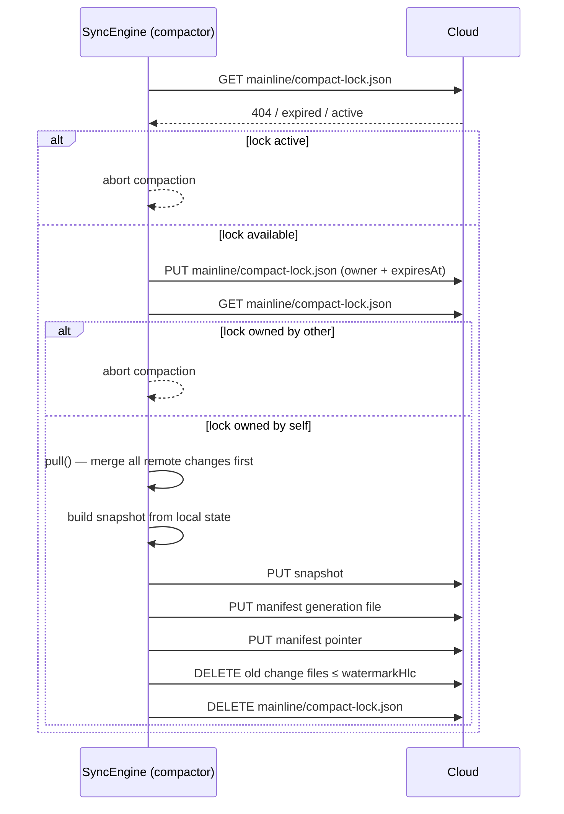

<p align="center">
  <a href="https://github.com/TheUiTeam/interocitor">
    
  </a>
</p>

# interocitor-swift

Swift-native Interocitor runtime for macOS and iOS.

Same idea, same trade-off: a mailbox that can't read your mail.

## Why this package exists

`interocitor-swift` brings the Interocitor model to Apple platforms.

The goal is not to compete with CloudKit, Firebase, or collaborative CRDT platforms on features. The goal is to preserve the same architectural property as the JavaScript package: all meaningful data work stays on the client.

That means:

- local state lives in SQLite
- merge happens on the device
- decryption happens on the device
- the remote transport only moves opaque bytes

If your app needs true end-to-end encrypted sync across your own Apple devices, this package is the native runtime for that model.

## Platforms

- iOS
- macOS

## Installation

### Swift Package Manager

```swift
dependencies: [
  .package(url: "https://github.com/TheUiTeam/interocitor.git", branch: "main")
]
```

Then depend on the `InterocitorSwift` product.

## Quick start

```swift
import InterocitorSwift

let config = SyncConfig(
  remotePath: "/App",
  dbName: "todos.sqlite",
  deviceName: "My Device",
  deviceType: "ios"
)

let db = Interocitor(
  config: config,
  localStore: IndexedSQLiteStore(path: "todos.sqlite")
)

try await db.initialize()

try await db.put("todos", rowId: "todo-1", columns: [
  "text": .string("Ship encrypted sync"),
  "done": .bool(false),
  "createdAt": .number(Date().timeIntervalSince1970)
])

let rows = try await db.query("todos")
```

## Adapters

### WebDAV

Use `WebDAVStorageAdapter` when you want self-hosted sync or an inspectable remote mailbox.

### Cloudflare Workers (`interocitor-workers`)

Use `CloudflareStorageAdapter` when you want an Interocitor-native endpoint with push-style invalidation while preserving client-side merge and decryption.

### Custom adapter

Implement the `StorageAdapter` protocol to target any byte-oriented transport that can list, read, write, and delete remote objects.

## Local store

### SQLite (persistent)

This package maps the Interocitor local-first model onto SQLite for Apple platforms.

### Memory (tests)

Use `MemoryLocalStore` for tests and in-process validation.

## Core API

```swift
try await db.initialize()
try await db.put("todos", rowId: "todo-1", columns: columns)
try await db.delete("todos", rowId: "todo-1")
let one = try await db.get("todos", rowId: "todo-1")
let many = try await db.query("todos")
try await db.flush()
try await db.compact()
```

`compact()` is a manual maintenance call. It is not part of normal sync.
Use it to write a fresh snapshot and prune old remote change files.

```swift
try await db.flush()
try await db.compact()
```

### Compaction policy

Compact only when all are true:

- device idle **> 1 min**
- last successful pull **< 30 min** ago
- remote churn **> 20 changes** since last compaction
- engine connected and healthy
- no compaction already in progress

### Compaction coordination

`compact()` has no built-in distributed lock. Two clients can race and overwrite the manifest pointer.
Recommended: coordinate with a remote lease file such as `mainline/compact-lock.json`.

Recommended protocol:

1. Read lock. If present and not expired → skip compaction.
2. Write lock for self with short TTL.
3. Re-read lock. If not owned by self → abort.
4. Re-read manifest/head. If generation changed since lock acquisition → abort.
5. Run `compact()`.
6. Delete lock on success, or rely on TTL on crash.

For repo-level diagrams and monorepo context, see the project root: `https://github.com/TheUiTeam/interocitor`.



## Where clauses

```swift
let doneRows = try await db.queryWhere(
  "todos",
  clause: WhereClause(field: "done", op: .equals, value: true)
)
```

## Encryption

Interocitor only works for its intended purpose if the transport never needs plaintext.

```swift
let config = SyncConfig(
  remotePath: "/App",
  dbName: "secure.sqlite",
  deviceName: "My Device"
)

let db = Interocitor(
  adapter: adapter,
  config: config,
  localStore: IndexedSQLiteStore(path: "secure.sqlite")
)
```

### Client-side fingerprint verification

As with the JavaScript package, you can expose a key fingerprint in your UI so users can verify device pairing intentionally.

## Device configuration

Pass `deviceName` and `deviceType` in `SyncConfig` to tag this device in the mesh:

```swift
let config = SyncConfig(
  remotePath: "/App",
  dbName: "app.sqlite",
  deviceName: "Anton's laptop",  // human-readable name
  deviceType: "desktop"           // 'web' | 'ios' | 'android' | 'desktop' | 'tv' | 'worker'
)
```

These are stored in device metadata on the server and visible to all peers.

## Row ownership

Every row written via `put()` automatically sets `_owner` to the current device ID. This allows you to track which device last wrote each row.

## CRDT strategy

This runtime keeps the same core architecture as the JS package: client-side CRDT merge with hybrid logical clocks, remote mailbox only for exchange.

## How sync works

```text
App
  -> Interocitor
  -> local SQLite
  -> encrypt locally
  -> remote byte transport
  -> download ciphertext
  -> decrypt locally
  -> merge locally
```

## Offline guarantee

| Operation | Network? |
| --- | --- |
| init | No |
| put / delete | No |
| get / query | No |
| sync | Yes, if adapter configured |

## Cloud folder layout

```text
<remotePath>/
  snapshot.meta
  changes/
  blobs/
```

## Tests

Current coverage includes:

- SQLite local store behavior
- HLC behavior and ordering
- CRDT merge logic
- WebDAV integration flows

Run the Swift package tests from the package directory with standard Swift tooling.

## Source layout

```text
Sources/InterocitorSwift/
  SyncEngine.swift
  IndexedSQLiteStore.swift
  MemoryLocalStore.swift
  Crypto.swift
  CRDT.swift
  HLC.swift
  ...
```

## Package context

- Monorepo root: <https://github.com/TheUiTeam/interocitor>
- Package home: <https://github.com/TheUiTeam/interocitor/tree/main/packages/interocitor-swift>
- JS runtime sibling: <https://github.com/TheUiTeam/interocitor/tree/main/packages/interocitor>
- Workers runtime sibling: <https://github.com/TheUiTeam/interocitor/tree/main/packages/interocitor-workers>

## License

MIT
